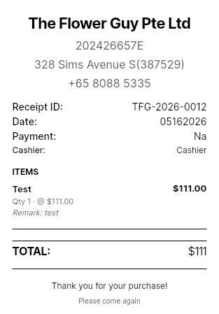
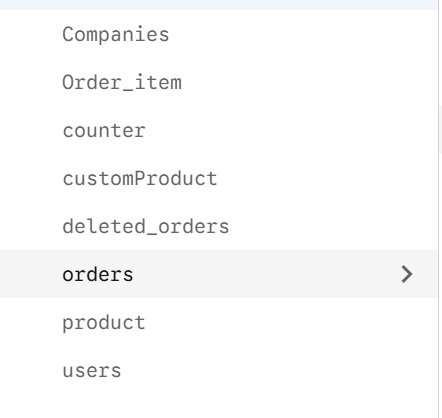
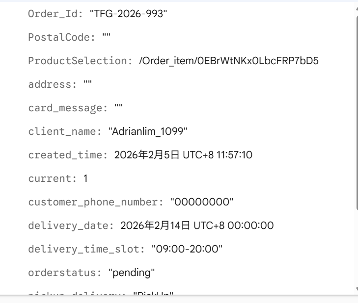

# TFG VDAY

Internal **florist POS and delivery management** app for Valentine's Day peak operations. Built with **Flutter (FlutterFlow)** and **Firebase**.

Staff use it to handle in-store sales, phone/pre-orders, delivery scheduling, driver handoff, and printing — not a customer-facing shop.

## What it does

| Area | Features |
|------|----------|
| **Retail (POS)** | Create orders, select products, take payment, print thermal receipts |
| **Delivery / pick-up** | Customer & delivery details, order status tracking, **A4 PDF** delivery orders |
| **Roles** | superadmin (cross-company), admin, senior_florist, driver (each sees relevant screens) |
| **Staff admin** | **User List** (name, role, active status) · **Add Staff** · set inactive / activate / delete profiles |
| **Reporting** | Sales dashboard, **daily sales report** (date range, PayNow/Cash/Card), CSV export |
| **Printing** | Bluetooth ESC/POS (mobile) · PDF A4 via system print dialog (all platforms) |

## Screenshots

### Dashboard


### Order Management


### Create Order


### Delivery Management


### POS


### PDF Invoice


### Receipt Printing



### Firebase console

Firestore collections and sample order document (`tfg-sales-record`):





## Documentation

Full workflows (diagrams, screens, Firestore, printing):

**[docs/WORKFLOW.md](docs/WORKFLOW.md)**

Peak on-call (network, duplicate order ID, driver login):

**[docs/RUNBOOK_PEAK_OPERATIONS.md](docs/RUNBOOK_PEAK_OPERATIONS.md)** · 中文 PDF：[docs/RUNBOOK_PEAK_OPERATIONS.zh.pdf](docs/RUNBOOK_PEAK_OPERATIONS.zh.pdf)

Topics covered:

- Login, roles, and company selection  
- Retail vs delivery order flows  
- Order status lifecycle (`pending` → `completed`)  
- Driver delivery workflow  
- **Staff admin** — User List, Add Staff, inactive accounts  
- **Bluetooth thermal** and **PDF A4** printing  
- Screen map and Firestore collections  

## Live app

| Platform | URL / location |
|----------|----------------|
| **Web (production)** | https://tfg-sales-record.web.app |
| **Web (local build)** | `build/web` → copy to `firebase/public` for hosting deploy |
| **Android APK** | `build/app/outputs/flutter-apk/app-release.apk` |

## Tech stack

- **Flutter** 3.x (stable)  
- **Firebase** — Auth, Firestore, Storage (`tfg-sales-record`)  
- **Key packages** — `go_router`, `cloud_firestore`, `flutter_bluetooth_printer`, `pdf`, `printing`  

## Getting started

### Prerequisites

- [Flutter SDK](https://docs.flutter.dev/get-started/install) (stable)  
- Firebase project configured (`google-services.json` / `GoogleService-Info.plist` already in repo)  
- For Android builds: Android SDK  
- For Bluetooth printing: physical Android/iOS device  

### Run locally

```bash
cd tfg_vday
flutter pub get
flutter run -d chrome    # Web
flutter run -d android     # Android (Bluetooth + full features)
```

### Build

```bash
flutter build apk --release   # Android release APK
flutter build web --release   # Web
```

Release outputs:

- APK: `build/app/outputs/flutter-apk/app-release.apk`
- Web: `build/web/`

Local copies (optional): `Desktop/tfg_vday-release.apk` · `Desktop/tfg_vday-web/`

### Deploy Web + Firestore rules

From the repo root, after `flutter build web --release`:

```bash
# Copy web build into Firebase hosting folder
rm -rf firebase/public && mkdir firebase/public
cp -r build/web/* firebase/public/          # Linux/macOS
# Windows: Copy-Item build\web\* firebase\public\ -Recurse

cd firebase
firebase deploy --only hosting,firestore:rules --project tfg-sales-record
```

Production URL: **https://tfg-sales-record.web.app**

On push to `main`, GitHub Actions also builds the APK and uploads it as a workflow artifact (**build-apk** job in [.github/workflows/ci.yml](.github/workflows/ci.yml)).

### Staff admin (admin / superadmin)

| Action | Where |
|--------|--------|
| View staff | **Sales Dashboard → User List** or **Company Profile → View User List** (`/userListPage`) |
| Add staff | **Company Profile → Add Staff** (`/register`) |
| Deactivate | User List → select users → **Set Inactive** (blocks login; prefer over delete) |
| Reactivate | User List → select → **Activate** |
| Delete profile | User List → select → **Delete** (Firestore `users` doc only; Auth account remains) |

See [docs/WORKFLOW.md §8](docs/WORKFLOW.md#8-order-management--reporting) (staff registration) and screen map §10.

### Daily sales report

**Sales Dashboard → View Reports** opens the daily report for the selected date:

- Total orders and total sales amount
- Payment breakdown, e.g. **PayNow total: $X.XX** (plus Cash, Card)

Paid orders only (`paymentType` set, not cancelled). See [docs/WORKFLOW.md §8](docs/WORKFLOW.md#8-order-management--reporting).

## Printing quick reference

| Need | Where | Platform |
|------|-------|----------|
| Small receipt | Receipt preview → pair Bluetooth → **Print Receipt** | Android / iOS |
| Delivery order (A4) | Delivery summary or receipt preview → **Print PDF (A4)** | Web, mobile, desktop |

See [docs/WORKFLOW.md §7](docs/WORKFLOW.md#7-printing-workflows) for details.

## Project structure (high level)

```
lib/
  pages/           # Login, dashboard, order forms, reports, user list
  pos/             # Retail summary & receipt preview
  delivery/        # Delivery checkout, receipt, A4 print views
  custom_code/     # Bluetooth & PDF printers, CSV exports
  backend/schema/  # Firestore models & enums
docs/
  WORKFLOW.md      # System workflows
  screenshots/     # README screenshots
```

## CI

| Job | What it runs |
|-----|----------------|
| **flutter** | `flutter analyze` (errors only), `flutter test` |
| **firestore-rules** | Firebase emulator + Firestore rules tests |
| **build-apk** | `flutter build apk --release` on `main` (artifact upload) |

## Repository

https://github.com/kahliantoo-rgb/tfg_vday

## License

Private project — internal business use.
