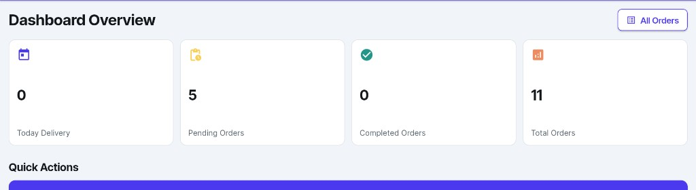
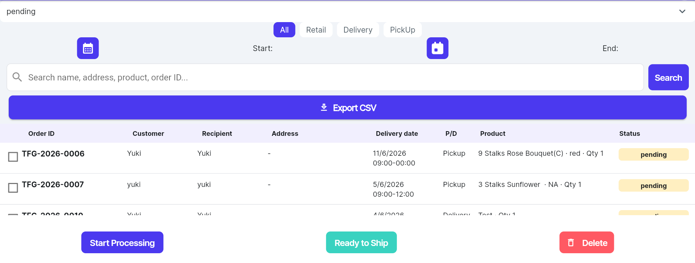
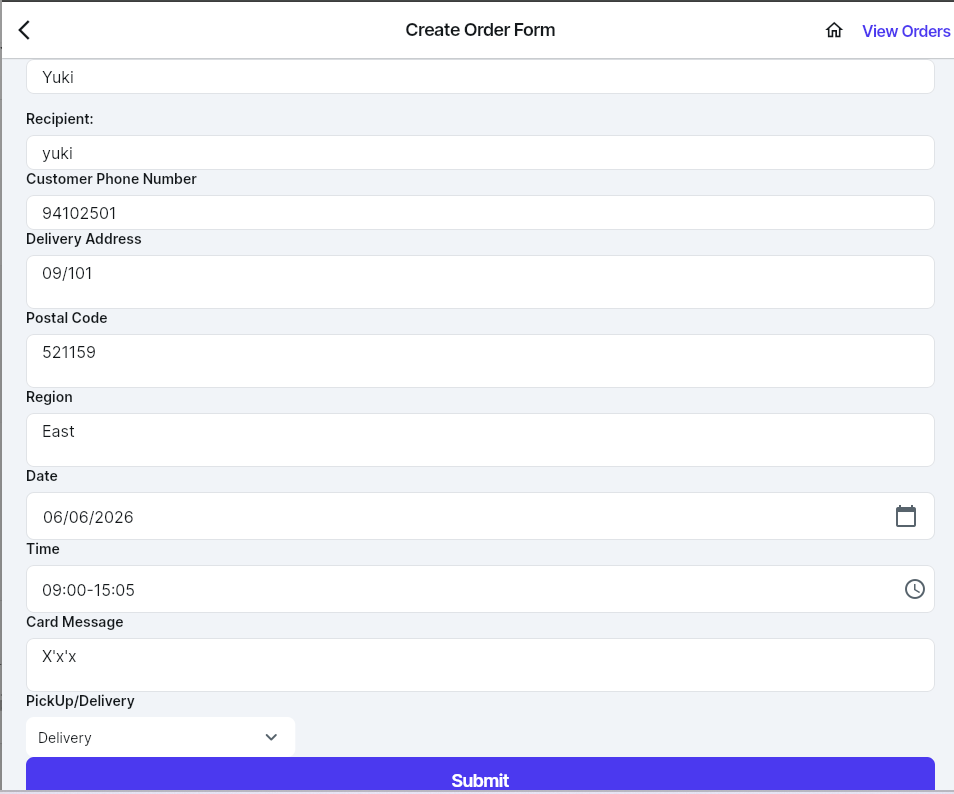
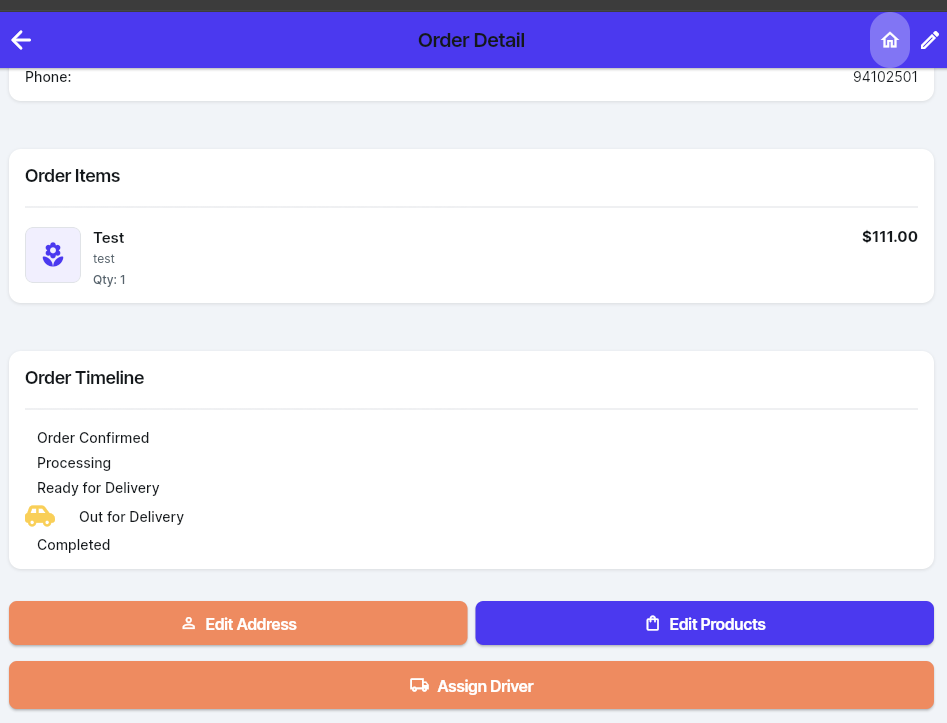
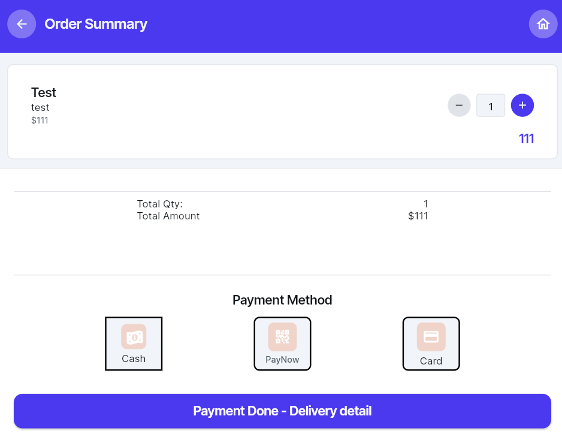
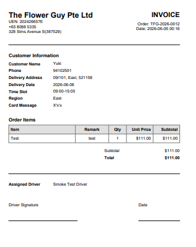
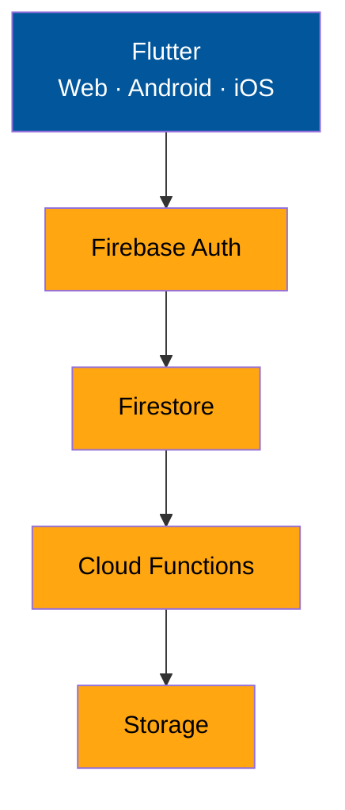

# TFG VDAY

Internal **florist POS + order + delivery** app for peak-season operations. **Flutter** + **Firebase** — staff-only, not a customer-facing shop.

**v1.0.3 (10)** · [Production web](https://tfg-sales-record.web.app)

> This repo is the only source of truth (Strategy A — no FlutterFlow re-export). See [docs/FLUTTERFLOW_FREEZE.md](docs/FLUTTERFLOW_FREEZE.md).

## Project Highlights

- **17 Modules** — orders, POS, delivery, customers, invoices, materials, reports, and more → [docs/FEATURES.md](docs/FEATURES.md)
- **10 User Roles** — superadmin + director, admin, manager, account, HR, payroll, florists, driver
- **33 Permissions** — granular RBAC matrix per company (`role_permissions`)
- **Shopify Integration** — webhook → Cloud Functions → Firestore
- **WhatsApp Order Import** — clipboard paste → review → delivery order
- **Multi-Tenant Architecture** — company-scoped data via Firestore `companyRef`

---

## Overview

One app for walk-in retail, phone/pre-orders, delivery scheduling, driver handoff, printing, and reporting — multi-tenant via Firestore `companyRef`.

| | |
|---|---|
| **Platforms** | Web · Android (prod / staging) · iOS |
| **Backend** | Firebase Auth, Firestore, Storage, Functions, Hosting |
| **Repository** | https://github.com/kahliantoo-rgb/tfg_vday |

---

## Screenshots

| Dashboard | Order list |
|:---:|:---:|
|  |  |

| Create order | Delivery detail |
|:---:|:---:|
|  |  |

| POS checkout | PDF invoice |
|:---:|:---:|
|  |  |

Thermal receipt · [docs/screenshots/receipt-printing.png](docs/screenshots/receipt-printing.png)

---

## Architecture

Multi-tenant SaaS — orders, customers, and permissions live in **Firestore**; photos and proofs in **Storage**; **Cloud Functions** handle Shopify import and staff push (FCM).

Full diagrams → **[docs/TECH_STACK.md](docs/TECH_STACK.md)** · **[docs/FIREBASE_STRUCTURE.md](docs/FIREBASE_STRUCTURE.md)**

---

## Key Features

- **Retail POS** — checkout, thermal receipts, production menu (florist prep sheet)
- **Orders & delivery** — status lifecycle, A4 PDF, driver assignments, delivery proof photos
- **Customers** — profiles, autocomplete on create order, WhatsApp / Email broadcast (optional inline photo)
- **Invoices** — credit billing, mark paid, payment proof upload
- **Import** — paste from WhatsApp; Shopify webhook → Firestore
- **Roles & permissions** — 10 staff roles + superadmin, 33 granular permissions per company
- **Catalog & materials** — products, BOM/recipes, usage & profit reports
- **Printing** — Bluetooth ESC/POS (mobile) · PDF A4 (all platforms)
- **Staff notices** — in-app bell + FCM push

Module-by-module detail → **[docs/FEATURES.md](docs/FEATURES.md)** (EN + 中文)

---

## Documentation

| Doc | What's inside |
|-----|----------------|
| **[FEATURES.md](docs/FEATURES.md)** | Feature guide / 功能说明 — modules, roles, permissions |
| **[WORKFLOW.md](docs/WORKFLOW.md)** | Workflows, screen map, printing, peak ops |
| **[TECH_STACK.md](docs/TECH_STACK.md)** | Architecture, dependencies, **run / build / deploy**, CI |
| **[FIREBASE_STRUCTURE.md](docs/FIREBASE_STRUCTURE.md)** | Firebase projects, services, deploy layout |
| **[DATABASE_SCHEMA.md](docs/DATABASE_SCHEMA.md)** | Firestore collections & fields / 数据库结构 |
| **[STAGING.md](docs/STAGING.md)** | Staging-first deploy workflow |
| **[SHOPIFY_WEBHOOK.md](docs/SHOPIFY_WEBHOOK.md)** | Shopify order import |
| **[OBSERVABILITY.md](docs/OBSERVABILITY.md)** | Crashlytics, Performance, offline queue |
| **[FLUTTERFLOW_FREEZE.md](docs/FLUTTERFLOW_FREEZE.md)** | Dev rules — protected files, no FF re-export |
| **[RUNBOOK_PEAK_OPERATIONS.md](docs/RUNBOOK_PEAK_OPERATIONS.md)** | Peak on-call ([中文](docs/RUNBOOK_PEAK_OPERATIONS.zh.md)) |
| **[SMOKE_TEST_LOG.md](docs/SMOKE_TEST_LOG.md)** | Test execution log |

---

## License

Private project — internal business use.
