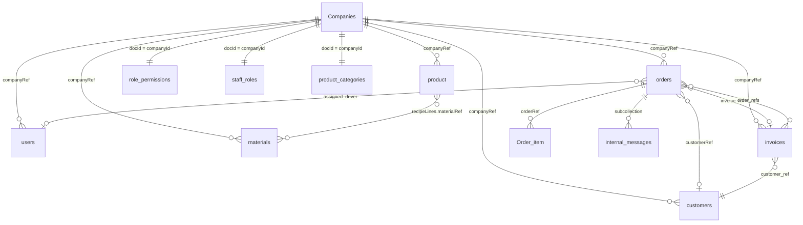

# TFG VDAY — Firestore Database Schema / 数据库结构

**Backend / 后端:** Firebase Firestore (`tfg-sales-record` production · `tfg-vday-record-staging` staging)

**Multi-tenant / 多租户:** Most business documents include `companyRef` → `Companies/{id}`  
绝大多数业务文档含 `companyRef` → `Companies/{id}`

**Production canonical company ID / 生产默认公司 ID:** `lc3Dhfby8f35Md0E1vZC` (`lib/backend/tenant_company_helpers.dart`)

**Schema source of truth / 源码定义:**  
`lib/backend/schema/*.dart` · `role_permissions_helpers.dart` · `staff_role_helpers.dart` · `product_category_helpers.dart`

**Rules / 规则:** `firebase/firestore.rules` · `firebase/storage.rules`

See also / 另见: [TECH_STACK.md](TECH_STACK.md) · [WORKFLOW.md](WORKFLOW.md)

---

## Entity relationship overview / 实体关系概览

---

## Enums / 枚举

Defined in `lib/backend/schema/enums/enums.dart`:

| Enum | Values |
|------|--------|
| **UserRole** | `superadmin`, `admin`, `director`, `manager`, `account`, `hr`, `payroll`, `senior_florist`, `florist`, `driver` |
| **OrderStatus** | `pending`, `processing`, `ready_to_delivery`, `out_of_delivery`, `completed`, `cancelled` |

`orders.status` (enum) and `orders.orderstatus` (legacy string) are synced on write via `order_status_helpers.dart`.  
`orders.status`（枚举）与 `orders.orderstatus`（legacy 字符串）写入时同步。

Legacy filter values / 旧版过滤值: `readyToShip`, `outOfDelivery`.

---

## Collection index / 集合索引

| Collection | Doc ID | Dart model / helper | 说明 |
|------------|--------|---------------------|------|
| `Companies` | auto | `CompaniesRecord` | 公司/租户 |
| `users` | **Auth UID** | `UsersRecord` | 员工档案 |
| `role_permissions` | `{companyId}` | `role_permissions_helpers.dart` | 权限矩阵覆盖 |
| `staff_roles` | `{companyId}` | `staff_role_helpers.dart` | 可分配角色列表 |
| `product_categories` | `{companyId}` | `product_category_helpers.dart` | 产品分类 |
| `orders` | auto | `OrdersRecord` | 订单主表 |
| `Order_item` | auto | `OrderItemRecord` | 订单行 |
| `product` | auto | `ProductRecord` | 产品目录 |
| `materials` | auto | `MaterialRecord` | 物料 |
| `customers` | auto | `CustomersRecord` | 客户 |
| `invoices` | auto | `InvoicesRecord` | 信用发票 |
| `customProduct` | auto | `CustomProductRecord` | 定制产品 |
| `counter` | `{companyId}_delivery_JUN26` etc. | `CounterRecord` | 订单号计数器 |
| `counters` | auto *(legacy)* | `CountersRecord` | 旧计数器（弃用） |
| `audit_logs` | auto | `AuditLogsRecord` | 审计/活动日志 |
| `deleted_orders` | auto | `DeletedOrdersRecord` | 已删订单归档 |
| `staff_notices` | auto | `StaffNoticesRecord` | 员工通知 |
| `orders/{id}/internal_messages` | auto | `InternalMessagesRecord` | 订单内消息（子集合） |

---

## `Companies/{companyId}` — 公司

| Field | Type | Description |
|-------|------|-------------|
| `Company_id` | string | Company identifier · 公司 ID |
| `Company_name` | string | Receipt / PDF header · 收据/PDF 抬头 |
| `Company_phone` | string | Phone · 电话 |
| `company_address` | string | Address · 地址 |
| `company_uen` | string | UEN · 注册号 |
| `is_active` | bool | Active flag · 是否启用 |
| `created_at` | timestamp | Created · 创建时间 |
| `logo` | string | Storage URL → `company_logos/` · Logo 链接 |

---

## `users/{authUid}` — 用户

Document ID **must equal** Firebase Auth UID.  
文档 ID **必须等于** Firebase Auth UID。

| Field | Type | Description |
|-------|------|-------------|
| `uid` | string | Must match doc id · 须与文档 ID 一致 |
| `name` | string | Display name · 姓名 |
| `email` | string | Login email · 邮箱 |
| `role` | UserRole | Staff role · 角色 |
| `companyRef` | ref → Companies | Required for staff; optional for superadmin · 员工必填 |
| `display_name` | string | Alternate display name · 显示名 |
| `photo_url` | string | Avatar URL · 头像 |
| `phone_number` | string | Phone · 电话 |
| `created_time` | timestamp | Profile created · 创建时间 |
| `is_active` | bool | `false` blocks login · `false` 禁止登录 |

Profile lookup: uid first, then email (`user_query_helpers.dart`).  
档案查找：先 uid，再 email。

---

## `role_permissions/{companyId}` — 角色权限

Per-company permission overrides (Director / Admin / Super Admin edit in UI).  
每公司权限覆盖（Director / Admin / Super Admin 在 UI 编辑）。

| Field | Type | Description |
|-------|------|-------------|
| `companyRef` | ref → Companies | Tenant · 租户 |
| `roles` | map | `{ roleKey: { permissionKey: bool } }` |
| `updated_time` | timestamp | Last update · 更新时间 |

- `roleKey` = `UserRole.serialize()` (e.g. `director`, `florist`)
- `permissionKey` = `AppPermission.name` — **33 keys** in `app_permissions.dart`
- Defaults in Dart; Firestore stores **overrides only** · 默认在代码，Firestore 只存覆盖
- `superadmin` is not configurable · 超管不在矩阵内

---

## `staff_roles/{companyId}` — 可分配角色

Roles shown in **Add Staff** UI · **添加员工** 时的角色下拉。

| Field | Type | Description |
|-------|------|-------------|
| `companyRef` | ref → Companies | Tenant · 租户 |
| `roles` | array\<string\> | Serialized `UserRole` values · 角色字符串数组 |
| `updated_time` | timestamp | Last update · 更新时间 |

---

## `orders/{orderId}` — 订单

| Field | Type | Description |
|-------|------|-------------|
| `Order_Id` | string | Display ID e.g. `TFG-JUN26-0001` · 显示编号 |
| `orderType` | string | `Retail` or `Delivery` · 零售/配送 |
| `status` | OrderStatus | Canonical lifecycle · 主状态 |
| `orderstatus` | string | Legacy mirror for filters · 旧版过滤字段 |
| `created_time` | timestamp | Order created · 创建时间 |
| `companyRef` | ref → Companies | Tenant · 租户 |
| **Customer / recipient / 客户与收花人** | | |
| `client_name` | string | Payer / Shopify ref name · 付款人/Shopify 参考名 |
| `recipientName` | string | Delivery recipient · 收花人 |
| `customer_phone_number` | string | Customer phone · 客户电话 |
| `recipient_phone_number` | string | Recipient phone · 收花人电话 |
| `customerRef` | ref → customers | Optional customer link · 客户关联 |
| **Delivery / 配送** | | |
| `address` | string | Delivery address · 地址 |
| `region` | string | Region · 区域 |
| `PostalCode` | string | Postal code · 邮编 |
| `autoRegion` | string | Auto-detected region · 自动区域 |
| `delivery_date` | timestamp | Scheduled date · 配送日期 |
| `delivery_time_slot` | string | e.g. `09:00-20:00` · 时段 |
| `delivery_time_actual` | timestamp | Actual completion time · 实际完成时间 |
| `pickup_delivery` | string | Pick-up vs delivery · 自取/配送 |
| `assigned_driver` | ref → users | Assigned driver · 指派司机 |
| `card_message` | string | Greeting card text · 贺卡信息 |
| **Payment / totals / 付款与合计** | | |
| `paymentType` | string | PayNow / Cash / Card · 付款方式 |
| `total` | number | Total · 合计 |
| `totalAmount` | number | Total amount · 总金额 |
| `totalQty` | int | Total quantity · 总件数 |
| `amount_paid` | number | Amount paid · 已付 |
| `balance_due` | number | Balance due · 欠款 |
| `cash_received` | number | Cash received · 收现 |
| `cash_change` | number | Change · 找零 |
| **Invoice link / 发票关联** | | |
| `invoice_ref` | ref → invoices | Linked invoice · 发票引用 |
| `invoice_number` | string | Invoice number · 发票号 |
| `invoice_payment_status` | string | Invoice payment status · 发票付款状态 |
| **External / import / 外部导入** | | |
| `source` | string | e.g. `shopify`, WhatsApp import · 来源 |
| `externalOrderId` | string | External system ID · 外部订单 ID |
| `externalOrderName` | string | External order name · 外部订单名 |
| **Cancellation / 取消** | | |
| `Cancel_reason` | string | Cancel reason · 取消原因 |
| `Cancelled_at` | timestamp | Cancelled at · 取消时间 |
| **Delivery proof / 送达凭证** | | |
| `delivery_proof_url` | string | Storage → `delivery_proof_images/` · 凭证 URL |
| `delivery_proof_at` | timestamp | Proof uploaded at · 上传时间 |
| **Legacy / misc / 遗留字段** | | |
| `ProductSelection` | ref | Legacy ref · 旧引用 |
| `current` | int | Legacy counter · 旧计数 |
| `currentrtl` | int | Legacy retail counter · 旧零售计数 |

### Subcollection / 子集合: `orders/{orderId}/internal_messages/{msgId}`

| Field | Type | Description |
|-------|------|-------------|
| `message` | string | Message text · 消息内容 |
| `sender` | ref → users | Sender · 发送者 |
| `created_time` | timestamp | Sent at · 发送时间 |
| `Order_ref` | ref → orders | Parent order · 所属订单 |

---

## `Order_item/{itemId}` — 订单行

| Field | Type | Description |
|-------|------|-------------|
| `orderRef` | ref → orders | Parent order · 所属订单 |
| `productRef` | ref → product | Catalog product · 目录产品 |
| `customProduct` | ref → customProduct | Custom line · 定制行 |
| `name` | string | Line name · 名称 |
| `sku` | string | SKU; includes `Customize` · 含定制 SKU |
| `qty` | int | Quantity · 数量 |
| `delivered_qty` | int | Partial delivery qty · 已送数量 |
| `price` | number | Unit price · 单价 |
| `subtotal` | number | Line subtotal · 小计 |
| `Remark` | string | Remark · 备注 |
| `image` | string | Custom photo URL · 定制图 URL |
| `companyRef` | ref → Companies | Tenant · 租户 |
| `orderId` | string | Denormalized order ID · 冗余订单号 |
| `client_name`, `address`, `region`, `cardmessage`, `customerphonenumber`, `status`, `deliverydate` | various | Legacy denormalized · 历史冗余字段 |

---

## `product/{productId}` — 产品

| Field | Type | Description |
|-------|------|-------------|
| `name` | string | Product name · 产品名 |
| `sku` | string | SKU · 货号 |
| `price` | number | Price · 价格 |
| `image` | string | → `product_images/` · 图片 URL |
| `category` | string | Category · 分类 |
| `isActive` | bool | Active · 是否上架 |
| `companyRef` | ref → Companies | Tenant · 租户 |
| `recipeLines` | array\<map\> | Bill of materials (BOM) · 物料配方 |

**`recipeLines[]` element / 配方元素:**

| Field | Type | Description |
|-------|------|-------------|
| `materialRef` | ref → materials | Material · 物料引用 |
| `materialName` | string | Material name · 物料名 |
| `qty` | number | Qty per product · 用量 |
| `unit` | string | Unit · 单位 |

---

## `materials/{materialId}` — 物料

| Field | Type | Description |
|-------|------|-------------|
| `name` | string | Material name · 名称 |
| `sku` | string | SKU · 货号 |
| `unit` | string | Unit e.g. stem, bunch · 单位 |
| `cost` | number | Unit cost (usage / profit reports) · 单位成本 |
| `isActive` | bool | Active · 是否启用 |
| `companyRef` | ref → Companies | Tenant · 租户 |

---

## `product_categories/{companyId}` — 产品分类

| Field | Type | Description |
|-------|------|-------------|
| `categories` | array\<string\> | Category names for picker · 分类列表 |
| `companyRef` | ref → Companies | Tenant · 租户 |

Doc ID = canonical company id. Falls back to code defaults if missing.  
文档 ID = 公司 ID；缺失时用代码默认值。

---

## `customers/{customerId}` — 客户

| Field | Type | Description |
|-------|------|-------------|
| `customer_id` | string | Customer ID · 客户编号 |
| `name` | string | Name · 姓名 |
| `phone` | string | Phone · 电话 |
| `email` | string | Email (broadcast) · 邮箱（群发） |
| `billing_address` | string | Billing address · 账单地址 |
| `uen` | string | UEN · 注册号 |
| `is_credit_customer` | bool | Credit customer · 是否信用客户 |
| `credit_term` | string | Credit terms · 账期 |
| `birthday` | timestamp | Birthday · 生日 |
| `created_time` | timestamp | Created · 创建 |
| `updated_time` | timestamp | Updated · 更新 |
| `companyRef` | ref → Companies | Tenant · 租户 |

---

## `invoices/{invoiceId}` — 发票

| Field | Type | Description |
|-------|------|-------------|
| `invoice_number` | string | Invoice number · 发票号 |
| `customer_ref` | ref → customers | Customer · 客户 |
| `customer_name` | string | Customer name snapshot · 客户名 |
| `credit_term` | string | Credit terms · 账期 |
| `order_refs` | array\<ref\> | Linked orders · 关联订单 |
| `order_ids` | array\<string\> | Display order numbers · 订单号列表 |
| `subtotal` | number | Subtotal · 小计 |
| `discount` | number | Discount amount · 折扣 |
| `discount_label` | string | Discount label · 折扣说明 |
| `total` | number | Total · 总计 |
| `status` | string | e.g. draft, sent, paid, void · 状态 |
| `created_time` | timestamp | Created · 创建 |
| `paid_at` | timestamp | Paid at · 付款时间 |
| `payment_proof_url` | string | → `invoice_payment_proof_images/` · 付款凭证 |
| `payment_proof_at` | timestamp | Proof uploaded at · 凭证上传时间 |
| `companyRef` | ref → Companies | Tenant · 租户 |

---

## `customProduct/{id}` — 定制产品

| Field | Type | Description |
|-------|------|-------------|
| `Name` | string | Name · 名称 |
| `Qty` | int | Quantity · 数量 |
| `Price` | number | Price · 价格 |
| `Remark` | string | Remark · 备注 |
| `orderRef` | ref → orders | Order · 订单 |
| `orderItem` | ref → Order_item | Line item · 订单行 |
| `companyRef` | ref → Companies | Tenant · 租户 |

---

## `counter/{counterDocId}` — 订单号计数器

Atomic transactions via `order_id_service.dart`.  
通过 `order_id_service.dart` 事务递增。

**Doc ID patterns / 文档 ID 格式:**

| Pattern | Example | Purpose |
|---------|---------|---------|
| `{companyId}_delivery_{MMMyy}` | `lc3Dhfby8f35Md0E1vZC_delivery_JUN26` | Delivery / pre-order · 配送/预订单 |
| `{companyId}_retail_{MMMyy}` | `…_retail_JUN26` | Retail walk-in · 零售 |
| `default_delivery_{MMMyy}` | Legacy shared · 旧共享计数器 | |
| `default_retail_{MMMyy}` | Legacy shared · 旧共享计数器 | |

| Field | Type | Description |
|-------|------|-------------|
| `current` | int | Last sequence number · 当前序号 |
| `comR` | ref → Companies | Optional tenant marker · 租户标记 |

Initialize: `npm run init:counters` from `firebase/`.  
初始化：`firebase/` 下运行 `npm run init:counters`。

---

## `counters/{id}` — 旧计数器 *(legacy / 弃用)*

| Field | Type | Description |
|-------|------|-------------|
| `current` | int | Counter · 计数 |
| `current1` | int | Secondary counter · 副计数 |
| `orderRef` | ref | Order ref · 订单引用 |

Prefer `counter/` for new deployments · 新部署请用 `counter/`。

---

## `audit_logs/{logId}` — 审计日志

Admin + order activity trail. Order Detail **Activity log** writes here.  
管理端与订单活动记录；订单详情「活动日志」写入此集合。

| Field | Type | Description |
|-------|------|-------------|
| `userId` | string | Actor uid · 操作人 ID |
| `userName` | string | Actor name · 操作人姓名 |
| `userRole` | string | Actor role · 角色 |
| `action` / `action_type` | string | Action code · 操作类型 |
| `entityType` / `entity_type` | string | Entity type · 实体类型 |
| `entityId` | string | Entity id · 实体 ID |
| `entityLabel` | string | Human label · 显示标签 |
| `entity_ref`, `entity_ref2` | ref | Legacy refs · 旧引用 |
| `oldValue`, `newValue` | map | Field diff · 字段变更 |
| `description` | string | Description · 说明 |
| `companyId` | string | Company id string · 公司 ID |
| `companyRef` | ref → Companies | Tenant · 租户 |
| `performed_by` | ref → users | Legacy performer · 旧操作人 |
| `is_impersonated` | bool | Impersonation flag · 模拟登录 |
| `createdAt` / `created_at` | timestamp | Created · 时间 |
| `before_value`, `after_value` | string | Legacy string diff · 旧字符串 diff |

---

## `deleted_orders/{id}` — 已删订单归档

Soft-delete archive before removal from `orders`.  
从 `orders` 删除前的软删除快照。

| Field | Type | Description |
|-------|------|-------------|
| `original_order_id` | string | Original Firestore doc id · 原文档 ID |
| `original_order_path` | string | Original path · 原路径 |
| `order_id` | string | Display order id · 显示订单号 |
| `order_data` | map | Full order snapshot · 订单快照 |
| `order_items` | array | Line item snapshots · 行项目快照 |
| `activity_log` | array | Activity entries · 活动日志 |
| `deleted_at` | timestamp | Deleted at · 删除时间 |
| `deleted_by_uid` | string | Deleter uid · 删除人 |
| `deleted_by_email` | string | Deleter email · 删除人邮箱 |
| `delete_reason` | string | Reason · 原因 |
| `original_order_status` | string | Status before delete · 删除前状态 |
| `is_restored` | bool | Restored flag · 是否已恢复 |
| `restored_at` | timestamp | Restored at · 恢复时间 |
| `restored_by_uid` | string | Restorer uid · 恢复人 |
| `restored_by_email` | string | Restorer email · 恢复人邮箱 |
| `companyRef` | ref → Companies | Tenant · 租户 |

---

## `staff_notices/{noticeId}` — 员工通知

In-app bell + FCM push (`staff_notice_push.js`).  
应用内铃铛 + FCM 推送。

| Field | Type | Description |
|-------|------|-------------|
| `type` | string | Notice type · 类型 |
| `recipient_user_ref` | ref → users | Recipient · 接收人 |
| `order_ref` | ref → orders | Related order · 相关订单 |
| `order_id` | string | Order display id · 订单号 |
| `delivery_date` | timestamp | Delivery date · 配送日 |
| `item_summary` | string | Item summary · 商品摘要 |
| `message` | string | Message body · 消息 |
| `created_time` | timestamp | Created · 创建 |
| `read_at` | timestamp | Read at · 已读时间 |
| `companyRef` | ref → Companies | Tenant · 租户 |

---

## Firebase Storage paths / 文件存储路径

Not Firestore — documents store download URLs.  
非 Firestore，文档存 URL 指向以下路径。

| Storage path | Used by / 用途 |
|--------------|----------------|
| `product_images/` | Product catalog · 产品图 |
| `company_logos/` | Company logo · 公司 Logo |
| `custom_product_images/` | Custom order line photos · 定制行图片 |
| `delivery_proof_images/{orderId}/` | Driver delivery proof · 送达凭证 |
| `invoice_payment_proof_images/{invoiceId}/` | Invoice payment proof · 发票付款凭证 |
| `customer_broadcast_images/{companyId}/` | Broadcast photos · 群发图片 |
| `users/{userId}/` | Private user files · 用户私有文件 |

All uploads compressed to **≤ 2 MB** (`image_compress_helpers.dart`).  
上传前压缩至 **≤ 2 MB**。

Public read on business paths for web `` tags (`storage.rules`).  
业务图片路径公开读，供 Web 显示。

---

## Order ID formats / 订单号格式

| Type | Format | Counter doc |
|------|--------|-------------|
| Delivery / pre-order · 配送/预订单 | `TFG-JUN26-0001` | `{companyId}_delivery_{MMMyy}` |
| Retail walk-in · 零售 | `TFG-JUN26-WI0001` | `{companyId}_retail_{MMMyy}` |

Month suffix: English `MMMyy` (`JUN26`, `JUL26`, …). Legacy IDs still valid.  
月份后缀：英文 `MMMyy`。旧格式（如 `TFG-2026-0001`）仍有效。

---

## Composite indexes / 复合索引

Defined in `firebase/firestore.indexes.json`.

Common patterns / 常见查询:

- `orders`: `companyRef` + `created_time` / `delivery_date` / `orderstatus`
- `customers`: `companyRef` + `name`
- `invoices`: `companyRef` + `created_time`
- `Order_item`: `orderRef`

Deploy: `npm run deploy:rules:staging` or `deploy_production_web.ps1`.  
部署：staging rules 或 production 部署脚本。

---

## Driver field update constraint / 司机可写字段

Firestore rules — drivers may update **only** on existing orders:  
Firestore 规则 — 司机只能改以下字段：

- `status`
- `orderstatus`
- `delivery_time_actual`
- `delivery_proof_url`
- `delivery_proof_at`

---

## Related documentation / 相关文档

| Doc | EN | 中文 |
|-----|----|------|
| [WORKFLOW.md](WORKFLOW.md) | Business flows | 业务流程 |
| [TECH_STACK.md](TECH_STACK.md) | Architecture & stack | 技术线 |
| [STAGING.md](STAGING.md) | Deploy rules / indexes | 规则与索引部署 |
| [SHOPIFY_WEBHOOK.md](SHOPIFY_WEBHOOK.md) | `orders.source`, `externalOrderId` | Shopify 字段 |

---

*Schema reflects `tfg_vday` at app version **v1.0.3 (10)**.*

*对应应用版本 **v1.0.3 (10)**。*
