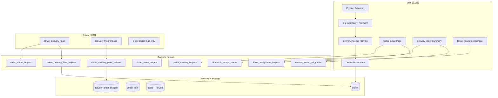
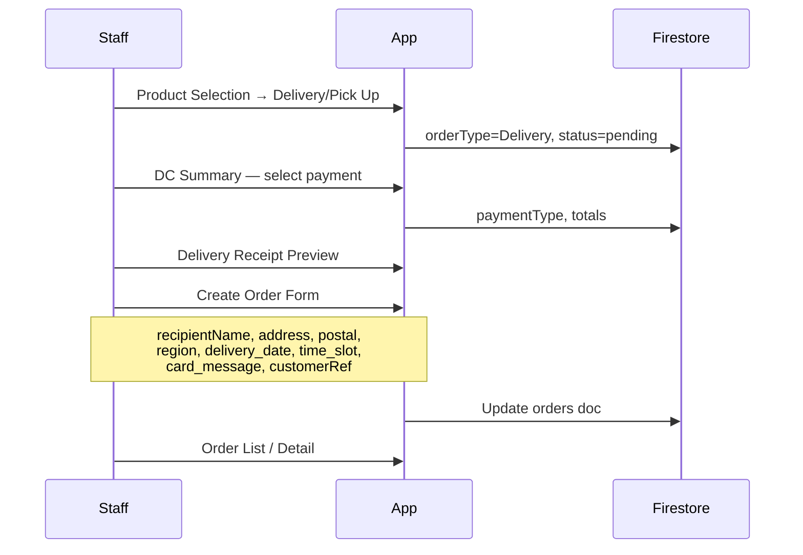
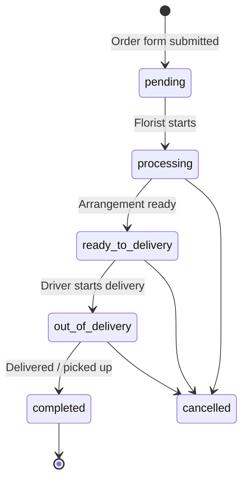
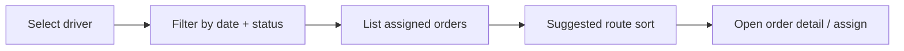

# TFG VDAY — Delivery Module / 配送模块

Deep dive into **delivery & pick-up orders**, **driver operations**, **dispatch**, and **delivery documents**.  
**配送/自取订单**、**司机操作**、**派单调度** 与 **配送单据** 的专项说明。

| Item | Detail |
|------|--------|
| **App version** | `v1.0.3 (10)` |
| **Related docs** | [ORDER_WORKFLOW.md](ORDER_WORKFLOW.md) · [DATABASE_SCHEMA.md](DATABASE_SCHEMA.md) · [PERMISSION_MATRIX.md](PERMISSION_MATRIX.md) |

---

## 1. Module scope / 模块范围

| In scope | Out of scope |
|----------|--------------|
| Delivery & pick-up order checkout | Retail walk-in POS (see `lib/pos/`) |
| Create Order Form (address, schedule) | Online payment gateway |
| Driver My Deliveries app | GPS route optimization API |
| Staff driver assignments & suggested route | Real-time fleet tracking |
| Delivery proof photos | Customer self-service tracking portal |
| PDF A4 & thermal delivery slips | |
| Partial delivery per line item | |

**Order types covered:** `orderType = Delivery` with `pickup_delivery` = `Delivery` or `Pick Up`.  
Retail orders (`orderType = Retail`) exit this module at checkout with `status = completed`.

---

## 2. Module architecture / 模块架构



---

## 3. Staff delivery checkout flow / 员工配送结账流程



### 3.1 Screens & routes

| Screen | Route | Purpose |
|--------|-------|---------|
| DC Summary | `/deliverySummaryCopy` | Payment step (Cash / PayNow / Card) |
| Delivery Receipt Preview | `/deliveryreceiptPreviewPage` | Priced receipt preview before form |
| Create Order Form | `/createOrderForm` | Customer & delivery details |
| Delivery Order Summary | `/deliveryOrderSummaryPage` | Print PDF / thermal · review |
| Delivery Order Print | `/deliveryOrderPrint` · `/dO` | A4 preview / share |
| Order Detail | `/orderDetailPage` | Status, driver, proof, partial delivery |

**Code paths:** `lib/delivery/` · `lib/pages/create_order_form/` · `lib/pages/delivery_order_summary_page/`

### 3.2 Key Firestore fields / 关键字段

| Field | Purpose |
|-------|---------|
| `Order_Id` | Display number e.g. `TFG-JUN26-0001` |
| `orderType` | `Delivery` |
| `pickup_delivery` | `Delivery` or `Pick Up` |
| `client_name` | Payer / reference name |
| `recipientName` | Delivery recipient |
| `customer_phone_number` | Customer profile phone |
| `recipient_phone_number` | Recipient contact (may differ) |
| `address`, `region`, `PostalCode`, `autoRegion` | Location |
| `delivery_date`, `delivery_time_slot` | Schedule |
| `delivery_time_actual` | Actual completion timestamp |
| `card_message` | Greeting card text |
| `customerRef` | Optional link to `customers/{id}` |
| `assigned_driver` | Ref to `users/{driverUid}` |
| `status` / `orderstatus` | Lifecycle (synced on write) |
| `delivery_proof_url`, `delivery_proof_at` | Driver proof photo |

Full schema: [DATABASE_SCHEMA.md](DATABASE_SCHEMA.md)

---

## 4. Order fulfillment lifecycle / 履约生命周期



| Transition | Typical actor | UI |
|------------|---------------|-----|
| → `processing` | Florist | Order Detail · Order List bulk |
| → `ready_to_delivery` | Senior florist | Same |
| → `out_of_delivery` | Driver | Driver Delivery Page |
| → `completed` | Driver / staff | Driver app · staff override |
| → `cancelled` | Admin / manager | Order Detail |

**Status write helper:** `updateOrderStatus()` — `lib/backend/order_status_helpers.dart`

Pick-up orders follow the same status path; final step may be staff marking **completed** when customer collects.

---

## 5. Driver subsystem / 司机子系统

### 5.1 Authentication & routing

| Item | Detail |
|------|--------|
| Login | Same Firebase Auth as staff |
| Post-login | Always `/driverDeliveryPage` — `lib/auth/auth_redirect.dart` |
| Allowed routes | `/`, `/loginPage`, `/driverDeliveryPage`, `/orderDetailPage` |
| Blocked | Sales Dashboard, create order, admin menus |

### 5.2 My Deliveries page

**Route:** `/driverDeliveryPage` · **Widget:** `DriverDeliveryPageWidget`

**Query:**

```dart
orders.where('assigned_driver', isEqualTo: currentUserRef)
```

Only orders **explicitly assigned** to the logged-in driver appear. Unassigned orders are invisible to drivers.

**Status chips:**

| Chip | Filtered statuses |
|------|-------------------|
| **All** | All assigned, not cancelled |
| **Assigned** | `processing` + `ready_to_delivery` |
| **Out for Delivery** | `out_of_delivery` |
| **Completed** | `completed` |

Optional date range filter on `delivery_date` (fallback `created_time`).

**Sort:** `delivery_date` ascending → `delivery_time_slot`

**Implementation:** `lib/backend/driver_delivery_filter_helpers.dart` · `lib/components/driver_delivery_order_card.dart`

### 5.3 Driver actions per order

| Current status | Action | New status |
|----------------|--------|------------|
| `processing` / `ready_to_delivery` | Start delivery | `out_of_delivery` |
| `out_of_delivery` | Mark delivered (+ optional proof) | `completed` |
| `completed` | — (read-only) | — |

**Extra fields on complete:** `delivery_time_actual`, optional `delivery_proof_url`, `delivery_proof_at`

### 5.4 Delivery proof

| Item | Detail |
|------|--------|
| When | Completing delivery (`out_of_delivery` → `completed`) |
| Storage path | `delivery_proof_images/{orderId}/…` |
| Max size | 2 MB (client compression) |
| Staff view | Order Detail → `OrderDeliveryProofSection` |

**Implementation:** `lib/backend/driver_delivery_proof_helpers.dart` · `lib/components/driver_delivery_proof_panel.dart`

### 5.5 Firestore write constraint

Drivers may **only** update these fields on existing orders:

- `status`
- `orderstatus`
- `delivery_time_actual`
- `delivery_proof_url`
- `delivery_proof_at`

Enforced in `firebase/firestore.rules`.

---

## 6. Staff dispatch — Driver Assignments / 员工派单

**Route:** `/driverAssignmentsPage` · **Permission:** `assignDriver`



| Feature | Detail |
|---------|--------|
| Driver list | Active `users` where `role = driver`, company-scoped |
| Order filter | `assigned_driver == selected driver` |
| Date range | Filter on `delivery_date` |
| Status tabs | Same chips as driver view |
| **Suggested route** | Sort by `delivery_date` then `delivery_time_slot` — address text only |

**Assign driver:** Order Detail → set `assigned_driver` ref to driver’s `users/{uid}`.

**Implementation:** `lib/pages/driver_assignments_page/` · `lib/backend/driver_assignment_helpers.dart` · `lib/backend/driver_route_helpers.dart`

**Note:** Driver Assignments is for **dispatch planning**. The driver app only shows orders where `assigned_driver` matches the logged-in user.

---

## 7. Partial delivery / 部分送达

Staff can deliver line items in multiple runs without closing the whole order immediately.

| Concept | Storage |
|---------|---------|
| Per-line progress | `Order_item.delivered_qty` |
| Run history | `orders.partial_delivery_runs[]` (optional) |
| Completion | Order → `completed` when all lines fully delivered |

**Implementation:** `lib/backend/partial_delivery_helpers.dart` · Order Detail UI

---

## 8. Delivery documents / 配送单据

### 8.1 PDF A4 delivery order

| Item | Detail |
|------|--------|
| Module | `lib/custom_code/delivery_order_pdf_printer.dart` |
| Packages | `pdf`, `printing` |
| Platform | Web, Android, iOS, desktop |
| Content | Company header, order #, customer & delivery details, items table, totals, driver name, signature lines |

**Print entry points:**

| Screen | Action |
|--------|--------|
| Delivery Order Summary | **Print PDF (A4)** |
| Delivery Receipt Preview | **PDF A4** |
| Delivery Order Print (`/deliveryOrderPrint`, `/dO`) | App bar print / share |

### 8.2 Thermal delivery slip (no prices)

| Item | Detail |
|------|--------|
| Module | `lib/custom_code/bluetooth_receipt_printer.dart` |
| Platform | Android & iOS only |
| Content | Delivery info, items, addresses — **no prices** |

**Entry:** Delivery Order Summary → **Print thermal (delivery order)**

### 8.3 Priced receipt

Delivery Receipt Preview and Order Detail can print **priced** thermal receipts (same as retail path).

### 8.4 Production menu

Florist prep sheet — item names, qty, remarks; **no prices**.  
Entry: Order Detail → **Production menu** · `/productionMenuPreviewPage`

---

## 9. External delivery order sources / 外部建单来源

| Source | Flow | Initial status |
|--------|------|----------------|
| **Staff create** | Product Selection → Delivery branch | `pending` |
| **WhatsApp paste** | Dashboard paste → review → form | `pending` |
| **Shopify webhook** | Cloud Function import | `pending` (typical) |

WhatsApp & Shopify set delivery fields automatically; staff still assign drivers and advance status.

---

## 10. Maps integration / 地图集成

Drivers and staff can open delivery addresses in an external maps app.

**Service:** `lib/services/google_maps_service.dart` — launches platform map URL from address string.

No embedded turn-by-turn navigation or route optimization in-app.

---

## 11. Notifications / 通知

New delivery orders (e.g. Shopify import) can create `staff_notices` documents → FCM push via `onStaffNoticeCreated` Cloud Function.

**Client:** Staff bell icon · `lib/backend/staff_notice_alert_service.dart`

---

## 12. Permissions / 权限

| Action | Permission |
|--------|------------|
| Create delivery order | `createOrders` |
| View orders | `viewOrders` |
| Update status (staff) | `updateOrderStatus` |
| Assign driver | `assignDriver` |
| Driver status updates | `updateOrderStatus` (driver role default) |
| Print invoice / receipt | `printCashInvoice` |
| View delivery proof | `viewOrders` |
| Driver Assignments page | `assignDriver` |

Full matrix: [PERMISSION_MATRIX.md](PERMISSION_MATRIX.md)

---

## 13. Reporting touchpoints / 报表相关

| Report | Delivery-specific logic |
|--------|-------------------------|
| Dashboard tomorrow stats | Counts delivery orders by `delivery_date` |
| Order list type chip **Delivery** | `pickup_delivery` contains "deliver" |
| Pick-up CSV export | `exportOrdersItemsPickupCsv` custom action |
| Daily sales | Includes delivery orders paid at DC Summary |

---

## 14. Smoke test checklist / 冒烟测试

See [WORKFLOW.md](WORKFLOW.md) §17 — Staff creates delivery order → assigns driver → driver advances to `completed` → staff verifies proof & status.

**Test driver account:** `tfg.driver.smoke@gmail.com` (documented in WORKFLOW.md)

---

## 15. Implementation index / 实现索引

| File | Purpose |
|------|---------|
| `lib/delivery/d_c_summary_copy/` | Delivery payment summary |
| `lib/delivery/delivery_receipt_preview_page/` | Receipt preview |
| `lib/delivery/delivery_order_print/` | A4 print screen |
| `lib/pages/create_order_form/` | Customer & delivery form |
| `lib/pages/delivery_order_summary_page/` | Summary + print actions |
| `lib/driver_delivery_page/` | Driver My Deliveries |
| `lib/pages/driver_assignments_page/` | Staff dispatch |
| `lib/backend/driver_delivery_filter_helpers.dart` | Driver list filters |
| `lib/backend/driver_assignment_helpers.dart` | Driver queries |
| `lib/backend/driver_route_helpers.dart` | Suggested route sort |
| `lib/backend/driver_delivery_proof_helpers.dart` | Proof upload |
| `lib/backend/partial_delivery_helpers.dart` | Partial delivery runs |
| `lib/backend/order_status_helpers.dart` | Status sync |
| `lib/custom_code/delivery_order_pdf_printer.dart` | PDF generation |
| `lib/custom_code/bluetooth_receipt_printer.dart` | Thermal print |
| `lib/components/driver_delivery_order_card.dart` | Driver order card UI |
| `lib/components/order_delivery_proof_section.dart` | Staff proof viewer |
| `lib/auth/role_route_guard.dart` | Driver route restrictions |

---

*Delivery module documentation for `tfg_vday` at version **v1.0.3 (10)**.*

*对应应用版本 **v1.0.3 (10)**。*
