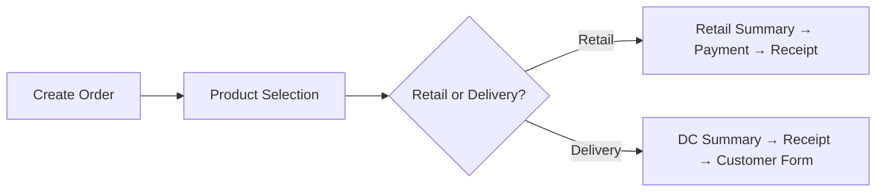

# TFG VDAY — Feature Guide / 功能说明

Internal **florist POS + order + delivery** app for staff — **not** a customer-facing online shop.

内部 **花店 POS + 订单 + 配送** 员工系统 — **不是** 面向顾客的商城。

| Audience / 使用对象 | Staff, florists, drivers, admins · 员工、花艺师、司机、管理员 |
| Platforms / 平台 | Web · Android · iOS |
| Current version / 版本 | `v1.0.3 (10)` |

**Related docs / 相关文档:** [WORKFLOW.md](WORKFLOW.md) · [TECH_STACK.md](TECH_STACK.md) · [DATABASE_SCHEMA.md](DATABASE_SCHEMA.md)

---

## 1. Product overview / 产品概述

| EN | 中文 |
|----|------|
| Handle **walk-in retail** (POS), **phone/pre-orders**, and **delivery** in one app | 同一应用处理 **门店零售**、**电话/预订单**、**配送** |
| Multi-company (**tenant**) for platform owner; single company for most staff | 超管可跨公司；一般员工只看本公司 |
| Peak-season ready: order IDs, bulk ops, offline queue, staging environment | 旺季就绪：订单号、批量操作、离线队列、staging 环境 |
| Integrations: **WhatsApp paste**, **Shopify webhook**, **WhatsApp/Email broadcast** | 集成：**WhatsApp 粘贴**、**Shopify**、**客户群发** |

---

## 2. User roles / 用户角色

| Role | EN | 中文 | Typical access |
|------|----|------|----------------|
| **superadmin** | Platform owner; all companies | 平台超管；全部公司 | Companies CRUD, cross-tenant view |
| **director** | Company director | 总监 | Full ops + **role permissions** |
| **admin** | Company admin | 管理员 | Staff, settings, permissions |
| **manager** | Operations lead | 经理 | Orders, staff (per matrix) |
| **account** | Billing focus | 账务 | Invoices (per matrix) |
| **hr** / **payroll** | HR / payroll | 人事 / 薪酬 | Staff-related (per matrix) |
| **senior_florist** | Senior florist | 高级花艺师 | Orders, products, print, CSV |
| **florist** | Florist | 花艺师 | Limited order/product access |
| **driver** | Delivery driver | 司机 | **My Deliveries** only |

Effective permissions = **code defaults** + Firestore **`role_permissions`** overrides.  
实际权限 = 代码默认 + Firestore **`role_permissions`** 覆盖。

Configurable via **Role Permissions** UI (Director / Admin / Super Admin).  
可在 **Role Permissions** 页面按角色开关 **33 项**权限。

---

## 3. Sales Dashboard / 销售主页

Central hub after login (non-driver roles).  
非司机角色登录后的中心页。

### Primary actions / 主要操作

| Feature | EN | 中文 | Entry |
|---------|----|------|-------|
| **Create Order** | New order + product selection | 新建订单 | Dashboard button |
| **Paste from WhatsApp** | Parse clipboard → delivery order | 粘贴 WhatsApp 文本建单 | Dashboard button |
| **Tomorrow stats** | Delivery / total order counts | 明日配送/订单统计 | Stat cards → filtered list |

### Menu sections / 菜单分区 (bilingual labels)

| Section | Items | Permission-gated |
|---------|-------|------------------|
| **Orders 订单** | All Orders · Driver Assignments · Deleted Orders | assignDriver, viewDeletedOrders |
| **Customers & Billing 客户与账务** | Customers · Invoice List | viewCustomers, viewInvoices |
| **Catalog & Production 产品与物料** | Product List · Material List | manageProducts |
| **Reports 报表** | Sales Report · Material Usage · Profit Summary | various |
| **Admin 管理** | User List · Company Profile · Audit Log | staff / company / audit |
| **Account 账户** | Logout | all |

---

## 4. Orders / 订单管理

### 4.1 Create order flow / 建单流程

| Step | EN | 中文 |
|------|----|------|
| Product selection | Catalog grid, categories, search, custom SKU | 选产品、分类、搜索、定制 |
| **Retail** | Immediate payment; ID `TFG-MMMYY-WI000n`; status completed | 零售结账；零售单号；已完成 |
| **Delivery / Pick-up** | Payment step; ID `TFG-MMMYY-000n`; status pending | 配送/自取；配送单号；待处理 |
| Customer form | Address, date, time slot, card message, recipient phone | 地址、日期、时段、贺卡、收花人电话 |

### 4.2 Order IDs / 订单号

| Type | Format | 类型 |
|------|--------|------|
| Delivery | `TFG-JUN26-0001` | 配送/预订单 |
| Retail | `TFG-JUN26-WI0001` | 门店零售 |

Auto-generated via Firestore counter (per company, per month).  
按公司、按月 Firestore 计数器自动生成。

### 4.3 Order list / 订单列表

| Feature | EN | 中文 |
|---------|----|------|
| Filters | Date range, status, order type (Retail/Delivery/Pick-up) | 日期、状态、类型筛选 |
| Search | Order ID, customer, phone | 搜索 |
| Bulk status update | Multi-select → change status | 批量改状态 |
| Export | CSV (permission) | CSV 导出 |

### 4.4 Order detail / 订单详情

| Feature | EN | 中文 |
|---------|----|------|
| **Activity log** | Who changed what, when | 操作记录（By 用户） |
| **Edit Products** | Inline add/remove line items | 内联增删商品 |
| **Update Status** | Lifecycle transitions | 更新状态 |
| **Assign driver** | Link to `users` (driver role) | 指派司机 |
| **Delivery proof** | View driver-uploaded photo | 查看送达凭证 |
| **Production menu** | Florist prep sheet (no prices) | 制作单（无价格） |
| **Print** | Thermal receipt / PDF invoice | 热敏小票 / PDF |
| **Partial delivery** | Deliver qty per line | 部分送达 |
| **Delete** | Archive to `deleted_orders` | 归档删除 |

### 4.5 Order status lifecycle / 订单状态

| Status | EN | 中文 | Typical actor |
|--------|----|------|---------------|
| `pending` | New delivery order | 新单 | Staff |
| `processing` | Florist working | 制作中 | Florist |
| `ready_to_delivery` | Ready to ship | 待配送 | Florist |
| `out_of_delivery` | Driver en route | 配送中 | Driver |
| `completed` | Done | 已完成 | Driver / staff |
| `cancelled` | Cancelled | 已取消 | Staff |

Retail orders typically go straight to **completed** at checkout.  
零售单结账后通常为 **completed**。

### 4.6 Deleted orders / 已删订单

| Feature | EN | 中文 |
|---------|----|------|
| Archive | Full snapshot before delete | 删除前完整快照 |
| Restore | Put back into active orders | 恢复 |
| Permanent delete | Remove archive (permission) | 永久删除归档 |

---

## 5. WhatsApp & external import / WhatsApp 与外部导入

### 5.1 Paste from WhatsApp / WhatsApp 粘贴建单

| Item | Detail |
|------|--------|
| Entry | Dashboard → **Paste from WhatsApp** |
| Input | Clipboard text (recipient, phone, address, message, date) |
| Output | Always **Delivery** order + new `TFG-MMMYY-000n` ID |
| Default time slot | `09:00-20:00` if not parsed |
| Shopify `#` in text | Maps to `client_name` only |

### 5.2 Shopify webhook / Shopify 对接

| Item | Detail |
|------|--------|
| Trigger | Shopify `orders/create` → Cloud Function |
| Result | Firestore delivery order + staff notice + audit log |
| Config | [SHOPIFY_WEBHOOK.md](SHOPIFY_WEBHOOK.md) |

---

## 6. Retail POS / 门店零售

| Feature | EN | 中文 |
|---------|----|------|
| Checkout | Cash / PayNow / Card; change calculation | 现金/PayNow/卡；找零 |
| Receipt preview | Priced thermal receipt | 有价热敏小票 |
| **Production menu** | Separate florist prep list | 制作单（与顾客小票分开） |
| Bluetooth print | ESC/POS via paired printer (mobile) | 蓝牙热敏打印 |

---

## 7. Delivery & drivers / 配送与司机

### 7.1 Delivery documents / 配送单据

| Output | EN | 中文 | Platform |
|--------|----|------|----------|
| **PDF A4** | Delivery order with items, address, signature lines | 配送 A4 单 | Web + mobile |
| **Thermal delivery slip** | No prices — delivery info only | 配送热敏单（无价格） | Android / iOS |
| **Priced receipt** | Full receipt with totals | 有价小票 | Android / iOS |

### 7.2 Driver app / 司机端

| Feature | EN | 中文 |
|---------|----|------|
| **My Deliveries** | Only screen after login | 登录后唯一主界面 |
| Status chips | Filter by order status | 按状态筛选 |
| Advance status | processing → … → completed | 逐步推进状态 |
| **Delivery proof** | Optional photo on completion (≤ 2 MB) | 完成时可上传送达照片 |

### 7.3 Driver assignments (staff) / 司机派单（员工）

| Feature | EN | 中文 |
|---------|----|------|
| Select driver | Company drivers list | 选择本公司司机 |
| Assigned orders | Orders with `assigned_driver` | 已指派订单 |
| Date / status filter | Plan daily runs | 按日期、状态筛选 |
| **Suggested route** | Sort by delivery date + time slot | 按配送日+时段排序建议路线 |

Permission: **`assignDriver`**

---

## 8. Customers / 客户管理

| Feature | EN | 中文 |
|---------|----|------|
| CRUD | Name, phone, email, billing address, UEN, birthday | 增删改查客户资料 |
| Credit customer | Flag + credit terms | 信用客户与账期 |
| Autocomplete | Link customer on Create Order Form | 建单页自动关联客户 |
| Recipient phone | Separate from customer phone | 收花人电话独立字段 |
| **Broadcast** | Message many customers at once | 群发消息 |

### Broadcast / 群发

| Channel | EN | 中文 |
|---------|----|------|
| **WhatsApp** | Open `wa.me` per customer; optional photo URL in message | 逐个打开 WhatsApp；可附图片链接 |
| **Email 群发** | BCC in mail app; optional photo as **inline HTML** (paste into body) | 邮件 BCC；图片内嵌正文（粘贴） |

Optional photo uploads to Storage (`customer_broadcast_images/`).

---

## 9. Invoices (credit) / 发票（信用账）

| Feature | EN | 中文 |
|---------|----|------|
| Invoice list | Filter, search credit invoices | 发票列表 |
| Create / edit | Link orders, discounts, totals | 创建/编辑；关联订单 |
| Void | Cancel invoice (permission) | 作废 |
| **Mark as paid** | Optional **payment proof** photo | 标记已付；可选付款凭证 |
| Customer link | Tied to credit customer profile | 关联信用客户 |

Permissions: `viewInvoices`, `createInvoices`, `editInvoices`, `voidInvoices`, `markInvoicesPaid`

---

## 10. Catalog & materials / 产品与物料

### 10.1 Products / 产品

| Feature | EN | 中文 |
|---------|----|------|
| Product list | SKU, price, image, category, active flag | 产品列表 |
| Categories | Per-company list in `product_categories` | 分类管理 |
| Custom product | One-off line on order (`Customize` SKU) + optional photo | 订单定制行 + 可选照片 |
| Import | CSV product import (admin) | CSV 导入 |

### 10.2 Materials & recipes / 物料与配方

| Feature | EN | 中文 |
|---------|----|------|
| Material list | Name, unit, unit cost, SKU | 物料清单与单位成本 |
| **Product recipe (BOM)** | Materials + qty per product | 产品配方（物料用量） |
| Used by | Material usage & profit reports | 供用量与利润报表使用 |

---

## 11. Reports / 报表

| Report | EN | 中文 | Basis |
|--------|----|------|-------|
| **Daily sales** | Orders, totals, PayNow/Cash/Card breakdown | 日销售；付款方式分项 | Paid, non-cancelled orders by `created_time` |
| **Material usage** | Qty consumed from completed orders | 物料用量 | Product recipes × order lines |
| **Profit summary** | Sales − material cost − manual expenses | 利润汇总 | Sales − BOM cost − utility/salary/adhoc (manual fields) |
| **CSV export** | Orders / line items / pick-up lists | CSV 导出 | Permission: `exportOrdersCsv` |
| **Dashboard stats** | Tomorrow delivery & total counts | 明日配送/订单数 | Quick cards on dashboard |

---

## 12. Printing / 打印

| Need | Where | Platform |
|------|-------|----------|
| Priced thermal receipt | Receipt preview · Order detail | Android / iOS |
| Delivery slip (no prices) | Delivery summary | Android / iOS |
| PDF A4 delivery order | Delivery summary / print screen | All |
| PDF customer invoice | Order detail | All |
| **Production menu** | Order detail · Retail summary | All (preview) |

**Logo:** Full-colour PNG in Company Settings; thermal auto-converts to monochrome at print.  
**Logo：** 公司设置上传彩色图；热敏打印时自动转黑白。

---

## 13. Staff & admin / 员工与管理

| Feature | EN | 中文 |
|---------|----|------|
| **User List** | Name, role, active/inactive | 员工列表 |
| **Add Staff** | Admin creates accounts (no public signup) | 管理员添加账号 |
| **Role Permissions** | Toggle 33 permissions per role | 按角色配置权限 |
| Set inactive | Block login without deleting Auth | 停用（禁止登录） |
| Delete profile | Remove Firestore `users` doc only | 删除档案（Auth 账号仍在） |
| **Company Profile** | Name, UEN, address, logo | 公司资料 |
| **Audit Log** | Admin actions trail | 操作审计 |
| **Staff notices** | Bell icon — new order alerts | 铃铛通知；FCM 推送 |

**Superadmin:** Switch company / view all companies.  
**超管：** 切换公司 / 查看全部公司。

---

## 14. Platform capabilities / 平台能力

| Feature | Web | Android | iOS |
|---------|-----|---------|-----|
| Full staff workflows | ✅ | ✅ | ✅ |
| Driver deliveries | ✅ | ✅ | ✅ |
| Bluetooth thermal | ❌ | ✅ | ✅ |
| PDF print / share | ✅ | ✅ | ✅ |
| Offline write queue | ✅ | ✅ | ✅ |
| FCM push | ✅* | ✅ | ✅ |

\*Web push requires browser notification permission.

---

## 15. System features / 系统特性

| Feature | EN | 中文 |
|---------|----|------|
| **Multi-tenant** | `companyRef` isolates data per florist company | 多租户数据隔离 |
| **Offline queue** | Writes queued when offline; flush on reconnect | 离线写入队列 |
| **Image compress** | All uploads ≤ 2 MB | 图片自动压缩 |
| **Observability** | Crashlytics + Performance | 崩溃与性能监控 |
| **Staging environment** | Separate Firebase project for rehearsal | 独立 staging 环境 |
| **CI** | Analyze, unit tests, rules tests, APK on `main` | 自动化测试与构建 |

---

## 16. Permission reference (33 keys) / 权限一览

| Group | Permissions |
|-------|-------------|
| **Admin** | `manageRolePermissions`, `viewStaffList`, `createStaff`, `editStaffRoles`, `editCompanyProfile`, `viewAuditLog` |
| **Invoices** | `viewInvoices`, `createInvoices`, `editInvoices`, `voidInvoices`, `markInvoicesPaid` |
| **Customers** | `viewCustomers`, `editCustomers`, `createCreditCustomers`, `deleteCustomers` |
| **Orders** | `viewOrders`, `createOrders`, `editOrderDetails`, `updateOrderStatus`, `assignDriver`, `printCashInvoice`, `deleteOrders`, `viewDeletedOrders`, `restoreDeletedOrders`, `permanentlyDeleteDeletedOrders` |
| **Catalog** | `manageProducts` |
| **Reports** | `exportOrdersCsv`, `accessSalesDashboard` |

Defaults in `lib/auth/app_permissions.dart`; overrides in Firestore `role_permissions/{companyId}`.

---

## 17. What this app is NOT / 非目标功能

| Not included | 不包含 |
|--------------|--------|
| Customer self-service ordering website | 顾客自助下单网站 |
| Online payment gateway (Stripe/PayNow API) — payment type is recorded manually | 在线支付网关（付款方式人工记录） |
| Automatic GPS route optimization | 自动 GPS 路径规划（仅有地址排序建议） |
| Inventory stock auto-deduction on sale | 销售自动扣库存（物料用量为报表计算） |

---

*Feature guide for `tfg_vday` at version **v1.0.3 (10)**.*

*对应版本 **v1.0.3 (10)**。*
