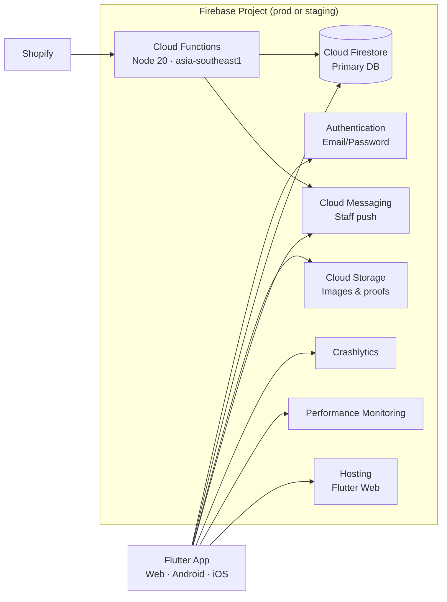

# TFG VDAY — Firebase Structure / Firebase 结构

How Firebase is organized in **Google Cloud**, in this **repo**, and in the **Flutter app**.

Firebase 在 **Google Cloud 项目**、**本仓库** 与 **Flutter 客户端** 中的组织方式。

| Doc | Topic |
|-----|-------|
| [DATABASE_SCHEMA.md](DATABASE_SCHEMA.md) | Firestore collections & fields / 数据库字段 |
| [TECH_STACK.md](TECH_STACK.md) | Full tech stack / 技术线 |
| [STAGING.md](STAGING.md) | Deploy workflow / 部署流程 |
| [SHOPIFY_WEBHOOK.md](SHOPIFY_WEBHOOK.md) | Shopify Functions config |

---

## 1. Two Firebase projects / 两个 Firebase 项目

| Alias (`.firebaserc`) | Project ID | Web URL | Purpose |
|----------------------|------------|---------|---------|
| `production` (default) | `tfg-sales-record` | https://tfg-sales-record.web.app | Live operations · 生产 |
| `staging` | `tfg-vday-record-staging` | https://tfg-vday-record-staging.web.app | Rehearsal before prod · 预发布 |

**Rule:** Always deploy & smoke-test **staging** before **production**.  
**原则：** 先 staging 验收，再 production。

```json
// firebase/.firebaserc
{
  "projects": {
    "default": "tfg-sales-record",
    "production": "tfg-sales-record",
    "staging": "tfg-vday-record-staging"
  }
}
```

---

## 2. Firebase services used / 使用的 Firebase 服务



| Service | EN | 中文 | Config in repo |
|---------|----|------|----------------|
| **Authentication** | Staff email/password only | 员工邮箱登录 | Console + `users/{uid}` profiles |
| **Cloud Firestore** | All business data | 全部业务数据 | `firestore.rules` · `firestore.indexes.json` |
| **Cloud Storage** | Product images, proofs, logos | 图片与凭证 | `storage.rules` · `storage.cors.json` |
| **Hosting** | Serves `firebase/public` (Flutter web build) | Web 静态托管 | `firebase.json` |
| **Cloud Functions** | Shopify webhook · staff notice FCM | Webhook 与推送 | `functions/index.js` |
| **FCM** | Push when app backgrounded | 后台推送 | Client: `fcm_service.dart` |
| **Crashlytics** | Crash reports | 崩溃报告 | `observability_service.dart` |
| **Performance** | Trace baselines | 性能追踪 | `observability_service.dart` |

**Not used as primary DB:** Realtime Database · 未使用 Realtime Database。

---

## 3. Repo folder: `firebase/` / 仓库目录

```
firebase/
├── .firebaserc              # Project aliases prod / staging
├── firebase.json            # Maps rules, indexes, hosting, functions
├── firestore.rules          # Security rules (tenant + role)
├── firestore.indexes.json   # Composite indexes
├── storage.rules            # Storage path permissions
├── storage.cors.json        # CORS for web uploads (apply via script)
├── package.json             # npm scripts: deploy, test, bootstrap
│
├── public/                  # Flutter web build output (deploy target)
│   └── index.html, main.dart.js, assets/…
│
├── functions/               # Cloud Functions (Node.js 20)
│   ├── index.js             # shopifyOrderCreated, onStaffNoticeCreated
│   ├── staff_notice_push.js
│   ├── shopify/             # HMAC verify, map order, import
│   └── package.json
│
├── scripts/                 # Admin CLI (service account required)
│   ├── admin_init.js          # Credential helper
│   ├── bootstrap_staging_admin.js
│   ├── init_counters.js
│   ├── set_user_role.js
│   ├── create_driver_user.js
│   ├── configure_shopify_webhook.js
│   └── …                      # repair images, verify peak, etc.
│
├── config/
│   └── shopify.staging.json   # Shopify env template (staging)
│
├── keys/                      # Service accounts (gitignored)
│   └── .gitkeep
│
└── test/                      # Rules & function unit tests (emulator)
    ├── firestore.rules.test.js
    ├── init_counters.integration.test.js
    └── shopify_webhook.test.js
```

**Flutter web build flow / Web 构建流程:**

```
flutter build web  →  build/web/  →  copy to  firebase/public/  →  firebase deploy --only hosting
```

Scripts: `scripts/deploy_staging_web.ps1` · `scripts/deploy_production_web.ps1`

---

## 4. `firebase.json` wiring / 配置映射

```json
{
  "firestore": {
    "rules": "firestore.rules",
    "indexes": "firestore.indexes.json"
  },
  "functions": [{ "source": "functions", "codebase": "functions" }],
  "storage": { "rules": "storage.rules" },
  "hosting": {
    "public": "public",
    "rewrites": [{ "source": "**", "destination": "/index.html" }]
  }
}
```

| Deploy target | npm script | What ships |
|---------------|------------|------------|
| Rules + Storage | `deploy:rules:staging` / `production` | `firestore.rules`, `storage.rules`, indexes |
| Hosting only | `deploy:hosting:staging` / `production` | `public/` |
| Full web release | `deploy:staging` / `deploy:production` | hosting + rules + storage |
| Functions | `deploy:functions:staging` / `production` | `shopifyOrderCreated` (+ `onStaffNoticeCreated` if included) |

---

## 5. Client ↔ Firebase wiring / 客户端连接

### Web

| Item | Location |
|------|----------|
| Environment | `--dart-define=APP_ENV=staging` or default production |
| Project ID | `lib/backend/firebase/app_environment.dart` |
| FirebaseOptions | `lib/backend/firebase/firebase_config.dart` |
| Init | `initFirebase()` in `main.dart` |

### Android (flavors)

| Flavor | Package | Config file |
|--------|---------|-------------|
| `production` | `com.mycompany.tfgvday` | `android/app/src/production/google-services.json` |
| `staging` | `com.tfg_staging` | `android/app/src/staging/google-services.json` |

Uses native `Firebase.initializeApp()` (no Dart options file).

### iOS

| Item | Value |
|------|-------|
| Bundle | `com.mycompany.tfgvday` |
| Config | `ios/Runner/GoogleService-Info.plist` |
| Staging flavor | **Not configured** — iOS points to production project only |

---

## 6. Firestore data layout / Firestore 数据布局

**Tenant key:** `companyRef` → `Companies/{id}` on most collections.  
**租户键：** 多数集合含 `companyRef`。

**Per-company config docs (doc id = companyId):**

| Collection | Purpose |
|------------|---------|
| `role_permissions/{companyId}` | Permission matrix overrides · 权限覆盖 |
| `staff_roles/{companyId}` | Assignable roles · 可分配角色 |
| `product_categories/{companyId}` | Product category list · 产品分类 |

**Full field reference:** [DATABASE_SCHEMA.md](DATABASE_SCHEMA.md)

**Subcollection:**

```
orders/{orderId}/internal_messages/{msgId}
```

**Counters (order IDs):**

```
counter/{companyId}_delivery_JUN26   →  { current: number }
counter/{companyId}_retail_JUN26     →  { current: number }
```

---

## 7. Cloud Storage layout / Storage 目录

| Path | Public read | Written by |
|------|-------------|------------|
| `product_images/` | Yes | Product catalog |
| `company_logos/` | Yes | Company settings |
| `custom_product_images/` | Yes | Custom order lines |
| `delivery_proof_images/{orderId}/` | Yes | Driver app |
| `invoice_payment_proof_images/{invoiceId}/` | Yes | Invoice mark paid |
| `customer_broadcast_images/{companyId}/` | Yes | Broadcast dialog |
| `users/{userId}/` | Owner only | User private files |

Rules: `firebase/storage.rules` · CORS: `storage.cors.json` + `npm run apply:storage:cors:*`

---

## 8. Cloud Functions / 云函数

| Function | Trigger | Region | Purpose |
|----------|---------|--------|---------|
| `shopifyOrderCreated` | HTTPS POST | default* | Shopify `orders/create` → Firestore order |
| `onStaffNoticeCreated` | Firestore `staff_notices/{id}` onCreate | `asia-southeast1` | FCM push to recipient |

\*Configure Shopify webhook URL in Shopify Admin → points to deployed HTTPS endpoint.  
See [SHOPIFY_WEBHOOK.md](SHOPIFY_WEBHOOK.md).

**Runtime:** Node.js **20** · Admin SDK in `functions/` and root `firebase/` scripts.

---

## 9. Security model summary / 安全模型摘要

| Layer | File | EN | 中文 |
|-------|------|----|------|
| **Firestore rules** | `firestore.rules` | Role from `users/{uid}.role` + tenant `companyRef` | 角色 + 租户隔离 |
| **Storage rules** | `storage.rules` | Signed-in write; public read on business images | 登录可写；业务图公开读 |
| **Auth** | Firebase Console | Email/password; no public signup | 仅员工账号 |

**Roles in rules:** `superadmin`, platform admin, staff, driver (driver limited order field updates).  
**Tests:** `npm run test:firebase` (CI job `firestore-rules`).

---

## 10. Admin scripts & credentials / 运维脚本

Service account JSON → `firebase/keys/` (never commit).  
服务账号 JSON → `firebase/keys/`（勿提交 Git）。

| Script | Purpose |
|--------|---------|
| `bootstrap:staging` | Create staging company + admin profile |
| `init:counters` | Sync order ID counters for all companies |
| `set:user-role` | Change user role |
| `create:driver` | Create driver Auth + profile |
| `config:shopify:staging` | Set Functions Shopify config |
| `verify:peak` | Pre-peak checklist (rules, counters, users) |

Uses `GOOGLE_APPLICATION_CREDENTIALS` or `--key path/to/serviceAccount.json`.

---

## 11. Environment comparison / 环境对照

| Item | Production | Staging |
|------|------------|---------|
| Project ID | `tfg-sales-record` | `tfg-vday-record-staging` |
| Web URL | tfg-sales-record.web.app | tfg-vday-record-staging.web.app |
| Android package | `com.mycompany.tfgvday` | `com.tfg_staging` |
| Dart define | *(default)* | `APP_ENV=staging` |
| Data | Live business data · 正式数据 | Test data · 测试数据 |
| Deploy first? | No — after staging PASS | Yes · 先部署这里 |

**Important:** Staging and production are **separate Firebase projects** — separate Auth users, Firestore, and Storage.  
**注意：** 两环境完全隔离，用户与数据不共享。

---

## 12. CI integration / CI 集成

| GitHub Actions job | Firebase-related step |
|--------------------|----------------------|
| `firestore-rules` | `cd firebase && npm run test:firebase` (emulator) |
| `build-apk` | Uses production Firebase via Android `google-services.json` |
| *(manual)* | `deploy_staging_web.ps1` / `deploy_production_web.ps1` |

---

*Reflects `tfg_vday` Firebase layout at app version **v1.0.3 (10)**.*

*对应应用版本 **v1.0.3 (10)**。*
