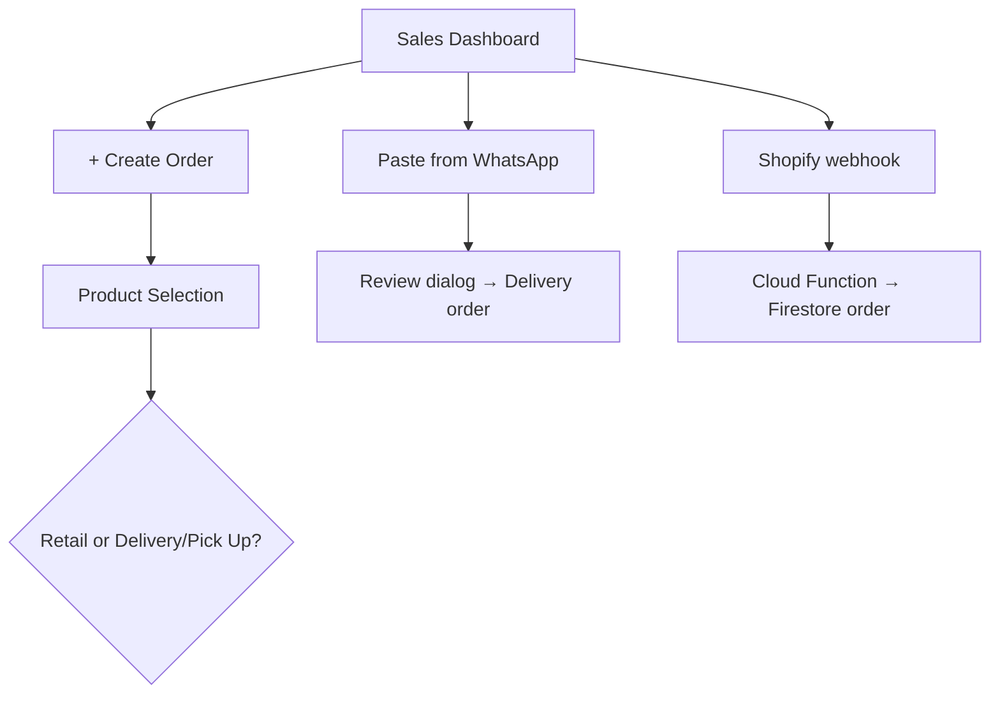
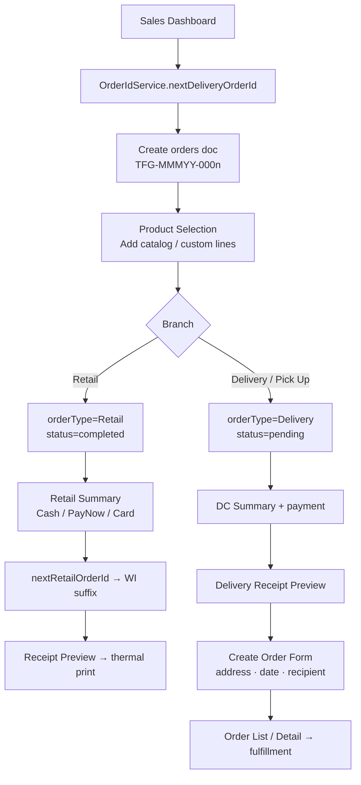
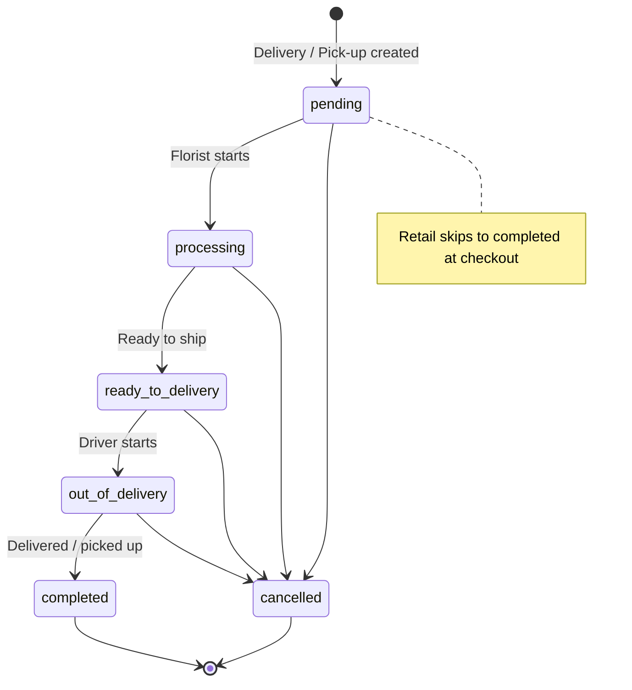

# TFG VDAY — Order Workflow / 订单工作流

Focused reference for **how orders are created, typed, paid, fulfilled, and closed**.  
专注说明 **订单如何创建、分类、付款、履约与完结**。

| Item | Detail |
|------|--------|
| **App version** | `v1.0.3 (10)` |
| **Related docs** | [DATABASE_SCHEMA.md](DATABASE_SCHEMA.md) · [DELIVERY_MODULE.md](DELIVERY_MODULE.md) · [PERMISSION_MATRIX.md](PERMISSION_MATRIX.md) · [WORKFLOW.md](WORKFLOW.md) |

---

## 1. Order types / 订单类型

| Type | `orderType` | `pickup_delivery` | Order ID pattern | Initial `status` |
|------|-------------|-------------------|------------------|------------------|
| **Retail walk-in** 门店零售 | `Retail` | `Retail` | `TFG-JUN26-WI0001` | `completed` |
| **Delivery** 配送 | `Delivery` | `Delivery` | `TFG-JUN26-0001` | `pending` |
| **Pick-up** 自取 | `Delivery` | `Pick Up` / `Pickup` | `TFG-JUN26-0001` | `pending` |

Retail orders complete at checkout. Delivery and pick-up share the same fulfillment lifecycle (florist → driver/staff → completed).  
零售单结账即完成；配送与自取共用花艺制作 → 配送/自取 → 完成 的流程。

**Implementation:** `lib/backend/order_list_filter_helpers.dart` · `lib/backend/order_id_service.dart`

---

## 2. Entry points / 建单入口

| Entry | Actor | Result |
|-------|-------|--------|
| **+ Create Order** | Staff (`createOrders`) | New `orders` doc + `Order_item` lines |
| **Paste from WhatsApp** | Staff | Always **Delivery**; new ID from counter |
| **Shopify `orders/create`** | External | Delivery order + staff notice — see [SHOPIFY_WEBHOOK.md](SHOPIFY_WEBHOOK.md) |

---

## 3. Create order — staff path / 员工建单路径

### 3.1 Screens & routes / 页面与路由

| Step | Widget | Route |
|------|--------|-------|
| Dashboard | `SalesDashBoard` | `/salesDashBoard` |
| Product pick | `ProductselectionCopy` | `/productselectionCopy` |
| Retail checkout | `RetailSummary` | `/retailSummary` |
| Retail receipt | `ReceiptPreviewpage2` | `/receiptPreviewpage2` |
| Delivery payment | `DCSummaryCopy` | `/deliverySummaryCopy` |
| Delivery receipt | `DeliveryReceiptPreviewPage` | `/deliveryreceiptPreviewPage` |
| Customer & delivery form | `CreateOrderForm` | `/createOrderForm` |

### 3.2 Order ID generation / 订单号生成

| When | Method | Counter doc |
|------|--------|-------------|
| Create Order (delivery path) | `nextDeliveryOrderId()` | `counter/{companyId}_delivery_{MMMyy}` |
| WhatsApp import | `nextDeliveryOrderId()` | Same |
| Retail confirm payment | `nextRetailOrderId()` | `counter/{companyId}_retail_{MMMyy}` |

Atomic Firestore transaction — `lib/backend/order_id_service.dart`.  
Initialize before peak: `cd firebase && npm run init:counters`.

### 3.3 Custom products / 定制商品

Staff add one-off lines with SKU **`Customize`**:

1. Product Selection bottom fields, or `/customproductcreate`
2. Optional photo → Storage `custom_product_images/{orderItemId}/`
3. Creates `Order_item` (+ optional `customProduct` doc)

**Implementation:** `lib/backend/custom_product_helpers.dart`

### 3.4 Customer link / 客户关联

On **Create Order Form**, autocomplete sets `customerRef` and `customer_phone_number`.  
**Recipient phone** (`recipient_phone_number`) is separate — recipient may differ from billing contact.

---

## 4. Payment recording / 付款记录

Payment is **recorded manually** (no payment gateway integration).

| Path | Screen | Fields written |
|------|--------|----------------|
| Retail | `RetailSummary` | `paymentType`, `totalAmount`, `amount_paid`, `cash_received`, `cash_change` |
| Delivery | `DCSummaryCopy` | Same + continues to delivery form |

`paymentType`: **PayNow** · **Cash** · **Card**

Daily sales report filters: paid, non-cancelled, `paymentType` set, amount > 0 — by `created_time`.

---

## 5. Status lifecycle / 状态生命周期

Canonical field: **`orders.status`** (`OrderStatus` enum).  
Legacy mirror: **`orders.orderstatus`** — kept in sync on every write.

| `status` | `orderstatus` (legacy) | EN | 中文 | Typical actor |
|----------|--------------------------|----|------|---------------|
| `pending` | `pending` | New order | 新单 | Staff |
| `processing` | `processing` | In production | 制作中 | Florist |
| `ready_to_delivery` | `readyToShip` | Ready to ship | 待配送 | Florist |
| `out_of_delivery` | `outOfDelivery` | En route | 配送中 | Driver |
| `completed` | `completed` | Done | 已完成 | Driver / staff |
| `cancelled` | `cancelled` | Cancelled | 已取消 | Admin / staff |

**Write helper:** `createOrderStatusUpdateData()` · `updateOrderStatus()` — `lib/backend/order_status_helpers.dart`

**Who can change status:** Staff with `updateOrderStatus`; drivers with `updateOrderStatus` on assigned orders (limited Firestore fields).

**UI entry points:** Order Detail → Update Status · Order List bulk action · Driver Delivery Page

---

## 6. Post-creation operations / 建单后操作

| Action | Permission | Where |
|--------|------------|-------|
| View order list | `viewOrders` | `/orderlist` |
| Edit line items | `editOrderDetails` | Order Detail → Edit Products |
| Update status | `updateOrderStatus` | Order Detail · Order List · Driver app |
| Assign driver | `assignDriver` | Order Detail · Driver Assignments |
| Partial delivery | `updateOrderStatus` | Order Detail (per-line `delivered_qty`) |
| Print receipt / PDF | `printCashInvoice` | Order Detail · summary pages |
| Production menu | `viewOrders` | Order Detail · Retail Summary |
| Delete (archive) | `deleteOrders` | Order Detail → `deleted_orders` |
| Restore archive | `restoreDeletedOrders` | Deleted Orders page |
| Activity log | `viewOrders` | Order Detail → Activity log panel |

**Partial delivery:** `lib/backend/partial_delivery_helpers.dart` — tracks `delivered_qty` per `Order_item` and optional `partial_delivery_runs` on the order.

---

## 7. Driver fulfillment (summary) / 司机履约（摘要）

Full detail: [DELIVERY_MODULE.md](DELIVERY_MODULE.md)

1. Staff sets `assigned_driver` → `users/{driverUid}`
2. Driver logs in → **My Deliveries** (`/driverDeliveryPage`)
3. Query: `assigned_driver == current user` + status chips
4. Advance: `processing` / `ready_to_delivery` → `out_of_delivery` → `completed`
5. Optional: upload `delivery_proof_url` (≤ 2 MB)

**Driver Firestore write limit:** `status`, `orderstatus`, `delivery_time_actual`, `delivery_proof_url`, `delivery_proof_at` only.

---

## 8. External import flows / 外部导入

### 8.1 WhatsApp paste

| Item | Value |
|------|-------|
| Entry | Dashboard → **Paste from WhatsApp** |
| Order type | Always Delivery |
| ID | New from counter — never reuses pasted ID |
| Default time slot | `09:00-20:00` if not parsed |
| Shopify `#` in text | → `client_name` only |

**Implementation:** `lib/backend/whatsapp_order_import_service.dart` · `lib/backend/order_whatsapp_import_helpers.dart`

### 8.2 Shopify webhook

Shopify `orders/create` → `shopifyOrderCreated` Cloud Function → Firestore delivery order.

Fields: `source=shopify`, `externalOrderId`, `externalOrderName` — see [SHOPIFY_WEBHOOK.md](SHOPIFY_WEBHOOK.md).

---

## 9. Data model (order-related) / 相关数据模型

| Collection | Role |
|------------|------|
| `orders` | Header: customer, delivery, status, payment, driver |
| `Order_item` | Line items: product, qty, price, `delivered_qty` |
| `customProduct` | One-off custom line metadata |
| `counter` | Monthly sequential IDs |
| `deleted_orders` | Soft-delete archive |
| `orders/{id}/internal_messages` | Order-scoped messages |
| `audit_logs` | Activity trail (order changes) |
| `staff_notices` | New-order alerts + FCM |

Full field reference: [DATABASE_SCHEMA.md](DATABASE_SCHEMA.md)

---

## 10. Reporting & export touchpoints / 报表与导出

| Report / export | Order fields used |
|-----------------|-------------------|
| Daily sales | `created_time`, `paymentType`, `totalAmount`, not cancelled |
| Material usage | Completed orders × product recipes |
| Profit summary | Same sales basis − BOM cost |
| CSV export | `exportOrdersCsv` — orders / line items / pick-up lists |
| Dashboard tomorrow stats | `delivery_date`, order type filters |

---

## 11. Permissions quick reference / 权限速查

| Task | Permission |
|------|------------|
| Access dashboard | `accessSalesDashboard` |
| Create order | `createOrders` |
| View orders | `viewOrders` |
| Edit products on order | `editOrderDetails` |
| Change status | `updateOrderStatus` |
| Assign driver | `assignDriver` |
| Delete order | `deleteOrders` |
| Export CSV | `exportOrdersCsv` |

Full matrix: [PERMISSION_MATRIX.md](PERMISSION_MATRIX.md)

---

## 12. Implementation index / 实现索引

| Module | Path |
|--------|------|
| Order ID service | `lib/backend/order_id_service.dart` |
| Status sync | `lib/backend/order_status_helpers.dart` |
| Order items & totals | `lib/backend/order_item_helpers.dart` |
| Order list filters | `lib/backend/order_list_filter_helpers.dart` |
| Order query | `lib/backend/order_query_helpers.dart` |
| Delete / restore | `lib/backend/order_delete_service.dart` · `order_restore_service.dart` |
| Activity log | `lib/backend/order_activity_log_service.dart` |
| WhatsApp import | `lib/backend/whatsapp_order_import_service.dart` |
| Partial delivery | `lib/backend/partial_delivery_helpers.dart` |
| Navigation | `lib/backend/order_navigation_helpers.dart` |

---

*Order workflow for `tfg_vday` at version **v1.0.3 (10)**.*

*对应应用版本 **v1.0.3 (10)**。*
