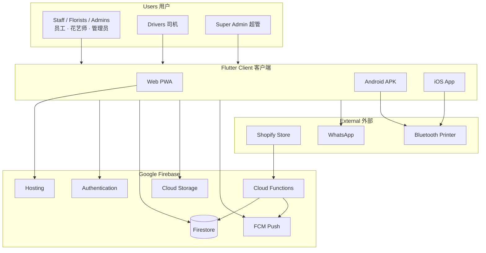
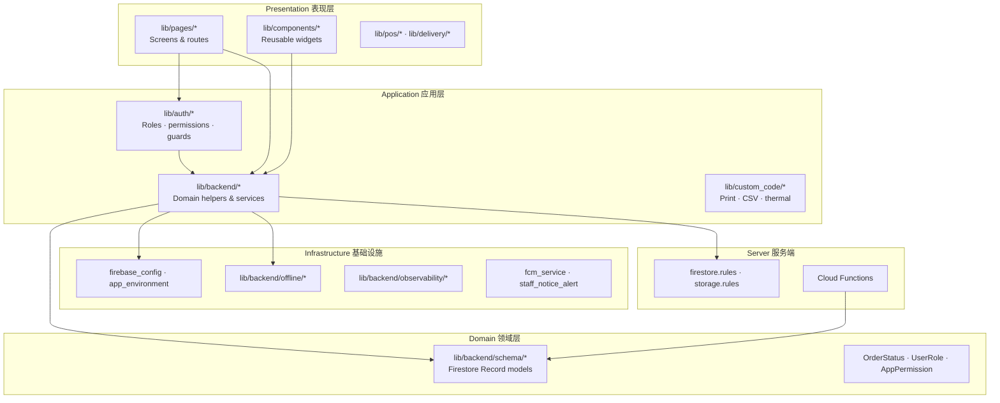
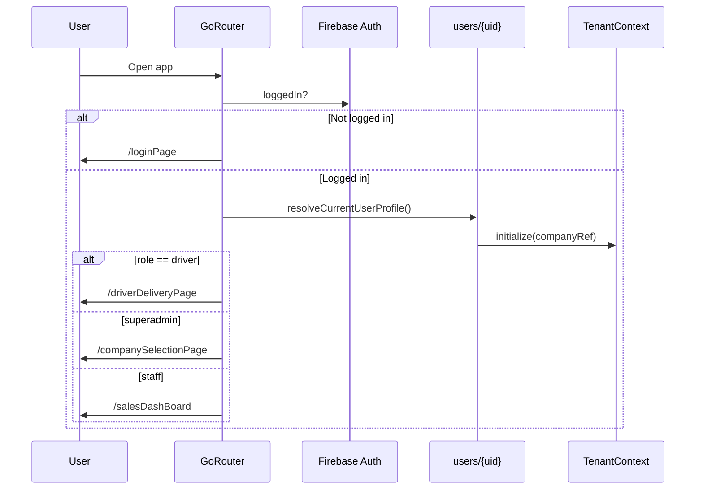
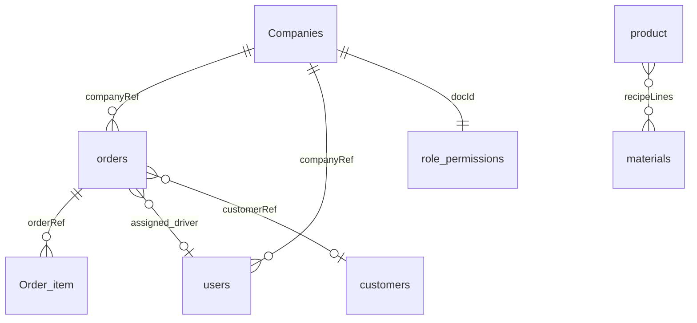
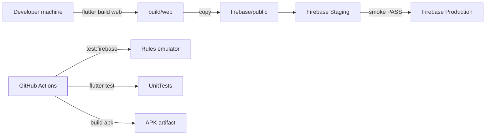

# TFG VDAY — System Architecture / 系统架构

High-level architecture for the **multi-tenant florist POS + order + delivery** platform.  
**多租户花店 POS + 订单 + 配送** 平台的总体架构说明。

| Item | Detail |
|------|--------|
| **App version** | `v1.0.3 (10)` |
| **Related docs** | [TECH_STACK.md](TECH_STACK.md) · [FIREBASE_STRUCTURE.md](FIREBASE_STRUCTURE.md) · [DATABASE_SCHEMA.md](DATABASE_SCHEMA.md) · [PERMISSION_MATRIX.md](PERMISSION_MATRIX.md) |

---

## 1. System context / 系统上下文



**Purpose:** Internal operations tool — not a customer-facing e-commerce site.  
**用途：** 内部运营工具，非顾客自助商城。

---

## 2. Architectural principles / 架构原则

| Principle | EN | 中文 |
|-----------|----|------|
| **Single repo truth** | Git repo is sole source; FlutterFlow export frozen | Git 为唯一源码；FlutterFlow 冻结 |
| **Multi-tenant** | `companyRef` on business documents | 业务数据按 `companyRef` 隔离 |
| **Client-heavy** | Business logic in Flutter `lib/backend/*` | 业务逻辑主要在 Flutter 客户端 |
| **Rules as backstop** | Firestore/Storage rules enforce tenant + role | 规则层强制租户与角色 |
| **Staging first** | Separate Firebase project for rehearsal | 独立 staging 项目预发布 |
| **Offline tolerant** | Write queue flush on reconnect | 离线写入队列 |

---

## 3. Layered architecture / 分层架构



---

## 4. Client architecture / 客户端架构

### 4.1 Bootstrap sequence / 启动顺序

`lib/main.dart`:

1. `initFirebase()` — project from `APP_ENV` / Android flavor
2. FCM background handler registration
3. `ObservabilityService.initialize()` — Crashlytics + Performance
4. `ConnectivityService.start()` — offline detection
5. `StaffNoticeAlertService` + `FcmService`
6. `FFAppState` persisted state
7. `GoRouter` via `lib/flutter_flow/nav/nav.dart`

### 4.2 Routing & auth flow / 路由与认证



**Key modules:**

| Module | Path | Role |
|--------|------|------|
| Post-login routing | `lib/auth/auth_redirect.dart` | Role-based home |
| Route guard | `lib/auth/role_route_guard.dart` | Driver allow-list |
| Tenant context | `lib/backend/tenant_context.dart` | Active company scope |
| Permission service | `lib/auth/permission_service.dart` | UI permission checks |

### 4.3 State management / 状态管理

| Mechanism | Usage |
|-----------|-------|
| `provider` + `FFAppState` | Global app state, printer MAC, persisted prefs |
| `PermissionService` (ChangeNotifier) | Live permission overrides |
| `TenantContext` | Active / write company for queries |
| Firestore streams | Order lists, profiles, notices |

---

## 5. Backend architecture (Firebase) / 后端架构

### 5.1 Environment topology / 环境拓扑

| Environment | Project ID | Hosting |
|-------------|------------|---------|
| **Production** | `tfg-sales-record` | https://tfg-sales-record.web.app |
| **Staging** | `tfg-vday-record-staging` | https://tfg-vday-record-staging.web.app |

Fully isolated: Auth users, Firestore, Storage do not sync between projects.

### 5.2 Data architecture / 数据架构



**Primary store:** Cloud Firestore — no Realtime Database.

**Tenant key:** `companyRef` → `Companies/{id}` (superadmin bypasses in rules only).

**Per-company config docs** (ID = companyId): `role_permissions`, `staff_roles`, `product_categories`.

Full schema: [DATABASE_SCHEMA.md](DATABASE_SCHEMA.md)

### 5.3 Cloud Functions / 云函数

| Function | Trigger | Purpose |
|----------|---------|---------|
| `shopifyOrderCreated` | HTTPS POST | Shopify order import |
| `onStaffNoticeCreated` | Firestore onCreate | FCM push to staff |

Region: `asia-southeast1` · Runtime: Node.js 20

### 5.4 Storage architecture / 存储架构

Business images (products, proofs, logos) — **public read** for Web ``.  
Uploads compressed client-side to **≤ 2 MB** before write.

Paths: `product_images/` · `delivery_proof_images/` · `invoice_payment_proof_images/` · etc.

---

## 6. Security architecture / 安全架构

```mermaid
flowchart LR
    Login[Email/Password Auth]
    Profile[users/{uid}.role]
    Tenant[companyRef match]
    UI[AppPermission UI gate]
    Rules[Firestore Rules]

    Login --> Profile
    Profile --> UI
    Profile --> Rules
    Tenant --> Rules
    UI -.->|UX only| Rules
```

| Layer | Controls |
|-------|----------|
| **Authentication** | Firebase Auth; `is_active: false` blocks login |
| **Authorization (UI)** | 28 `AppPermission` keys + Firestore overrides |
| **Authorization (data)** | `firestore.rules` — role helpers + tenant helpers |
| **Driver constraint** | Whitelist 5 order fields on update |
| **Superadmin** | Cross-tenant read/write; Companies CRUD |

Detail: [PERMISSION_MATRIX.md](PERMISSION_MATRIX.md)

---

## 7. Domain modules / 业务模块

| Module | Responsibility | Key paths |
|--------|----------------|-----------|
| **Orders** | Create, status, IDs, items, delete/restore | `lib/backend/order_*` |
| **Retail POS** | Walk-in checkout, cash change | `lib/pos/` · `retail_payment_helpers` |
| **Delivery** | Checkout, forms, PDF, driver flow | `lib/delivery/` · [DELIVERY_MODULE.md](DELIVERY_MODULE.md) |
| **Customers** | CRUD, broadcast, import | `customer_*` helpers |
| **Invoices** | Credit billing, payment proof | `invoice_*` helpers |
| **Catalog** | Products, materials, recipes, categories | `product_*` · `material_*` |
| **Reports** | Daily sales, material usage, profit, CSV | `*_report_service` · `custom_code/actions/` |
| **Staff admin** | Users, roles, permissions, audit | `user_*` · `role_permissions_*` |
| **Import** | WhatsApp paste, Shopify webhook | `whatsapp_*` · `firebase/functions/shopify/` |
| **Notifications** | Staff notices, FCM | `staff_notice_*` · `fcm_service` |
| **Printing** | ESC/POS thermal, PDF A4 | `lib/custom_code/` |
| **Offline** | Queued writes | `lib/backend/offline/` |

Business flows: [ORDER_WORKFLOW.md](ORDER_WORKFLOW.md) · [WORKFLOW.md](WORKFLOW.md)

---

## 8. Integration architecture / 集成架构

| Integration | Direction | Mechanism |
|-------------|-----------|-----------|
| **Shopify** | Inbound | HTTPS webhook → Cloud Function → Firestore |
| **WhatsApp** | Outbound (broadcast) | `url_launcher` → `wa.me` |
| **Email broadcast** | Outbound | `mailto:` + HTML clipboard |
| **Bluetooth printer** | Device | `flutter_bluetooth_printer` ESC/POS (mobile only) |
| **Google Maps** | Outbound | Open address in maps app (`google_maps_service`) |

No online payment gateway — payment type recorded manually at checkout.

---

## 9. Observability & resilience / 可观测与韧性

| Concern | Implementation |
|---------|----------------|
| **Crashes** | Firebase Crashlytics — `observability_service.dart` |
| **Performance** | Firebase Performance traces |
| **Offline** | `ConnectivityService` + offline write queue |
| **CI gates** | `flutter analyze`, `flutter test`, Firestore rules emulator |
| **Peak runbook** | [RUNBOOK_PEAK_OPERATIONS.md](RUNBOOK_PEAK_OPERATIONS.md) |

---

## 10. Deployment architecture / 部署架构



| Artifact | Pipeline |
|----------|----------|
| **Web** | `scripts/deploy_staging_web.ps1` → smoke → `deploy_production_web.ps1` |
| **Android APK** | CI on `main` · flavors `production` / `staging` |
| **Rules + indexes** | `npm run deploy:rules:staging` then production |
| **Functions** | `npm run deploy:functions:*` |

Deploy order: **always staging before production** — [STAGING.md](STAGING.md)

---

## 11. Platform capability matrix / 平台能力

| Capability | Web | Android | iOS |
|------------|-----|---------|-----|
| Staff workflows | ✅ | ✅ | ✅ |
| Driver app | ✅ | ✅ | ✅ |
| Firestore offline queue | ✅ | ✅ | ✅ |
| Bluetooth thermal | ❌ | ✅ | ✅ |
| PDF print/share | ✅ | ✅ | ✅ |
| FCM push | ✅* | ✅ | ✅ |

\*Web requires browser notification permission.

---

## 12. Code repository map / 代码仓库地图

```
tfg_vday/
├── lib/
│   ├── auth/              # Auth, roles, permissions, route guards
│   ├── backend/           # Domain logic, schema, Firebase, offline
│   ├── pages/             # Business screens
│   ├── pos/               # Retail checkout flow
│   ├── delivery/          # Delivery checkout & print screens
│   ├── components/        # Shared UI widgets
│   ├── custom_code/       # Printers, CSV, ESC/POS
│   └── flutter_flow/      # Theme, router, AppState
├── firebase/
│   ├── firestore.rules · firestore.indexes.json
│   ├── storage.rules
│   ├── functions/         # Shopify + FCM
│   ├── scripts/           # Admin CLI
│   └── test/              # Rules & function tests
├── android/ · ios/        # Native flavors & permissions
├── scripts/               # deploy_*.ps1, build_*.ps1
├── test/                  # Dart unit tests
└── docs/                  # Architecture & runbooks
```

---

## 13. Related documentation index / 文档索引

| Document | Topic |
|----------|-------|
| [SYSTEM_ARCHITECTURE.md](SYSTEM_ARCHITECTURE.md) | This document — system overview |
| [TECH_STACK.md](TECH_STACK.md) | Versions, dependencies, build commands |
| [FIREBASE_STRUCTURE.md](FIREBASE_STRUCTURE.md) | Firebase projects, folders, deploy targets |
| [DATABASE_SCHEMA.md](DATABASE_SCHEMA.md) | Firestore collections & fields |
| [ORDER_WORKFLOW.md](ORDER_WORKFLOW.md) | Order lifecycle & entry points |
| [DELIVERY_MODULE.md](DELIVERY_MODULE.md) | Delivery & driver subsystem |
| [PERMISSION_MATRIX.md](PERMISSION_MATRIX.md) | Roles & permissions |
| [WORKFLOW.md](WORKFLOW.md) | End-to-end business workflows & screen map |
| [FEATURES.md](FEATURES.md) | Feature guide for staff |
| [STAGING.md](STAGING.md) | Staging-first deploy |
| [SHOPIFY_WEBHOOK.md](SHOPIFY_WEBHOOK.md) | Shopify integration |
| [OBSERVABILITY.md](OBSERVABILITY.md) | Monitoring |
| [RUNBOOK_PEAK_OPERATIONS.md](RUNBOOK_PEAK_OPERATIONS.md) | Peak season on-call |

---

*System architecture for `tfg_vday` at version **v1.0.3 (10)**.*

*对应应用版本 **v1.0.3 (10)**。*
