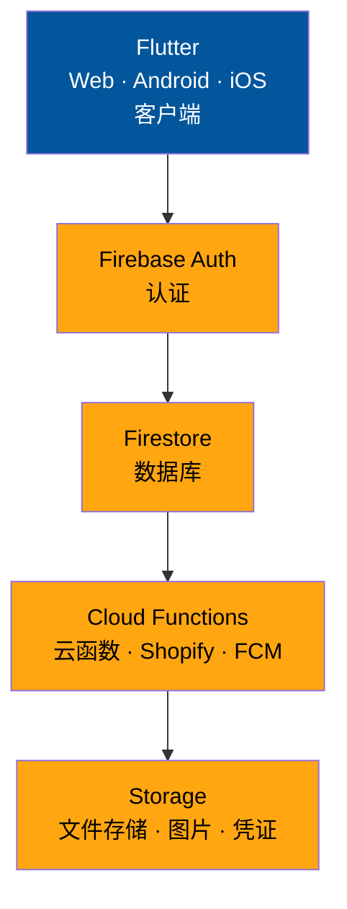
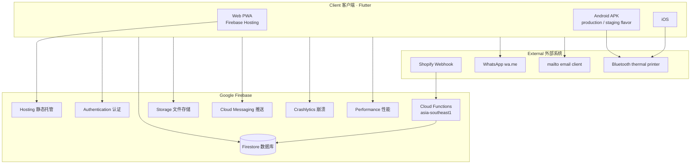

# TFG VDAY — Tech Stack / 技术线

Internal **florist POS + order + delivery** system. UI originated from FlutterFlow; **this Git repo is the sole source of truth** (Strategy A — no re-export from FlutterFlow).

内部 **花店 POS + 订单 + 配送** 系统。UI 源自 FlutterFlow；**本 Git 仓库为唯一源码**（Strategy A，不再从 FlutterFlow 回导）。

| Item | Detail |
|------|--------|
| **Current version / 当前版本** | `v1.0.3 (10)` — `lib/app_version.dart` |
| **Production Web / 生产 Web** | https://tfg-sales-record.web.app |
| **Staging Web / 测试 Web** | https://tfg-vday-record-staging.web.app |
| **Repository / 代码库** | https://github.com/kahliantoo-rgb/tfg_vday |

---

## 1. Architecture overview / 总体架构

### System stack / 系统架构



**Flow / 流程:** Staff app (**Flutter**) → sign in (**Auth**) → read/write business data (**Firestore**) → server triggers (**Functions**) → upload/download files (**Storage**).

### Detailed view / 详细视图



**Pattern / 模式:** Multi-tenant SaaS — most Firestore docs scoped by `companyRef` → `Companies/{id}`.

**模式：** 多租户 — 绝大多数 Firestore 文档通过 `companyRef` → `Companies/{id}` 隔离。

---

## 2. Client / 客户端

| Item | EN | 中文 |
|------|----|------|
| **Framework** | Flutter 3.x stable · Dart ≥3.0 | Flutter 3.x stable · Dart ≥3.0 |
| **Routing** | `go_router` 12 · `lib/flutter_flow/nav/nav.dart` | 路由：`go_router` · 集中定义于 nav |
| **State** | `provider` + FlutterFlow `FFAppState` | 状态：`provider` + FF AppState |
| **UI base** | FlutterFlow pages + custom `lib/backend/*`, `lib/components/*` | FF 生成页 + 自研 backend / components |
| **i18n** | `flutter_localizations` · `intl` | 国际化 |
| **Theme** | `FlutterFlowTheme` · `google_fonts` | 主题与字体 |

### Platforms / 平台

| Platform | Config | Firebase project |
|----------|--------|------------------|
| **Web** | `flutter build web` · path URL strategy | prod / staging (`APP_ENV=staging`) |
| **Android prod** | flavor `production` · `com.mycompany.tfgvday` · **TFG VDAY** | `tfg-sales-record` |
| **Android staging** | flavor `staging` · `com.tfg_staging` · **TFG Staging** | `tfg-vday-record-staging` |
| **iOS** | `com.mycompany.tfgvday` · **TFG VDAY** | `tfg-sales-record` (no staging flavor) |

### Run locally / 本地运行

**Prerequisites / 前置：** [Flutter SDK](https://docs.flutter.dev/get-started/install) (stable) · Android SDK for APK · physical device for Bluetooth print.

```bash
cd tfg_vday
flutter pub get
flutter run -d chrome                              # Web (production Firebase)
flutter run -d chrome --dart-define=APP_ENV=staging # Web (staging)
flutter run --flavor production -d android         # Android production
flutter run --flavor staging --dart-define=APP_ENV=staging -d android
```

### Build / 构建

```bash
flutter build web --release
flutter build web --release --dart-define=APP_ENV=staging
flutter build apk --release --flavor production --build-name=1.0.3 --build-number=10
flutter build apk --release --flavor staging --dart-define=APP_ENV=staging --build-name=1.0.3 --build-number=10
```

**Windows scripts / Windows 脚本:**

```powershell
powershell -ExecutionPolicy Bypass -File scripts/build_production_apk.ps1
powershell -ExecutionPolicy Bypass -File scripts/build_staging_apk.ps1
powershell -ExecutionPolicy Bypass -File scripts/deploy_staging_web.ps1
powershell -ExecutionPolicy Bypass -File scripts/deploy_production_web.ps1
```

Outputs: `build/web/` · `build/app/outputs/flutter-apk/app-{production,staging}-release.apk`

**Environment switch / 环境切换:** set `APP_ENV=staging` (web) or Android `staging` flavor as above.

Config files / 配置文件:

- Web: `lib/backend/firebase/firebase_config.dart` · `app_environment.dart`
- Android: `android/app/src/{production,staging}/google-services.json`
- iOS: `ios/Runner/GoogleService-Info.plist`
- Firebase CLI: `firebase/.firebaserc`

---

## 3. Backend (Firebase) / 后端

| Service | EN | 中文 |
|---------|----|------|
| **Firestore** | Primary database · tenant via `companyRef` | 主数据库 · 多租户 |
| **Storage** | Product images, logos, delivery/invoice proofs, broadcast photos | 图片与凭证文件 |
| **Auth** | Email/password · staff-only (no public signup) | 邮箱密码 · 仅员工账号 |
| **Hosting** | Flutter web build → `firebase/public` | Web 静态部署 |
| **Cloud Functions** | Shopify webhook · staff notice FCM push | 服务端 webhook 与推送 |
| **FCM** | Push notifications for staff notices | 员工通知推送 |
| **Crashlytics + Performance** | Observability — see [OBSERVABILITY.md](OBSERVABILITY.md) | 崩溃与性能监控 |

### Firebase projects / 项目

| Alias | Project ID | Hosting URL |
|-------|------------|-------------|
| `production` | `tfg-sales-record` | https://tfg-sales-record.web.app |
| `staging` | `tfg-vday-record-staging` | https://tfg-vday-record-staging.web.app |

### Cloud Functions / 云函数

| Item | Value |
|------|-------|
| **Runtime** | Node.js **20** |
| **Region** | `asia-southeast1` |
| **Entry** | `firebase/functions/index.js` |
| **Shopify** | `shopifyOrderCreated` — HMAC verify → Firestore order import |
| **Push** | `staff_notice_push.js` — FCM on new staff notices |

See [SHOPIFY_WEBHOOK.md](SHOPIFY_WEBHOOK.md) for webhook setup.

---

## 4. Security & permissions / 权限与安全

Three-layer model / 三层权限模型:

| Layer | Implementation | 实现 |
|-------|----------------|------|
| **UI defaults** | `lib/auth/app_permissions.dart` — 33 `AppPermission` keys | UI 默认权限 |
| **Firestore overrides** | `role_permissions/{companyId}` — per-role toggles | 每公司权限覆盖 |
| **Server rules** | `firebase/firestore.rules` · `firebase/storage.rules` | 服务端强制 |

**Roles / 角色:** `superadmin` (platform) + 9 configurable staff roles: `director`, `admin`, `manager`, `account`, `hr`, `payroll`, `senior_florist`, `florist`, `driver`.

**Tenant isolation / 租户隔离:** All staff except `superadmin` must match `companyRef` on read/write (Firestore rules).

**Staff role picker / 可分配角色列表:** `staff_roles/{companyId}`.

---

## 5. Domain modules / 业务模块

| Domain | Key paths / helpers |
|--------|---------------------|
| **Orders / 订单** | `order_id_service` · `create_order_service` · `order_status_helpers` · `order_item_helpers` |
| **Retail POS / 零售** | `lib/pos/` · `retail_payment_helpers` · `cash_payment_helpers` |
| **Delivery / 配送** | `lib/delivery/` · `partial_delivery_helpers` |
| **Driver / 司机** | `driver_delivery_filter_helpers` · `driver_assignment_helpers` · `driver_delivery_proof_helpers` |
| **Customers / 客户** | `customer_helpers` · `customer_broadcast_helpers` · `customer_import_helpers` |
| **Invoices / 发票** | `invoice_*` · `customer_invoice_helpers` · `invoice_payment_proof_helpers` |
| **Catalog / 产品** | `product_*` · `product_category_helpers` · `custom_product_helpers` |
| **Materials / 物料** | `material_helpers` · `product_recipe_helpers` · `material_usage_report_service` |
| **Reports / 报表** | `daily_sales_report_service` · `profit_summary_report_service` · `csv_export_service` |
| **Printing / 打印** | `lib/custom_code/` · Bluetooth ESC/POS · PDF A4 |
| **Import / 导入** | `whatsapp_order_import_service` · Shopify Functions |
| **Staff admin / 员工** | `user_admin_service` · `role_permissions_helpers` · `staff_role_helpers` |
| **Audit / 审计** | `audit_log_service` · `order_activity_log_service` |
| **Offline / 离线** | `lib/backend/offline/` — queue + flush on reconnect |
| **Observability / 可观测** | `lib/backend/observability/` · Crashlytics · Performance traces |

**Image uploads / 图片上传:** All paths use `uploadDataWithResult` → `image_compress_helpers` (**max 2 MB**).

**Storage paths / 存储路径:** `product_images/` · `company_logos/` · `custom_product_images/` · `delivery_proof_images/` · `invoice_payment_proof_images/` · `customer_broadcast_images/`.

Database field reference / 数据库字段: [DATABASE_SCHEMA.md](DATABASE_SCHEMA.md).

---

## 6. Key dependencies / 主要依赖

| Category | Packages |
|----------|----------|
| **Firebase** | `firebase_core`, `cloud_firestore`, `firebase_auth`, `firebase_storage`, `firebase_messaging`, `firebase_crashlytics`, `firebase_performance` |
| **Navigation** | `go_router`, `page_transition` |
| **UI** | `provider`, `flutter_animate`, `auto_size_text`, `font_awesome_flutter`, `dropdown_button2` |
| **Media / files** | `file_picker`, `image_picker`, `image`, `cached_network_image` |
| **Print** | `flutter_bluetooth_printer`, `pdf`, `printing`, `charset_converter` |
| **Export** | `csv`, `file_saver` |
| **Network** | `http`, `url_launcher`, `connectivity_plus` |
| **Local persistence** | `shared_preferences`, `flutter_secure_storage`, `sqflite` |
| **Notifications** | `flutter_local_notifications` |
| **Auth providers** | `google_sign_in`, `sign_in_with_apple` (available; primary login is email/password) |

Full list: `pubspec.yaml`.

---

## 7. Code layout / 代码结构

```
lib/
├── auth/                 # Login, roles, permission matrix, route guards
│                         # 登录、角色、权限矩阵、路由守卫
├── backend/
│   ├── schema/           # Firestore Record models / 数据模型
│   ├── firebase/         # initFirebase, APP_ENV / 初始化与环境
│   ├── firebase_storage/ # Upload helpers / 上传
│   ├── offline/          # Offline write queue / 离线队列
│   └── observability/    # Logging, Performance / 日志与性能
├── pages/                # Business screens / 业务页面
├── pos/ · delivery/      # POS & delivery flows / 零售与配送流程
├── components/           # Reusable widgets / 可复用组件
├── custom_code/          # Printers, CSV, thermal logo / 打印与导出
├── flutter_flow/         # FF theme, router, AppState
└── services/             # e.g. Google Maps / 外部服务封装

firebase/
├── firestore.rules · firestore.indexes.json
├── storage.rules · storage.cors.json
├── functions/            # Cloud Functions (Node.js)
├── scripts/              # bootstrap, counters, admin CLI
└── test/                 # Rules emulator tests

scripts/                  # deploy_*_web.ps1, build_*_apk.ps1
test/                     # Dart unit tests (~60+ files)
.github/workflows/ci.yml  # CI pipeline
```

---

## 8. CI/CD & deployment / 持续集成与部署

| Stage | Tool | 说明 |
|-------|------|------|
| **Integrity gate** | `scripts/check_custom_integrity.sh` | FlutterFlow freeze — protected files |
| **Analyze** | `flutter analyze --no-fatal-infos --no-fatal-warnings` | Errors only in CI |
| **Unit tests** | `flutter test` | Dart helpers & services |
| **Rules tests** | `firebase/` → `npm run test:firebase` | Firestore emulator |
| **APK artifact** | GitHub Actions on `main` push | Reads `lib/app_version.dart` |
| **Web deploy (Windows)** | `scripts/deploy_staging_web.ps1` → smoke → `deploy_production_web.ps1` | Build web + rules + hosting |
| **Manual deploy** | `cd firebase && npm run deploy:staging` / `deploy:production` | See [STAGING.md](STAGING.md) |

**Deploy order / 部署顺序:** Staging rules + hosting → smoke test → Production (never skip staging).

---

## 9. Platform capability matrix / 平台能力

| Feature | Web | Android | iOS |
|---------|-----|---------|-----|
| Login / Firestore | ✅ | ✅ | ✅ |
| Create & manage orders | ✅ | ✅ | ✅ |
| Driver delivery page | ✅ | ✅ | ✅ |
| Bluetooth thermal print | ❌ | ✅ | ✅ |
| PDF A4 print / share | ✅ | ✅ | ✅ |
| CSV export | ✅ | ✅ | ✅ |
| FCM push | ✅* | ✅ | ✅ |
| Offline write queue | ✅ | ✅ | ✅ |
| WhatsApp / mailto broadcast | ✅ | ✅ | ✅ |

\*Web push depends on browser notification permission.

\*Web 推送依赖浏览器通知权限。

---

## 10. Related documentation / 相关文档

| Doc | EN | 中文 |
|-----|----|------|
| [FEATURES.md](FEATURES.md) | Feature guide / 功能说明 | 模块与权限说明 |
| [WORKFLOW.md](WORKFLOW.md) | Business workflows & screen map | 业务流程与页面 |
| [FIREBASE_STRUCTURE.md](FIREBASE_STRUCTURE.md) | Firebase projects, services, deploy | Firebase 项目与服务结构 |
| [DATABASE_SCHEMA.md](DATABASE_SCHEMA.md) | Firestore collections & fields | 数据库字段说明 |
| [STAGING.md](STAGING.md) | Staging-first deploy workflow | 先 staging 后 production |
| [FLUTTERFLOW_FREEZE.md](FLUTTERFLOW_FREEZE.md) | Dev rules — no FF re-export | 开发规范 |
| [OBSERVABILITY.md](OBSERVABILITY.md) | Crashlytics & Performance | 监控与离线 |
| [SHOPIFY_WEBHOOK.md](SHOPIFY_WEBHOOK.md) | Shopify integration | Shopify 对接 |
| [RUNBOOK_PEAK_OPERATIONS.md](RUNBOOK_PEAK_OPERATIONS.md) | Peak season on-call | 高峰运维 |

---

*Reflects `tfg_vday` at app version **v1.0.3 (10)**.*

*对应应用版本 **v1.0.3 (10)**。*
