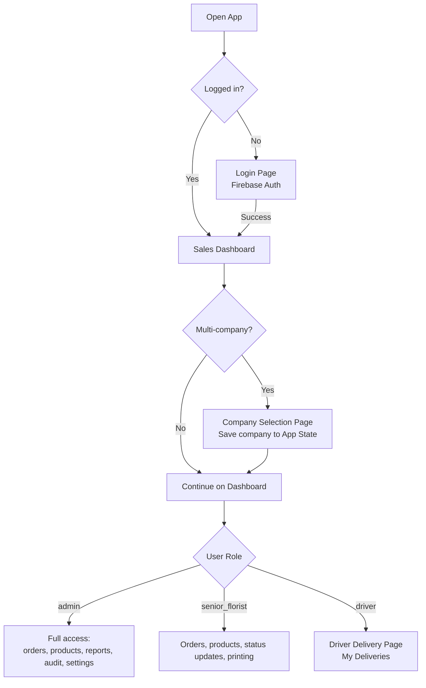
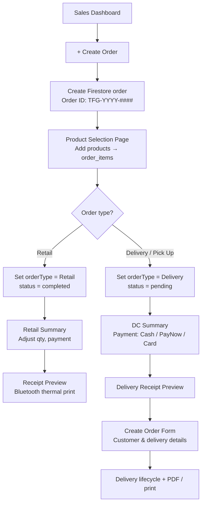
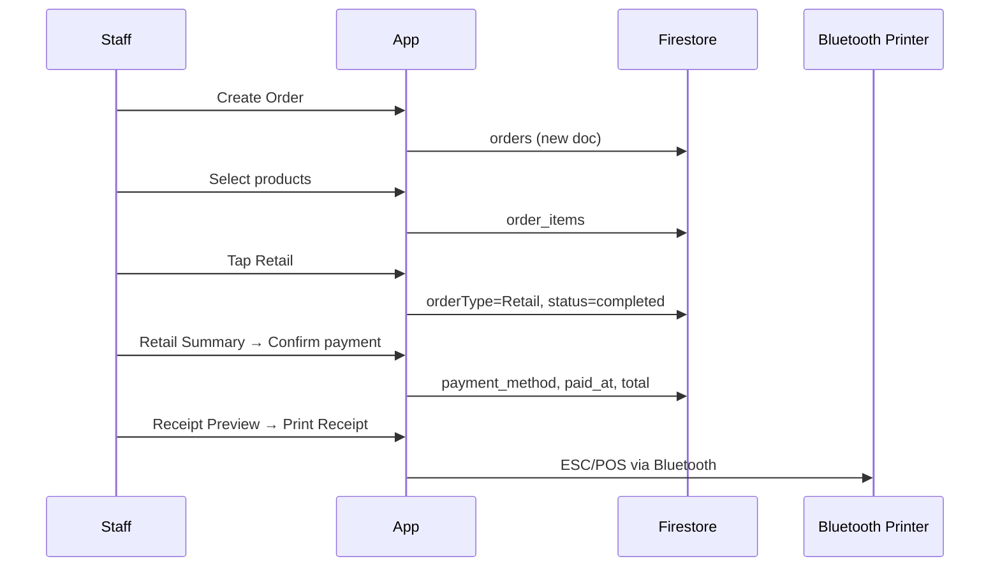
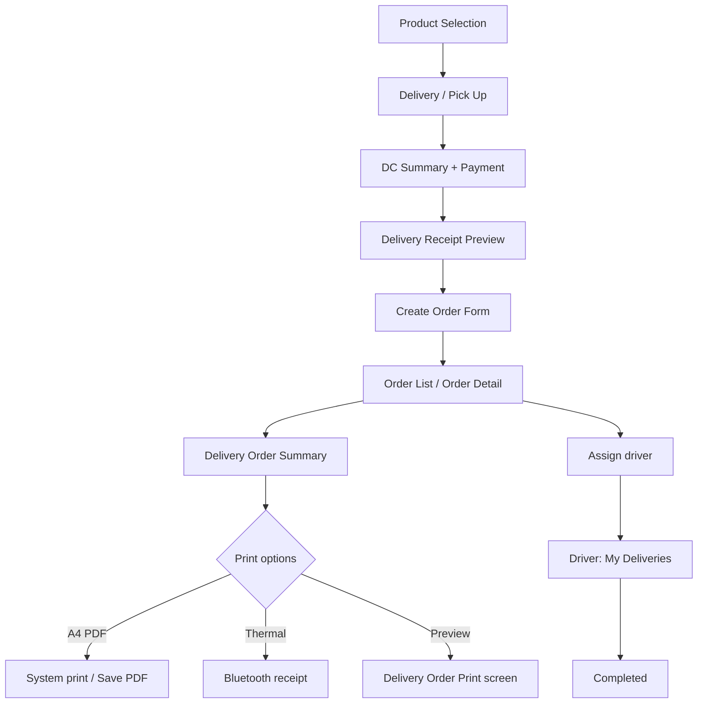
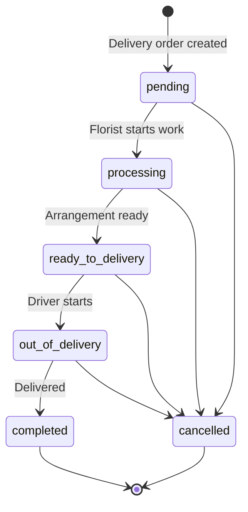
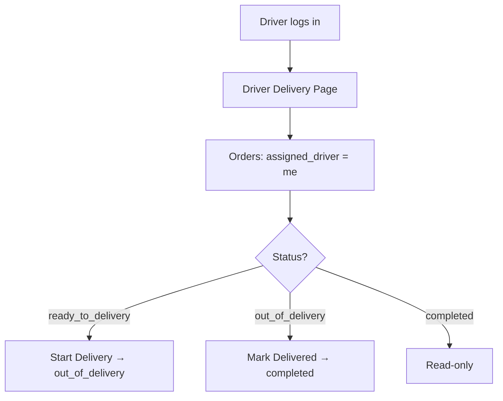
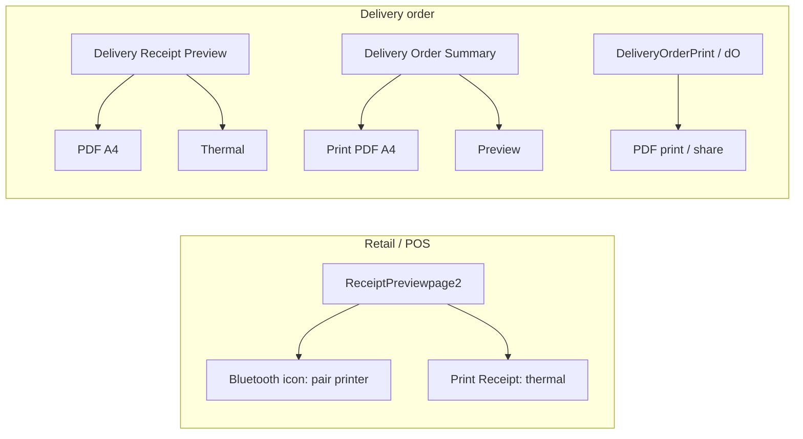
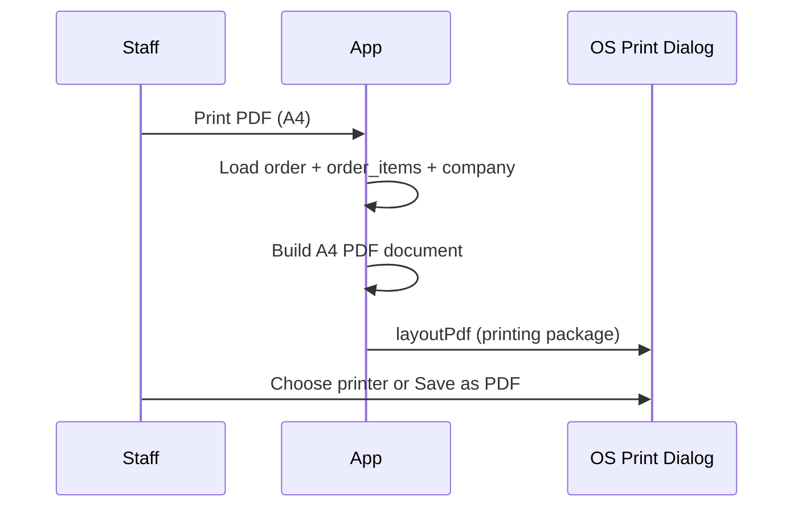
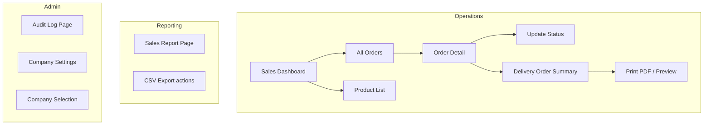
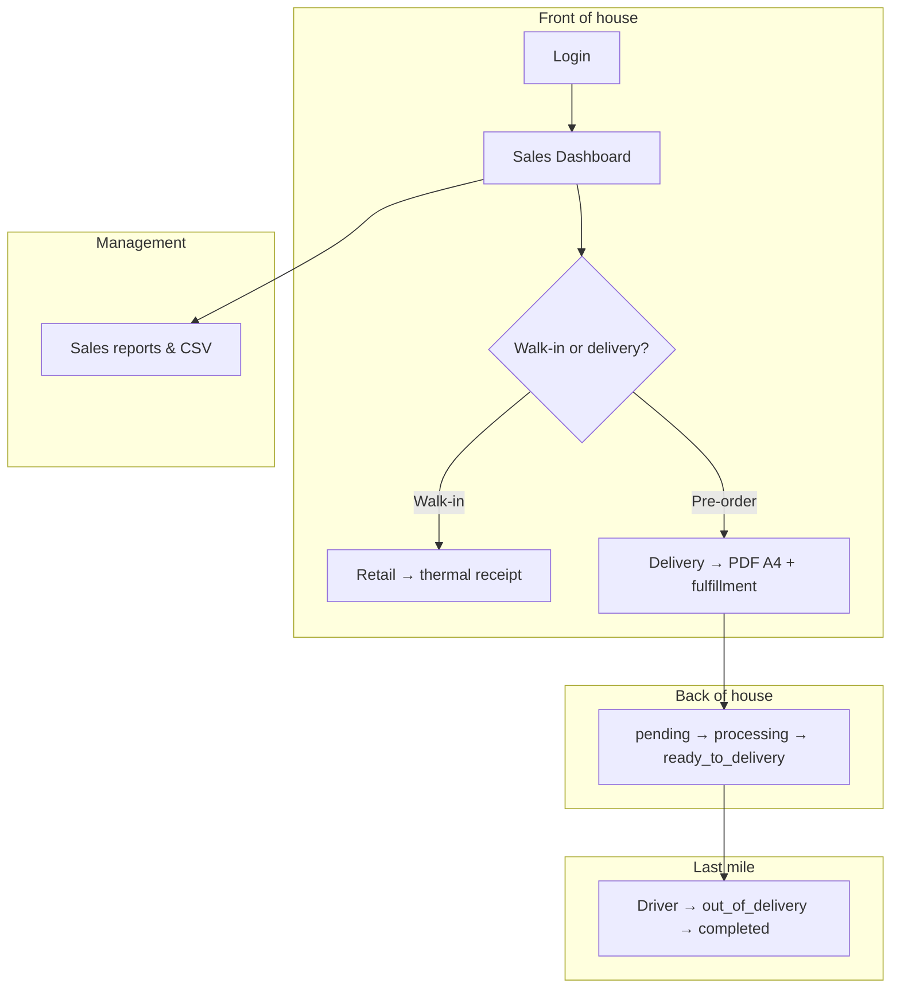

# TFG VDAY — System Workflows

Internal **POS + order + delivery** management for florist operations (Valentine's Day peak season).

| Item | Detail |
|------|--------|
| **Stack** | Flutter (FlutterFlow) · Firebase (Auth, Firestore, Storage) |
| **Backend** | Firebase project `tfg-sales-record` |
| **Platforms** | Web · Android · iOS (some features are mobile-only) |

---

## 1. System Entry & Roles

| Role | Main access |
|------|-------------|
| **admin** | Dashboard, orders, products, sales reports, audit logs, company settings |
| **senior_florist** | Dashboard, create/manage orders, product selection, status updates, printing |
| **driver** | Assigned deliveries only (`DriverDeliveryPage`) |

**User roles** (Firestore `users.role`): `admin` · `senior_florist` · `driver`

---

## 2. Create Order (Main Entry)

All new orders start from **Sales Dashboard → + Create Order**.

| Step | Route / screen |
|------|----------------|
| Dashboard | `SalesDashBoard` → `/salesDashBoard` |
| Create order | Firestore `orders` + `ProductselectionCopy` |
| Retail branch | `RetailSummary` → `ReceiptPreviewpage2` |
| Delivery branch | `DCSummaryCopy` → `DeliveryReceiptPreviewPage` → `CreateOrderForm` |

---

## 3. Retail (In-Store POS) Workflow

**Steps:** Dashboard → Create Order → Product Selection → **Retail** → Retail Summary → Pay → **Receipt Preview** → Print (thermal).

| Screen | Print action |
|--------|----------------|
| `ReceiptPreviewpage2` | App bar: select Bluetooth printer · **Print Receipt** |

---

## 4. Delivery / Pick-Up Workflow

**Key Firestore fields (`orders`):**

| Field | Purpose |
|-------|---------|
| `client_name` | Customer name |
| `address`, `region`, `postal_code` | Delivery location |
| `delivery_date`, `delivery_time_slot` | Schedule |
| `card_message` | Greeting card text |
| `customer_phone_number` | Contact |
| `pickup_delivery` | Pick-up vs delivery |
| `assigned_driver` | Driver user reference |
| `orderType` | `Retail` or `Delivery` |
| `status` | Order lifecycle enum |

---

## 5. Order Status Lifecycle

| Status | Meaning | Typical actor |
|--------|---------|----------------|
| `pending` | New delivery order | System / cashier |
| `processing` | Florist preparing | senior_florist |
| `ready_to_delivery` | Ready to ship | senior_florist |
| `out_of_delivery` | On the road | driver |
| `completed` | Done | driver / staff |
| `cancelled` | Cancelled | admin / staff |

**Updated via:** `UpdateOrderStatus` sheet · `DriverDeliveryPage` · `OrderDetailPage`

---

## 6. Driver Delivery Workflow

**Screen:** `DriverDeliveryPage` → `/driverDeliveryPage`

---

## 7. Printing Workflows

Two print paths: **Bluetooth thermal** (receipt) and **PDF A4** (delivery order document).

### 7.1 Bluetooth thermal (ESC/POS)

| Item | Detail |
|------|--------|
| **Module** | `lib/custom_code/bluetooth_receipt_printer.dart` |
| **Package** | `flutter_bluetooth_printer` |
| **Platform** | Android & iOS only (not Web) |
| **Saved printer** | MAC address in App State (`ff_bluetooth_printer_address`) |

**First-time setup**

1. Open receipt preview (Retail or Delivery).
2. Tap **Bluetooth** icon in app bar → select printer from list.
3. Tap **Print Receipt** / **Thermal**.

**Receipt content:** company name, order ID, date, items, total, delivery info (if applicable), thank-you line.

### 7.2 PDF A4 (delivery order)

| Item | Detail |
|------|--------|
| **Module** | `lib/custom_code/delivery_order_pdf_printer.dart` |
| **Packages** | `pdf` · `printing` |
| **Platform** | Web, Android, iOS, desktop (system print dialog) |

**Where to print**

| Screen | Button / action |
|--------|-----------------|
| `DeliveryOrderSummaryPage` | **Print PDF (A4)** · **Preview** |
| `DeliveryReceiptPreviewPage` | **PDF A4** |
| `DeliveryOrderPrint` | App bar PDF icon (print) · Share icon (export PDF) |
| `DOWidget` (`/dO`) | App bar PDF icon |

**PDF content:** company header · order number & date · customer & delivery details · items table · subtotal/total · driver name · signature lines.

---

## 8. Order Management & Reporting

---

## 9. End-to-End Overview (Peak Season)

---

## 10. Screen Map

| Purpose | Widget | Route |
|---------|--------|-------|
| Login | `LoginPage` | `/loginPage` |
| Sales hub | `SalesDashBoard` | `/salesDashBoard` |
| Company pick | `CompanySelectionPage` | `/companySelectionPage` |
| Product pick | `ProductselectionCopy` | `/productselectionCopy` |
| Retail checkout | `RetailSummary` | `/retailSummary` |
| Retail receipt + thermal | `ReceiptPreviewpage2` | `/receiptPreviewpage2` |
| Delivery checkout | `DCSummaryCopy` | `/deliverySummaryCopy` |
| Delivery receipt | `DeliveryReceiptPreviewPage` | `/deliveryreceiptPreviewPage` |
| Customer form | `CreateOrderForm` | `/createOrderForm` |
| Delivery summary + PDF | `DeliveryOrderSummaryPage` | `/deliveryOrderSummaryPage` |
| Delivery A4 preview | `DeliveryOrderPrint` | `/deliveryOrderPrint` |
| Delivery A4 alt | `DOWidget` | `/dO` |
| All orders | `Orderlist1` / `Orderlist` | — |
| Order details | `OrderDetailPage` | — |
| Driver view | `DriverDeliveryPage` | `/driverDeliveryPage` |
| Products | `Productlist` / `Productcreate` / `Customproductcreate` | — |
| Sales reports | `SalesReportPage` | — |
| Audit | `AuditLogPage` | — |
| Company settings | `CompanySettingPage` | — |

---

## 11. Firestore Collections

| Collection | Purpose |
|------------|---------|
| `orders` | Order header: customer, delivery, status, totals, payment |
| `order_items` | Line items: product, qty, price, subtotal |
| `product` | Catalog: name, price, SKU, image, category |
| `users` | Staff: role, display name, company link |
| `companies` | Company name, UEN, phone, address |
| `audit_logs` | Admin activity trail |
| `counters` | Order ID counters |

---

## 12. Custom Code Modules

| File | Purpose |
|------|---------|
| `lib/custom_code/bluetooth_receipt_printer.dart` | Pair Bluetooth printer, print ESC/POS receipts |
| `lib/custom_code/delivery_order_pdf_printer.dart` | Generate & print/share A4 delivery PDF |
| `lib/custom_code/actions/print_order_receipt_esc_pos.dart` | FlutterFlow action: thermal print |
| `lib/custom_code/actions/export_orders_to_csv.dart` | Export orders CSV |
| `lib/custom_code/actions/export_order_items_final_csv.dart` | Export line items CSV |
| `lib/custom_code/actions/export_orders_items_pickup_csv.dart` | Pick-up / delivery CSV |

---

## 13. Custom Actions (FlutterFlow)

| Action | Purpose |
|--------|---------|
| `printOrderReceiptEscPos` | Bluetooth thermal receipt (legacy / action) |
| `exportOrdersToCsv` | Export orders |
| `exportOrderItemsFinalCsv` | Export order line items |
| `exportOrdersItemsPickupCsv` | Pick-up / delivery export |

---

## 14. Platform Notes

| Feature | Web | Android | iOS |
|---------|-----|---------|-----|
| Login / Firestore | Yes | Yes | Yes |
| Create & manage orders | Yes | Yes | Yes |
| Bluetooth thermal print | No | Yes | Yes |
| PDF A4 print / share | Yes | Yes | Yes |
| CSV export | Yes | Yes | Yes |

**Android:** Bluetooth permissions in `AndroidManifest.xml` (`BLUETOOTH_SCAN`, `BLUETOOTH_CONNECT`, location for discovery).

---

*Repository: [kahliantoo-rgb/tfg_vday](https://github.com/kahliantoo-rgb/tfg_vday) · Mermaid diagrams render in GitHub, VS Code, and Cursor.*
