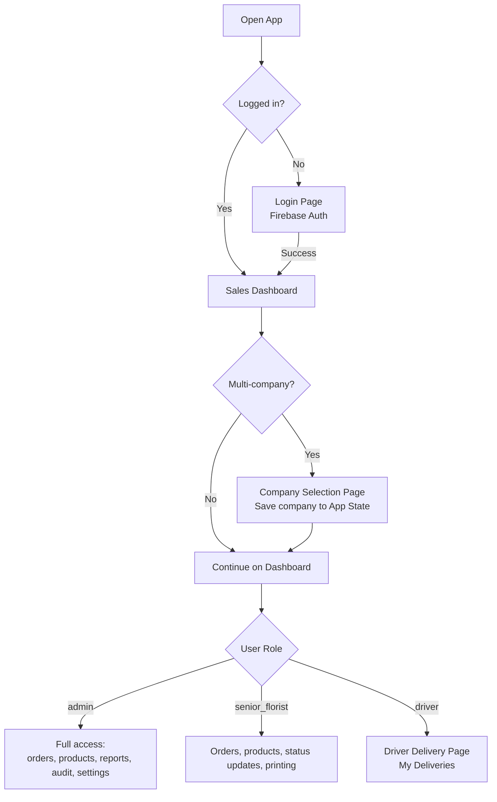
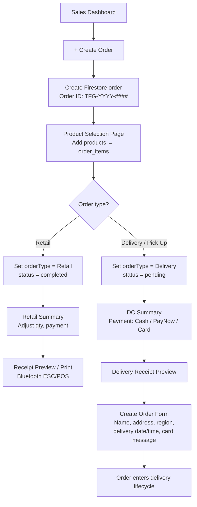
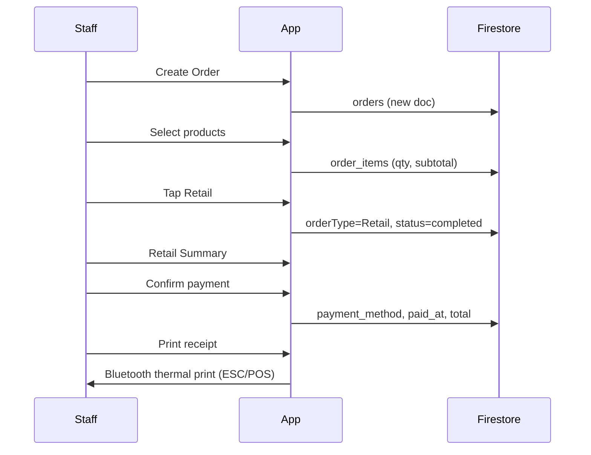
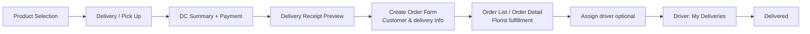
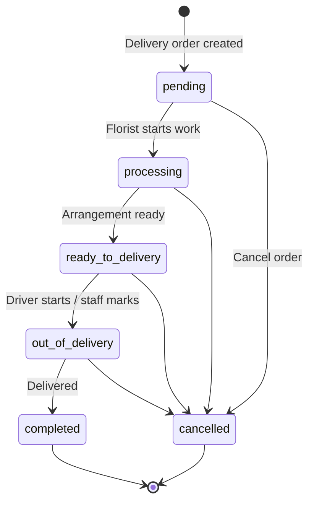
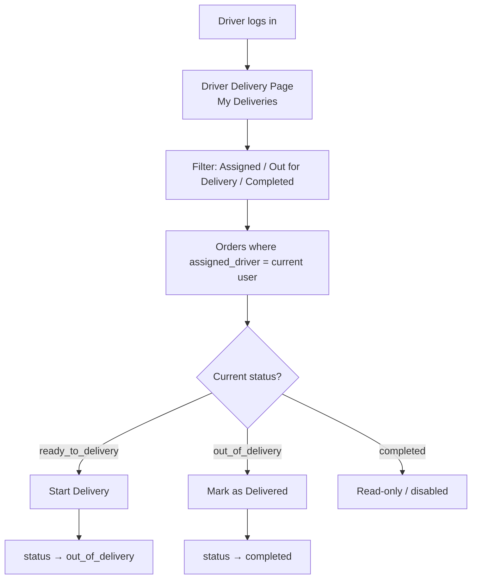
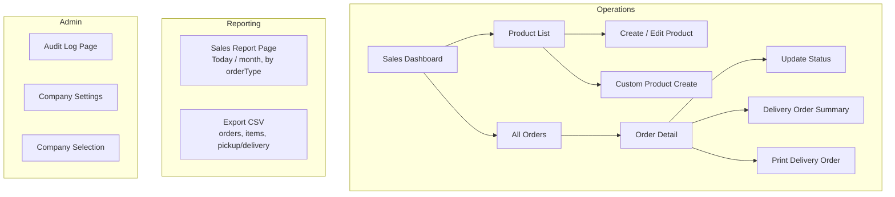
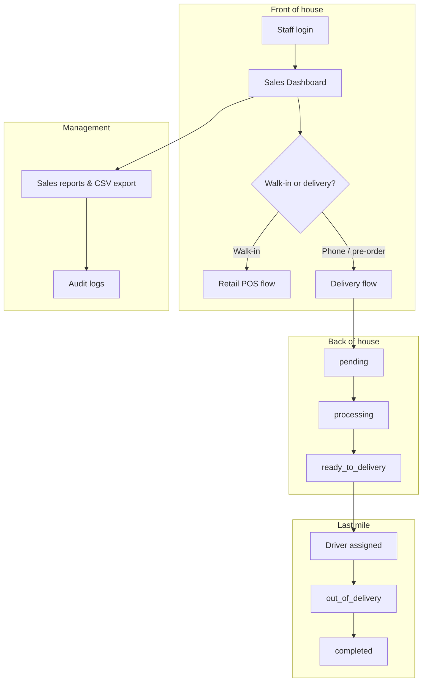

# TFG VDAY — System Workflows

Internal POS + order + delivery management for florist operations (Valentine's Day peak season).

**Stack:** Flutter (FlutterFlow) · Firebase (Auth, Firestore, Storage)

---

## 1. System Entry & Roles

| Role | Main access |
|------|-------------|
| **admin** | Dashboard, orders, products, sales reports, audit logs, company settings |
| **senior_florist** | Dashboard, create/manage orders, product selection, status updates |
| **driver** | Assigned deliveries only (`DriverDeliveryPage`) |

**User roles** (Firestore `users.role`): `admin` · `senior_florist` · `driver`

---

## 2. Create Order (Main Entry)

All new orders start from **Sales Dashboard → + Create Order**.

| Step | Route / screen |
|------|----------------|
| Dashboard | `SalesDashBoard` |
| Create order | Firestore `orders` doc + `ProductselectionCopy` |
| Retail branch | `RetailSummary` → `ReceiptPreviewpage2` |
| Delivery branch | `DCSummaryCopy` → `DeliveryReceiptPreviewPage` → `CreateOrderForm` |

---

## 3. Retail (In-Store POS) Workflow

**Steps:** Dashboard → Create Order → Product Selection → **Retail** → Retail Summary → Pay → Receipt / Print.

---

## 4. Delivery / Pick-Up Workflow

**Key Firestore fields (`orders`):**

| Field | Purpose |
|-------|---------|
| `client_name` | Customer name |
| `address`, `region`, `postal_code` | Delivery location |
| `delivery_date`, `delivery_time_slot` | Schedule |
| `card_message` | Greeting card text |
| `customer_phone_number` | Contact |
| `pickup_delivery` | Pick-up vs delivery |
| `assigned_driver` | Driver reference |
| `orderType` | `Retail` or `Delivery` |

---

## 5. Order Status Lifecycle (Florist / Staff)

| Status | Meaning | Typical actor |
|--------|---------|----------------|
| `pending` | New delivery order | System / cashier |
| `processing` | Florist preparing | senior_florist |
| `ready_to_delivery` | Ready to ship | senior_florist |
| `out_of_delivery` | On the road | driver |
| `completed` | Done | driver / staff |
| `cancelled` | Cancelled | admin / staff |

**Where status is updated:**

- `UpdateOrderStatus` sheet (from Order List / Order Detail)
- `DriverDeliveryPage` (driver actions)
- `OrderDetailPage` (e.g. Start Delivery)

---

## 6. Driver Delivery Workflow

**Screen:** `DriverDeliveryPage` (`/driverDeliveryPage`)

---

## 7. Order Management & Reporting

---

## 8. End-to-End Overview (Peak Season)

---

## 9. Screen Map

| Purpose | Widget / route |
|---------|----------------|
| Login | `LoginPage` → `/loginPage` |
| Sales hub | `SalesDashBoard` → `/salesDashBoard` |
| Company pick | `CompanySelectionPage` → `/companySelectionPage` |
| Product pick | `ProductselectionCopy` → `/productselectionCopy` |
| Retail checkout | `RetailSummary` → `/retailSummary` |
| Retail receipt | `ReceiptPreviewpage2` |
| Delivery checkout | `DCSummaryCopy` → `/deliverySummaryCopy` |
| Delivery receipt | `DeliveryReceiptPreviewPage` |
| Customer form | `CreateOrderForm` → `/createOrderForm` |
| All orders | `Orderlist1` / `Orderlist` |
| Order details | `OrderDetailPage` |
| Driver view | `DriverDeliveryPage` → `/driverDeliveryPage` |
| Products | `Productlist` / `Productcreate` / `Customproductcreate` |
| Sales reports | `SalesReportPage` |
| Audit | `AuditLogPage` |
| Company settings | `CompanySettingPage` |

---

## 10. Firestore Collections

| Collection | Purpose |
|------------|---------|
| `orders` | Order header: customer, delivery, status, totals, payment |
| `order_items` | Line items: product, qty, price, subtotal |
| `product` | Catalog: name, price, SKU, image, category |
| `users` | Staff: role, company link |
| `companies` | Multi-store / company config |
| `audit_logs` | Admin activity trail |
| `counters` | Order ID / sequence counters |

---

## 11. Custom Actions (Export / Print)

| Action | Purpose |
|--------|---------|
| `print_order_receipt_esc_pos` | Bluetooth thermal receipt |
| `export_orders_to_csv` | Export orders |
| `export_order_items_final_csv` | Export order line items |
| `export_orders_items_pickup_csv` | Pick-up / delivery export |

---

*Generated from TFG VDAY codebase. Mermaid diagrams render in GitHub, VS Code, and Cursor.*
