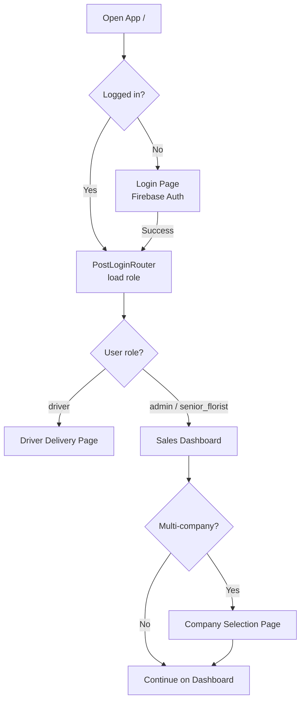
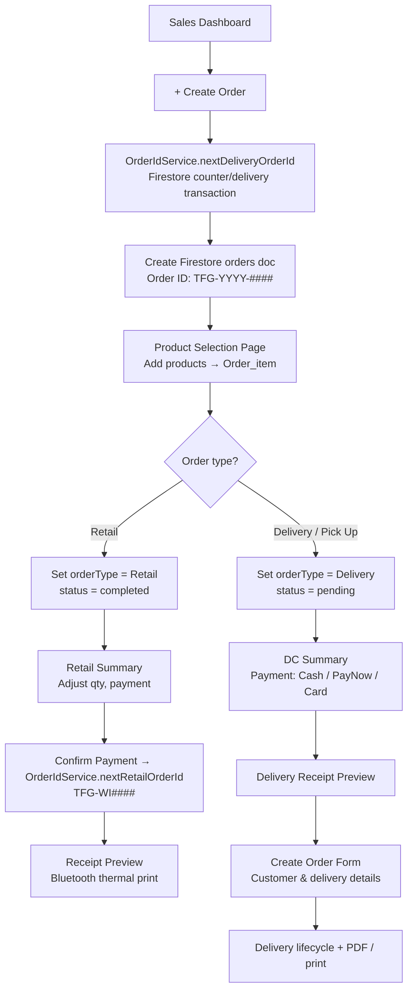
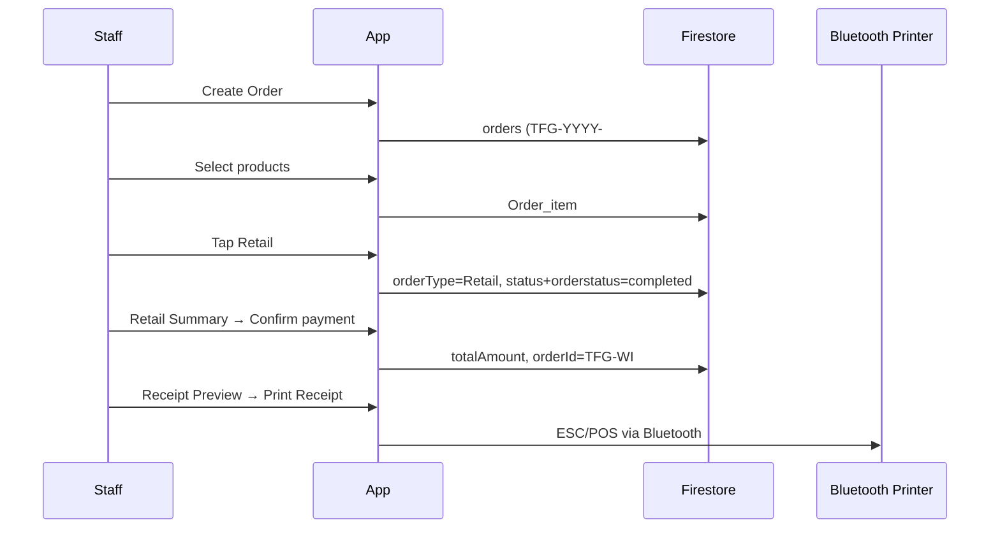
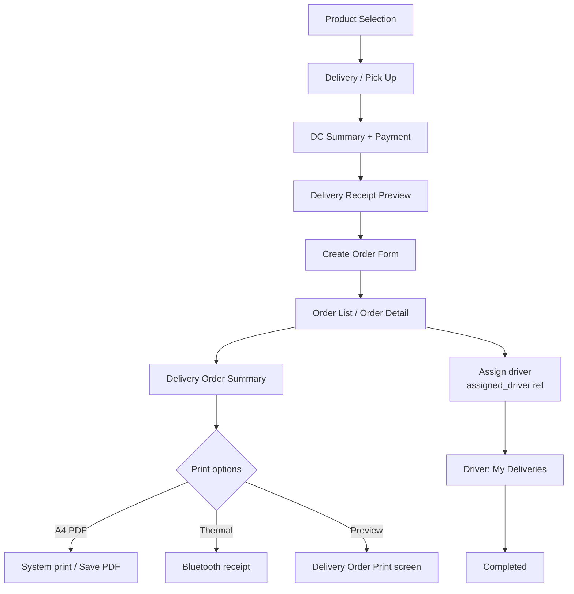
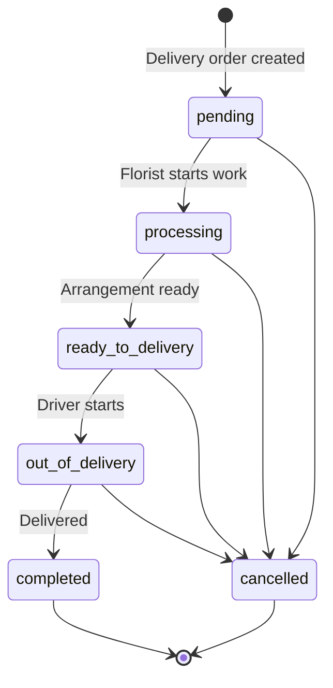
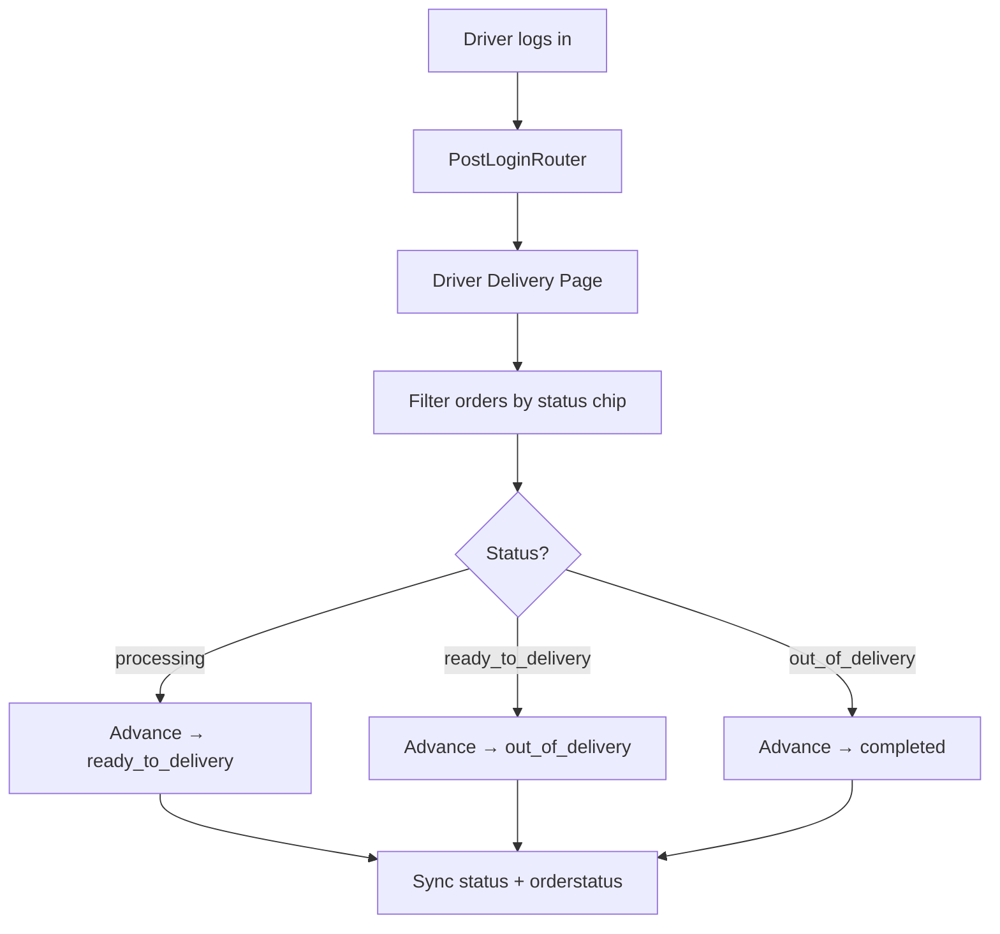
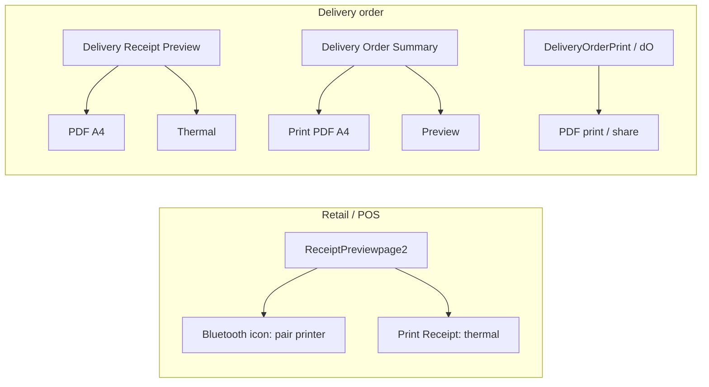
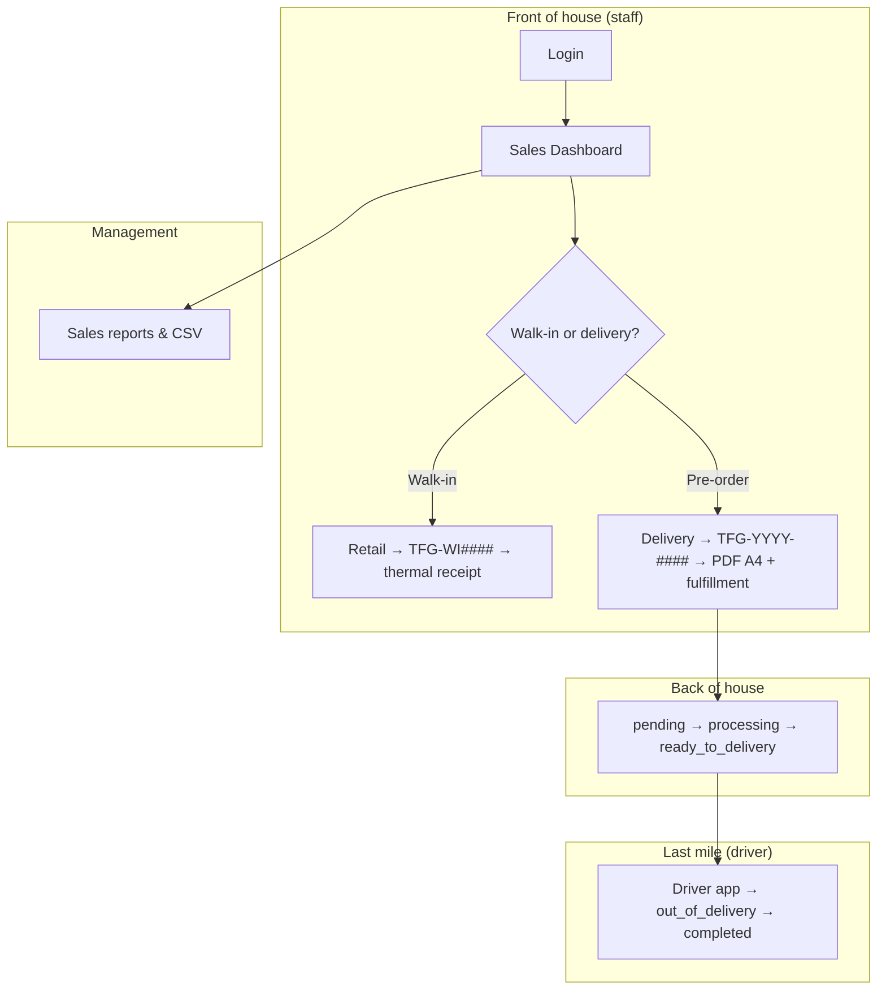

# TFG VDAY — System Workflows

Internal **POS + order + delivery** management for florist operations (Valentine's Day peak season).

| Item | Detail |
|------|--------|
| **Stack** | Flutter (FlutterFlow) · Firebase (Auth, Firestore, Storage) |
| **Backend** | Firebase project `tfg-sales-record` |
| **Platforms** | Web · Android · iOS (some features are mobile-only) |

---

## 1. System Entry, Auth & Roles

All business routes require Firebase Auth (`requireAuth = true`). Only `/loginPage` is public.



### Role-based routing

| Role | After login | Route access |
|------|-------------|--------------|
| **admin** | Sales Dashboard | Full app (orders, products, reports, audit, settings) |
| **senior_florist** | Sales Dashboard | Orders, products, status updates, printing, CSV |
| **driver** | Driver Delivery Page | **Only** `/`, `/loginPage`, `/driverDeliveryPage` — other URLs redirect to delivery page |

**Implementation:** `lib/auth/auth_redirect.dart` · `lib/auth/post_login_router_widget.dart` · `lib/auth/role_route_guard.dart` · cached role in `AppStateNotifier` (`nav.dart`).

### User profile (Firestore)

Each Firebase Auth user must have a document:

```
users/{auth.uid}
  role: admin | senior_florist | driver
  email: ...
  name: ...
  uid: {auth.uid}   (optional but recommended)
```

Profile is resolved by **uid first**, then **email** (`lib/backend/user_query_helpers.dart`).

---

## 2. Create Order (Main Entry)

All new orders start from **Sales Dashboard → + Create Order** (staff only).



| Step | Route / screen |
|------|----------------|
| Dashboard | `SalesDashBoard` → `/salesDashBoard` |
| Create order | Firestore `orders` + `ProductselectionCopy` |
| Retail branch | `RetailSummary` → `ReceiptPreviewpage2` |
| Delivery branch | `DCSummaryCopy` → `DeliveryReceiptPreviewPage` → `CreateOrderForm` |

### Order ID format

| Type | Format | Counter doc |
|------|--------|-------------|
| Delivery / pre-order | `TFG-2026-0001` | `counter/delivery` |
| Retail walk-in | `TFG-WI0001` | `counter/retail` |

Generated via atomic Firestore transaction (`lib/backend/order_id_service.dart`). Initialize counters before peak season (optional):

```
counter/delivery  →  { current: 0 }
counter/retail    →  { current: 0 }
```

---

## 3. Retail (In-Store POS) Workflow



**Steps:** Dashboard → Create Order → Product Selection → **Retail** → Retail Summary → Pay → **Receipt Preview** → Print (thermal).

| Screen | Print action |
|--------|----------------|
| `ReceiptPreviewpage2` | App bar: select Bluetooth printer · **Print Receipt** |

---

## 4. Delivery / Pick-Up Workflow



**Key Firestore fields (`orders`):**

| Field | Purpose |
|-------|---------|
| `Order_Id` | Display order number (`orderId` in app) |
| `client_name` | Customer name |
| `address`, `region`, `PostalCode` | Delivery location |
| `delivery_date`, `delivery_time_slot` | Schedule |
| `card_message` | Greeting card text |
| `customer_phone_number` | Contact |
| `pickup_delivery` | Pick-up vs delivery |
| `assigned_driver` | Reference to `users/{uid}` |
| `orderType` | `Retail` or `Delivery` |
| `status` | Order lifecycle enum (canonical) |
| `orderstatus` | Legacy string mirror for list filters (kept in sync on write) |

**Assigned driver display:** `DeliveryOrderSummaryPage` loads driver name via `orders.assigned_driver` → `users` document (not a random user query).

---

## 5. Order Status Lifecycle

Both `status` (enum) and `orderstatus` (legacy string) are updated together via `createOrderStatusUpdateData()` in `lib/backend/order_status_helpers.dart`.



| `status` (enum) | `orderstatus` (legacy filter) | Meaning | Typical actor |
|-----------------|-------------------------------|---------|----------------|
| `pending` | `pending` | New delivery order | staff |
| `processing` | `processing` | Florist preparing | senior_florist |
| `ready_to_delivery` | `readyToShip` | Ready to ship | senior_florist |
| `out_of_delivery` | `outOfDelivery` | On the road | driver |
| `completed` | `completed` | Done | driver / staff |
| `cancelled` | `cancelled` | Cancelled | admin / staff |

**Updated via:** `UpdateOrderStatus` sheet · `DriverDeliveryPage` · bulk actions on **Order List** · `OrderDetailPage`

**Driver Firestore constraint:** drivers may only update `status`, `orderstatus`, and `delivery_time_actual` on orders (see §15).

---

## 6. Driver Delivery Workflow



**Screen:** `DriverDeliveryPage` → `/driverDeliveryPage`

Drivers **cannot** open Sales Dashboard, create orders, or edit order line items (enforced by app routing + Firestore rules).

---

## 7. Printing Workflows

Two print paths: **Bluetooth thermal** (receipt) and **PDF A4** (delivery order document).



### 7.1 Bluetooth thermal (ESC/POS)

| Item | Detail |
|------|--------|
| **Module** | `lib/custom_code/bluetooth_receipt_printer.dart` |
| **Package** | `flutter_bluetooth_printer` |
| **Platform** | Android & iOS only (not Web) |
| **Saved printer** | MAC address in App State (`ff_bluetooth_printer_address`) |
| **Company header** | `getDefaultCompanyOnce()` — first company by name |

**First-time setup**

1. Open receipt preview (Retail or Delivery).
2. Tap **Bluetooth** icon in app bar → select printer from list.
3. Tap **Print Receipt** / **Thermal**.

**Receipt content:** company name, order ID, date, items, total, delivery info (if applicable), thank-you line.

### 7.2 PDF A4 (delivery order)

| Item | Detail |
|------|--------|
| **Module** | `lib/custom_code/delivery_order_pdf_printer.dart` |
| **Packages** | `pdf` · `printing` |
| **Platform** | Web, Android, iOS, desktop (system print dialog) |

**Where to print**

| Screen | Button / action |
|--------|-----------------|
| `DeliveryOrderSummaryPage` | **Print PDF (A4)** · **Preview** |
| `DeliveryReceiptPreviewPage` | **PDF A4** |
| `DeliveryOrderPrint` | App bar PDF icon (print) · Share icon (export PDF) |
| `DOWidget` (`/dO`) | App bar PDF icon |

**PDF content:** company header · order number & date · customer & delivery details · items table · subtotal/total · driver name · signature lines.

---

## 8. Order Management & Reporting


### Order List (unified)

| Item | Detail |
|------|--------|
| **Canonical route** | `/orderlist` (`Orderlist1Widget`) |
| **Legacy alias** | `/orderlist1` → redirects to `/orderlist` |
| **Widget alias** | `OrderlistWidget` extends `Orderlist1Widget` |
| **Filters** | Date range · `orderstatus` dropdown · order type chips · bulk status update |

Entry points: Sales Dashboard · Home Page · app bar search icon.

---

## 9. End-to-End Overview (Peak Season)



---

## 10. Screen Map

| Purpose | Widget | Route |
|---------|--------|-------|
| Login | `LoginPage` | `/loginPage` |
| Role router | `PostLoginRouterWidget` | `/` |
| Home hub | `HomePage` | `/homePage` |
| Sales hub | `SalesDashBoard` | `/salesDashBoard` |
| Company pick | `CompanySelectionPage` | `/companySelectionPage` |
| Product pick | `ProductselectionCopy` | `/productselectionCopy` |
| Retail checkout | `RetailSummary` | `/retailSummary` |
| Retail receipt + thermal | `ReceiptPreviewpage2` | `/receiptPreviewpage2` |
| Delivery checkout | `DCSummaryCopy` | `/deliverySummaryCopy` |
| Delivery receipt | `DeliveryReceiptPreviewPage` | `/deliveryreceiptPreviewPage` |
| Customer form | `CreateOrderForm` | `/createOrderForm` |
| Delivery summary + PDF | `DeliveryOrderSummaryPage` | `/deliveryOrderSummaryPage` |
| Delivery A4 preview | `DeliveryOrderPrint` | `/deliveryOrderPrint` |
| Delivery A4 alt | `DOWidget` | `/dO` |
| **All orders** | `Orderlist1Widget` / `OrderlistWidget` | **`/orderlist`** |
| Order details | `OrderDetailPage` | `/orderDetailPage` |
| Driver view | `DriverDeliveryPage` | `/driverDeliveryPage` |
| Products | `Productlist` / `Productcreate` / `Customproductcreate` | various |
| Sales reports | `SalesReportPage` | `/salesReportPage` |
| Audit | `AuditLogPage` | `/auditLogPage` |
| Company settings | `CompanySettingPage` | `/companySettingPage` |

---

## 11. Firestore Collections

| Collection | Purpose |
|------------|---------|
| `orders` | Order header: customer, delivery, status, totals, payment, `Order_Id` |
| `Order_item` | Line items: product, qty, price, subtotal, `orderRef` |
| `product` | Catalog: name, price, SKU, image, category |
| `users` | Staff profiles: **doc ID = auth.uid**, `role`, name, email |
| `Companies` | Company name, UEN, phone, address (used on receipts/PDF) |
| `audit_logs` | Admin activity trail (staff read) |
| `counter` | Sequential order IDs: `delivery`, `retail` |
| `counters` | Legacy counter collection (deprecated; rules still allow staff access) |

### Loading orders correctly

Always load a single order by document reference — **never** `queryOrdersRecord(singleRecord: true)` without a filter:

```dart
OrdersRecord.getDocument(orderRef)
// or
OrderRecordBuilder(orderRef: orderRef, builder: ...)
```

See `lib/backend/order_query_helpers.dart`.

---

## 12. Backend Helper Modules

| File | Purpose |
|------|---------|
| `lib/backend/order_query_helpers.dart` | `OrderRecordBuilder`, stream by `orderRef` |
| `lib/backend/order_status_helpers.dart` | Sync `status` + `orderstatus` on writes |
| `lib/backend/order_id_service.dart` | Transaction-based `TFG-*` / `TFG-WI*` IDs |
| `lib/backend/company_query_helpers.dart` | Default company for receipts/PDF (by name) |
| `lib/backend/user_query_helpers.dart` | Resolve current user profile (uid → email) |
| `lib/auth/auth_redirect.dart` | Post-login route by role |
| `lib/auth/role_route_guard.dart` | Driver route allow-list |

---

## 13. Custom Code Modules

| File | Purpose |
|------|---------|
| `lib/custom_code/bluetooth_receipt_printer.dart` | Pair Bluetooth printer, print ESC/POS receipts |
| `lib/custom_code/delivery_order_pdf_printer.dart` | Generate & print/share A4 delivery PDF |
| `lib/custom_code/actions/print_order_receipt_esc_pos.dart` | FlutterFlow action: thermal print |
| `lib/custom_code/actions/export_orders_to_csv.dart` | Export orders CSV |
| `lib/custom_code/actions/export_order_items_final_csv.dart` | Export line items CSV |
| `lib/custom_code/actions/export_orders_items_pickup_csv.dart` | Pick-up / delivery CSV |

---

## 14. Custom Actions (FlutterFlow)

| Action | Purpose |
|--------|---------|
| `printOrderReceiptEscPos` | Bluetooth thermal receipt |
| `exportOrdersToCsv` | Export orders |
| `exportOrderItemsFinalCsv` | Export order line items |
| `exportOrdersItemsPickupCsv` | Pick-up / delivery export |

---

## 15. Firestore Security Rules

Rules file: `firebase/firestore.rules` — deploy with:

```bash
firebase deploy --only firestore:rules
```

### Permission matrix

| Collection | Read | Create | Update | Delete |
|------------|------|--------|--------|--------|
| `orders` | staff + driver | staff | staff; driver: status fields only | admin |
| `Order_item` | staff + driver | staff | staff | admin |
| `product` / `customProduct` | signed-in | staff | staff | admin |
| `users` | self + staff | self (uid match) | self + admin | admin |
| `Companies` | signed-in | admin | admin | admin |
| `counter` | staff + driver | staff | staff | admin |
| `audit_logs` | staff | signed-in | — | — |

**Role helpers:** `isStaffUser()` · `isDriverUser()` · `isAdminUser()` — all read role from `users/{auth.uid}.role`.

### Driver update constraint

Drivers may only change these fields on an existing order:

- `status`
- `orderstatus`
- `delivery_time_actual`

---

## 16. Deployment Checklist (Peak Season)

1. **Deploy rules:** `firebase deploy --only firestore:rules`
2. **User documents:** ensure every Auth user has `users/{uid}` with correct `role`
3. **Initialize counters** (optional): `counter/delivery`, `counter/retail` → `{ current: 0 }`
4. **Smoke test staff:** create order → retail + delivery branches → print → CSV
5. **Smoke test driver:** login → delivery page only → advance status → verify staff pages blocked
6. **Android:** Bluetooth permissions already in manifest for thermal printing

---

## 17. Platform Notes

| Feature | Web | Android | iOS |
|---------|-----|---------|-----|
| Login / Firestore | Yes | Yes | Yes |
| Create & manage orders (staff) | Yes | Yes | Yes |
| Driver delivery page | Yes | Yes | Yes |
| Bluetooth thermal print | No | Yes | Yes |
| PDF A4 print / share | Yes | Yes | Yes |
| CSV export | Yes | Yes | Yes |

**Android:** Bluetooth permissions in `AndroidManifest.xml` (`BLUETOOTH_SCAN`, `BLUETOOTH_CONNECT`, location for discovery).

**Flutter 3.44:** if `page_transition` build fails, add `import 'package:flutter/cupertino.dart';` to the package's `page_transition.dart` in pub cache.

---

*Repository: [kahliantoo-rgb/tfg_vday](https://github.com/kahliantoo-rgb/tfg_vday) · Mermaid diagrams render in GitHub, VS Code, and Cursor.*
