# TFG VDAY — System Workflows

Internal **POS + order + delivery** management for florist operations (Valentine's Day peak season).

| Item | Detail |
|------|--------|
| **Stack** | Flutter (FlutterFlow) · Firebase (Auth, Firestore, Storage) |
| **Backend** | Firebase project `tfg-sales-record` |
| **Platforms** | Web · Android · iOS (some features are mobile-only) |

---

## 1. System Entry, Auth & Roles

All business routes require Firebase Auth (`requireAuth = true`). Only `/loginPage` is public.

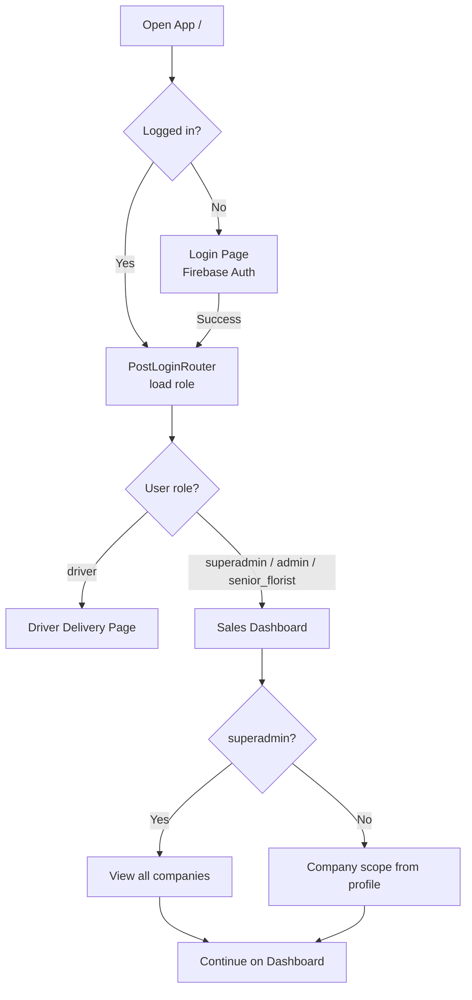
```mermaid
flowchart TD
    A[Open App /] --> B{Logged in?}
    B -->|No| C[Login Page<br/>Firebase Auth]
    B -->|Yes| D[PostLoginRouter<br/>load role]
    C -->|Success| D
    D --> E{User role?}
    E -->|driver| F[Driver Delivery Page]
    E -->|superadmin / admin / senior_florist| G[Sales Dashboard]
    G --> H{superadmin?}
    H -->|Yes| I[View all companies]
    H -->|No| J[Company scope from profile]
    I --> K[Continue on Dashboard]
    J --> K
```

### Role-based routing

| Role | Cross-company view | After login | Typical scope |
|------|-------------------|-------------|---------------|
| **superadmin** | Yes — all companies | Sales Dashboard | Platform owner; create/delete `Companies`; all admin UI |
| **admin** | No — own `companyRef` | Sales Dashboard | Company admin; register staff; company settings |
| **senior_florist** | No — own `companyRef` | Sales Dashboard | Orders, products, status, print, CSV |
| **driver** | No | Driver Delivery Page | **Only** `/`, `/loginPage`, `/driverDeliveryPage` |

**Implementation:** `lib/auth/role_helpers.dart` · `lib/auth/auth_redirect.dart` · `lib/auth/role_route_guard.dart` · `TenantContext.canViewAllCompanies()` (superadmin only).

### User profile (Firestore)

Each Firebase Auth user must have a document:

```
users/{auth.uid}
  role: superadmin | admin | senior_florist | driver
  email: ...
  name: ...
  uid: {auth.uid}   (required — doc id must match Auth UID)
  companyRef: ...    (required for admin / senior_florist / driver; optional for superadmin)
  is_active: true    (default; false blocks login)
  created_time, phone_number, display_name
```

Profile is resolved by **uid first**, then **email** (`lib/backend/user_query_helpers.dart`).

---

## 2. Create Order (Main Entry)

All new orders start from **Sales Dashboard → + Create Order** (staff only). The dashboard also offers **Paste from WhatsApp** (when enabled) and a **Menu** for secondary actions (customers, products, reports, logout).

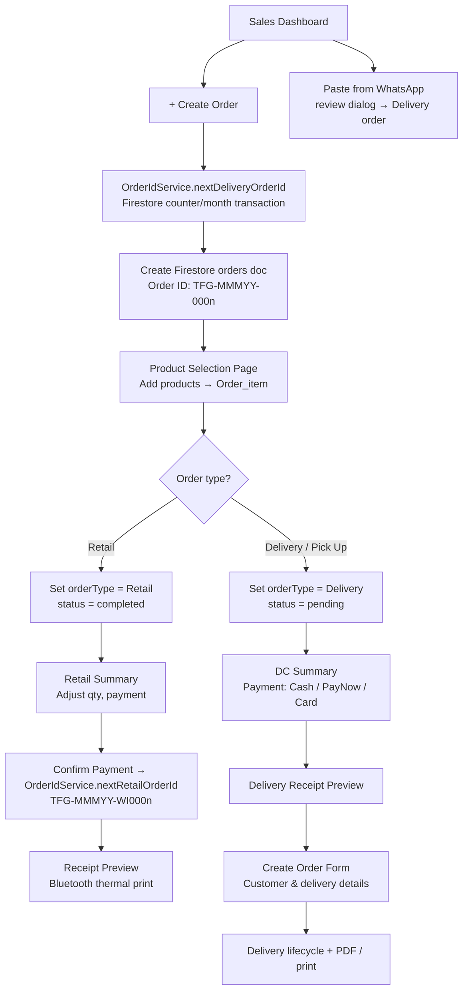
```mermaid
flowchart TD
    A[Sales Dashboard] --> B[+ Create Order]
    A --> W[Paste from WhatsApp<br/>review dialog → Delivery order]
    B --> C[OrderIdService.nextDeliveryOrderId<br/>Firestore counter/month transaction]
    C --> D[Create Firestore orders doc<br/>Order ID: TFG-MMMYY-000n]
    D --> E[Product Selection Page<br/>Add products → Order_item]
    E --> F{Order type?}

    F -->|Retail| G[Set orderType = Retail<br/>status = completed]
    G --> H[Retail Summary<br/>Adjust qty, payment]
    H --> I[Confirm Payment → OrderIdService.nextRetailOrderId<br/>TFG-MMMYY-WI000n]
    I --> J[Receipt Preview<br/>Bluetooth thermal print]

    F -->|Delivery / Pick Up| K[Set orderType = Delivery<br/>status = pending]
    K --> L[DC Summary<br/>Payment: Cash / PayNow / Card]
    L --> M[Delivery Receipt Preview]
    M --> N[Create Order Form<br/>Customer & delivery details]
    N --> O[Delivery lifecycle + PDF / print]
```

| Step | Route / screen |
|------|----------------|
| Dashboard | `SalesDashBoard` → `/salesDashBoard` |
| Create order | Firestore `orders` + `ProductselectionCopy` |
| Retail branch | `RetailSummary` → `ReceiptPreviewpage2` |
| Delivery branch | `DCSummaryCopy` → `DeliveryReceiptPreviewPage` → `CreateOrderForm` |

### 2.1 WhatsApp paste import

**Entry:** Sales Dashboard → **Paste from WhatsApp** (`WhatsAppOrderPasteButton`).

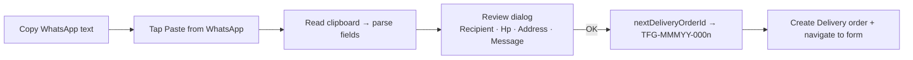
```mermaid
flowchart LR
    A[Copy WhatsApp text] --> B[Tap Paste from WhatsApp]
    B --> C[Read clipboard → parse fields]
    C --> D[Review dialog<br/>Recipient · Hp · Address · Message]
    D -->|OK| E[nextDeliveryOrderId → TFG-MMMYY-000n]
    E --> F[Create Delivery order + navigate to form]
```

| Behaviour | Detail |
|-----------|--------|
| **Enabled** | Staging and production (`isWhatsAppOrderImportEnabled = true`) |
| **Order type** | Always **Delivery** (`whatsAppImportOrderType`) |
| **Order ID** | New ID from `OrderIdService.nextDeliveryOrderId()` — never reuses pasted ID |
| **Time slot** | Parsed from text, else **09:00-20:00** (`defaultWhatsAppDeliveryTimeSlot`) |
| **Shopify #** | e.g. `#1102` → `client_name` on order only (not customer profile) |
| **Fields written** | `recipientName`, `recipient_phone_number`, address, postal, region, card message, delivery date |

**Implementation:** `lib/backend/order_whatsapp_import_helpers.dart` · `lib/backend/whatsapp_order_import_service.dart` · `lib/components/whatsapp_order_paste_button.dart`

### 2.2 Customer link on Create Order Form

Staff can search existing customers via autocomplete (`CustomerAutocompleteField`). Selecting a customer sets `customerRef` and `customer_phone_number` from the profile. The **Recipient Phone** field maps to `recipient_phone_number` and is **not** auto-filled from the customer profile (recipient may differ from billing contact).

**Implementation:** `lib/backend/customer_helpers.dart` · `lib/components/customer_autocomplete_field.dart` · `lib/pages/create_order_form/`

### Custom products (one-off line items)

Staff can add a **Customize** SKU from:

- **Product Selection** — bottom “Have a Customize product?” fields + **Create**
- **Custom product Form** — `/customproductcreate` (full name / qty / price / remark)

On **Create**, a dialog asks:

| Option | Action |
|--------|--------|
| **Upload Photo** | Pick image → Firebase Storage `custom_product_images/{orderItemId}/…` → save `Order_item` with optional `image` URL |
| **Add** | Save line item without photo |
| **Cancel** | No write |

**Implementation:** `lib/backend/custom_product_helpers.dart` · `Order_item.sku = 'Customize'`

### Order ID format

| Type | Format | Counter doc (per month) |
|------|--------|-------------------------|
| Delivery / pre-order | `TFG-JUN26-0001` | `counter/default_delivery_JUN26` |
| Retail walk-in | `TFG-JUN26-WI0001` | `counter/default_retail_JUN26` |

Month suffix uses `MMMyy` in English (`JUN26`, `JUL26`, …). Delivery and retail use **independent** counters per month. Legacy IDs (`TFG-2026-0001`, `TFG-WI0001`) remain valid for existing orders.

- **Delivery / pre-order:** `nextDeliveryOrderId()` at **Create Order** or WhatsApp import.
- **Retail walk-in:** `nextRetailOrderId()` when switching to Retail on checkout.

Initialize before peak season (optional):

```
counter/default_delivery_JUN26  →  { current: 0 }
counter/default_retail_JUN26    →  { current: 0 }
```

Generated via atomic Firestore transaction (`lib/backend/order_id_service.dart`). Run `npm run init:counters` from `firebase/` to sync counters for all companies (see §16).

---

## 3. Retail (In-Store POS) Workflow

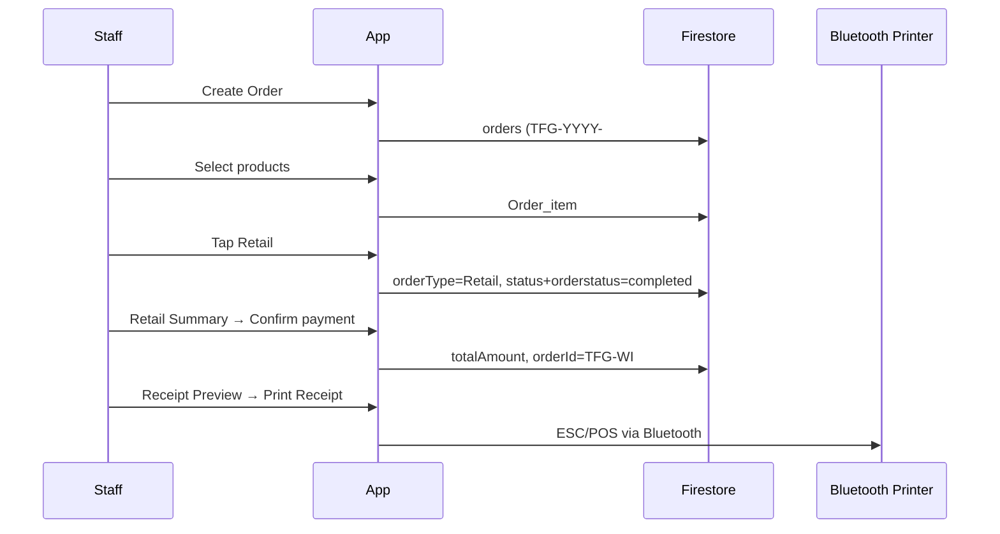
```mermaid
sequenceDiagram
    participant Staff
    participant App
    participant Firestore
    participant Printer as Bluetooth Printer

    Staff->>App: Create Order
    App->>Firestore: orders (TFG-YYYY-####)
    Staff->>App: Select products
    App->>Firestore: Order_item
    Staff->>App: Tap Retail
    App->>Firestore: orderType=Retail, status+orderstatus=completed
    Staff->>App: Retail Summary → Confirm payment
    App->>Firestore: totalAmount, orderId=TFG-WI####
    Staff->>App: Receipt Preview → Print Receipt
    App->>Printer: ESC/POS via Bluetooth
```

**Steps:** Dashboard → Create Order → Product Selection → **Retail** → Retail Summary → Pay → **Receipt Preview** → Print (thermal).

| Screen | Print action |
|--------|----------------|
| `ReceiptPreviewpage2` | App bar: select Bluetooth printer · **Print Receipt** |

---

## 4. Delivery / Pick-Up Workflow

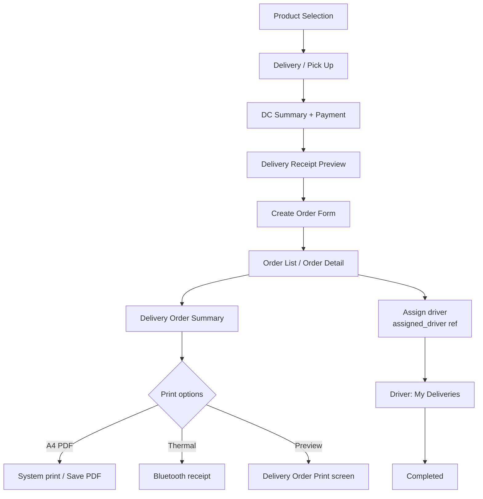
```mermaid
flowchart TD
    A[Product Selection] --> B[Delivery / Pick Up]
    B --> C[DC Summary + Payment]
    C --> D[Delivery Receipt Preview]
    D --> E[Create Order Form]
    E --> F[Order List / Order Detail]
    F --> G[Delivery Order Summary]
    G --> H{Print options}
    H -->|A4 PDF| I[System print / Save PDF]
    H -->|Thermal| J[Bluetooth receipt]
    H -->|Preview| K[Delivery Order Print screen]
    F --> L[Assign driver<br/>assigned_driver ref]
    L --> M[Driver: My Deliveries]
    M --> N[Completed]
```

**Key Firestore fields (`orders`):**

| Field | Purpose |
|-------|---------|
| `Order_Id` | Display order number (`orderId` in app) |
| `client_name` | Customer / payer name (Shopify ref on WhatsApp import) |
| `recipientName` | Delivery recipient display name |
| `address`, `region`, `PostalCode` | Delivery location |
| `delivery_date`, `delivery_time_slot` | Schedule |
| `card_message` | Greeting card text |
| `customer_phone_number` | Linked customer profile phone (when `customerRef` set) |
| `recipient_phone_number` | Recipient / delivery contact phone |
| `customerRef` | Optional link to `customers/{id}` |
| `pickup_delivery` | Pick-up vs delivery |
| `assigned_driver` | Reference to `users/{uid}` |
| `orderType` | `Retail` or `Delivery` |
| `status` | Order lifecycle enum (canonical) |
| `orderstatus` | Legacy string mirror for list filters (kept in sync on write) |

**Assigned driver display:** `DeliveryOrderSummaryPage` loads driver name via `orders.assigned_driver` → `users` document (not a random user query).

---

## 5. Order Status Lifecycle

Both `status` (enum) and `orderstatus` (legacy string) are updated together via `createOrderStatusUpdateData()` in `lib/backend/order_status_helpers.dart`.

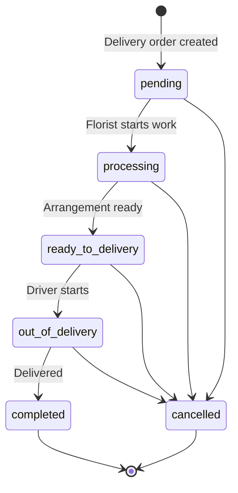
```mermaid
stateDiagram-v2
    [*] --> pending: Delivery order created
    pending --> processing: Florist starts work
    processing --> ready_to_delivery: Arrangement ready
    ready_to_delivery --> out_of_delivery: Driver starts
    out_of_delivery --> completed: Delivered
    pending --> cancelled
    processing --> cancelled
    ready_to_delivery --> cancelled
    out_of_delivery --> cancelled
    completed --> [*]
    cancelled --> [*]
```

| `status` (enum) | `orderstatus` (legacy filter) | Meaning | Typical actor |
|-----------------|-------------------------------|---------|----------------|
| `pending` | `pending` | New delivery order | staff |
| `processing` | `processing` | Florist preparing | senior_florist |
| `ready_to_delivery` | `readyToShip` | Ready to ship | senior_florist |
| `out_of_delivery` | `outOfDelivery` | On the road | driver |
| `completed` | `completed` | Done | driver / staff |
| `cancelled` | `cancelled` | Cancelled | admin / staff |

**Updated via:** `UpdateOrderStatus` sheet · `DriverDeliveryPage` · bulk actions on **Order List** · `OrderDetailPage`

**Driver Firestore constraint:** drivers may only update `status`, `orderstatus`, and `delivery_time_actual` on orders (see §15).

---

## 6. Driver Delivery Workflow

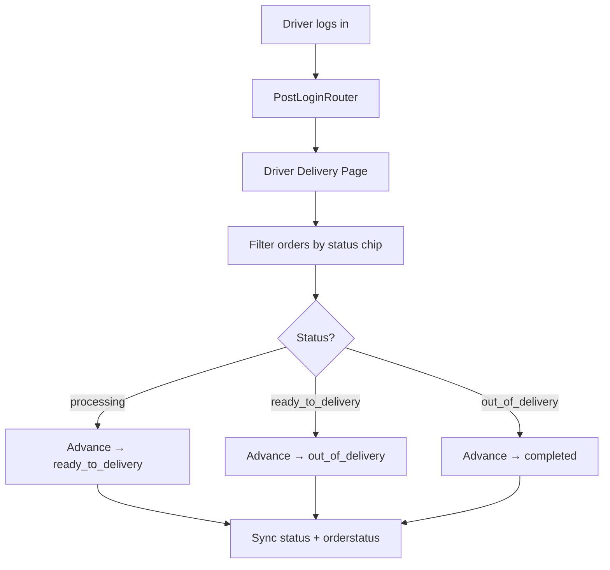
```mermaid
flowchart TD
    A[Driver logs in] --> B[PostLoginRouter]
    B --> C[Driver Delivery Page]
    C --> D[Filter orders by status chip]
    D --> E{Status?}
    E -->|processing| F[Advance → ready_to_delivery]
    E -->|ready_to_delivery| G[Advance → out_of_delivery]
    E -->|out_of_delivery| H[Advance → completed]
    F --> I[Sync status + orderstatus]
    G --> I
    H --> I
```

**Screen:** `DriverDeliveryPage` → `/driverDeliveryPage`

Drivers **cannot** open Sales Dashboard, create orders, or edit order line items (enforced by app routing + Firestore rules).

---

## 7. Printing Workflows

Two print paths: **Bluetooth thermal** (receipt) and **PDF A4** (delivery order document).

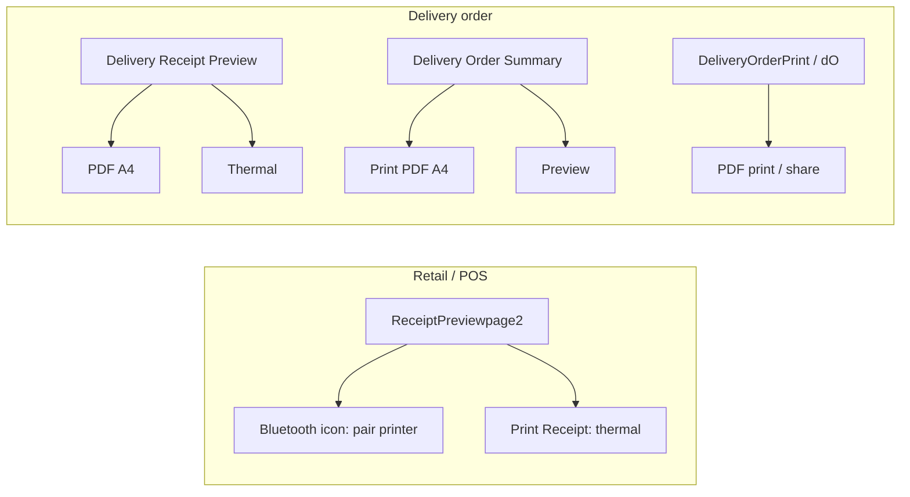
```mermaid
flowchart LR
    subgraph Retail["Retail / POS"]
        R1[ReceiptPreviewpage2] --> R2[Bluetooth icon: pair printer]
        R1 --> R3[Print Receipt: thermal]
    end

    subgraph Delivery["Delivery order"]
        D1[Delivery Receipt Preview] --> D2[PDF A4]
        D1 --> D3[Thermal]
        D4[Delivery Order Summary] --> D5[Print PDF A4]
        D4 --> D6[Preview]
        D7[DeliveryOrderPrint / dO] --> D8[PDF print / share]
    end
```

### 7.1 Bluetooth thermal (ESC/POS)

| Item | Detail |
|------|--------|
| **Module** | `lib/custom_code/bluetooth_receipt_printer.dart` |
| **Package** | `flutter_bluetooth_printer` |
| **Platform** | Android & iOS only (not Web) |
| **Saved printer** | MAC address in App State (`ff_bluetooth_printer_address`) |
| **Company header** | `getDefaultCompanyOnce()` — first company by name |

**First-time setup**

1. Open receipt preview (Retail or Delivery).
2. Tap **Bluetooth** icon in app bar → select printer from list.
3. Tap **Print Receipt** / **Thermal**.

**Receipt content:** company name, order ID, date, items, total, delivery info (if applicable), thank-you line.

### 7.2 PDF A4 (delivery order)

| Item | Detail |
|------|--------|
| **Module** | `lib/custom_code/delivery_order_pdf_printer.dart` |
| **Packages** | `pdf` · `printing` |
| **Platform** | Web, Android, iOS, desktop (system print dialog) |

**Where to print**

| Screen | Button / action |
|--------|-----------------|
| `DeliveryOrderSummaryPage` | **Print PDF (A4)** · **Preview** |
| `DeliveryReceiptPreviewPage` | **PDF A4** |
| `DeliveryOrderPrint` | App bar PDF icon (print) · Share icon (export PDF) |
| `DOWidget` (`/dO`) | App bar PDF icon |

**PDF content:** company header · order number & date · customer & delivery details · items table · subtotal/total · driver name · signature lines.

---

## 8. Order Management & Reporting

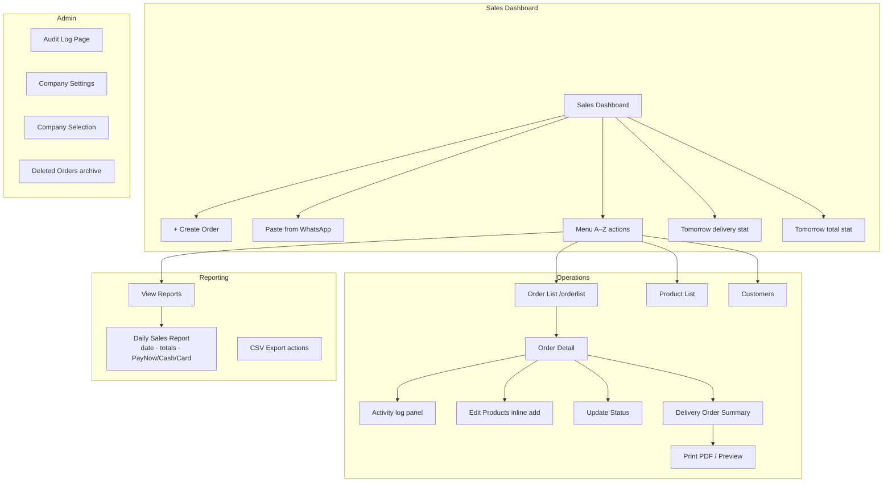
```mermaid
flowchart TB
    subgraph Dashboard["Sales Dashboard"]
        A[Sales Dashboard] --> CO[+ Create Order]
        A --> WA[Paste from WhatsApp]
        A --> M[Menu A–Z actions]
        A --> S1[Tomorrow delivery stat]
        A --> S2[Tomorrow total stat]
    end

    subgraph Operations
        M --> B[Order List /orderlist]
        M --> C[Product List]
        M --> CU[Customers]
        B --> D[Order Detail]
        D --> AL[Activity log panel]
        D --> EP[Edit Products inline add]
        D --> E[Update Status]
        D --> F[Delivery Order Summary]
        F --> G[Print PDF / Preview]
    end

    subgraph Reporting
        M --> V[View Reports]
        V --> H[Daily Sales Report<br/>date · totals · PayNow/Cash/Card]
        I[CSV Export actions]
    end

    subgraph Admin
        J[Audit Log Page]
        K[Company Settings]
        L[Company Selection]
        DO[Deleted Orders archive]
    end
```

### Sales Dashboard layout

| UI | Detail |
|----|--------|
| **Primary actions** | **+ Create Order** · **Paste from WhatsApp** (when enabled) |
| **Stat cards** | Tomorrow delivery orders · Tomorrow total orders (tap → filtered order list) |
| **Menu** | Secondary actions A–Z: products, customers, reports, audit log, company settings, user list, etc. |
| **Logout** | Last item in Menu |

**Implementation:** `lib/pages/sales_dash_board/` · `lib/backend/dashboard_order_stats_helpers.dart`

### Customers

| Action | Route |
|--------|-------|
| Create customer | Menu → **Create Customer** → `/customerCreateForm` |
| List / search | Menu → **Customers** → `/customerListPage` |
| Profile | Tap row → `/customerProfilePage` |
| Broadcast WhatsApp | Customer list → select → broadcast helper opens WhatsApp with prefilled message |

Firestore `customers/{id}`: `name`, `phone`, `billing_address`, `companyRef`, timestamps. Tenant-scoped read/write (staff).

**Implementation:** `lib/backend/customer_helpers.dart` · `lib/backend/customer_broadcast_helpers.dart` · `lib/pages/customer_*`

### Order Detail — Activity log & Edit Products

On **Order Detail Page**:

| Panel | Behaviour |
|-------|-----------|
| **Activity log** | Collapsible `ExpansionTile`; entries show action, **By {userName}**, timestamp (`OrderActivityLogPanel`) |
| **Edit Products** | **Add Products** opens inline bottom sheet — catalog grid with search/category filter + custom product form; no navigation to Product Selection page |

Totals recalculated after line-item changes (`recalculateOrderTotals` in `lib/backend/order_item_helpers.dart`).

### Order List (unified)

| Item | Detail |
|------|--------|
| **Canonical route** | `/orderlist` (`Orderlist1Widget`) |
| **Legacy alias** | `/orderlist1` → redirects to `/orderlist` |
| **Widget alias** | `OrderlistWidget` extends `Orderlist1Widget` |
| **Filters** | Date range · `orderstatus` dropdown · order type chips · bulk status update |

Entry points: Sales Dashboard · Home Page · app bar search icon.

**Order list type chips:** All · Retail · Delivery · Pick Up (`lib/backend/order_list_filter_helpers.dart`).

### Daily sales report

Staff open **Sales Dashboard → View Reports** (`/salesReportPage`).

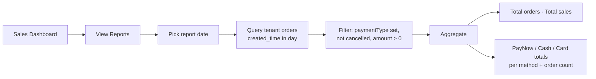
```mermaid
flowchart LR
    DB[Sales Dashboard] --> VR[View Reports]
    VR --> DP[Pick report date]
    DP --> Q[Query tenant orders<br/>created_time in day]
    Q --> F[Filter: paymentType set,<br/>not cancelled, amount > 0]
    F --> A[Aggregate]
    A --> T[Total orders · Total sales]
    A --> P[PayNow / Cash / Card totals<br/>per method + order count]
```

| Output | Source |
|--------|--------|
| Report date | User-selected calendar day (default: today) |
| Total orders | Count of qualifying paid orders |
| Total sales | Sum of `totalAmount` (fallback `total`) |
| **PayNow total** | Sum where `paymentType` normalizes to PayNow |
| Cash / Card totals | Same pattern |

**Implementation:** `lib/backend/daily_sales_report_service.dart` · `lib/pages/sales_report_page/sales_report_page_widget.dart`

**Note:** Report uses **`created_time`** and **`paymentType`** (set on Retail Summary or DC Summary payment step). Orders without a payment method are excluded.

### Staff registration & user management

- Public self-registration on login is **disabled**; **admin / superadmin** create staff after login (`RegisterPage` `/register`).
- **superadmin** can pick company when creating staff; **admin** is company-scoped.
- **User List** (`/userListPage`) — admin / superadmin only:
  - Columns: **Name**, **Role**, **Status** (Active / Inactive)
  - Multi-select → **Set Inactive**, **Activate**, or **Delete** (Firestore profile only)
  - **Admin** may manage drivers and senior florists in their company (not other admins / superadmins)
  - **Superadmin** may manage all staff except their own account
  - Inactive users cannot log in (`is_active: false`)
- Entry points: **Sales Dashboard → User List** · **Company Profile → View User List** · **Add Staff**
- **Home** button on staff screens returns to Sales Dashboard (`lib/components/home_nav_button.dart`).
- **Driver** app bar and footer include **Logout**.

**Implementation:** `lib/pages/user_list_page/` · `lib/backend/user_list_helpers.dart` · `lib/backend/user_admin_service.dart` · `lib/auth/role_helpers.dart` (`canViewUserList`)

---

## 9. End-to-End Overview (Peak Season)

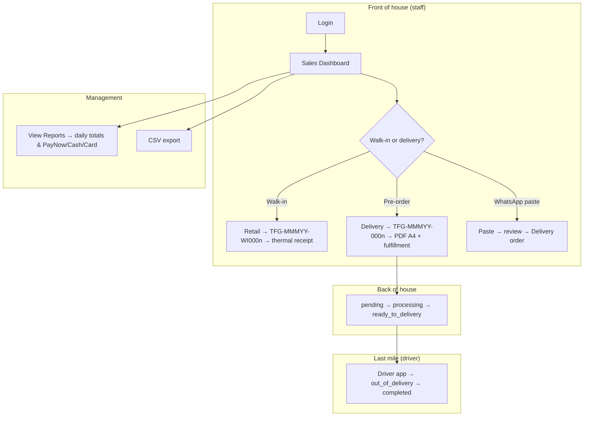
```mermaid
flowchart TB
    subgraph Front["Front of house (staff)"]
        S1[Login] --> S2[Sales Dashboard]
        S2 --> S3{Walk-in or delivery?}
        S3 -->|Walk-in| S4[Retail → TFG-MMMYY-WI000n → thermal receipt]
        S3 -->|Pre-order| S5[Delivery → TFG-MMMYY-000n → PDF A4 + fulfillment]
        S3 -->|WhatsApp paste| S6[Paste → review → Delivery order]
    end

    subgraph Back["Back of house"]
        S5 --> B1[pending → processing → ready_to_delivery]
    end

    subgraph LastMile["Last mile (driver)"]
        B1 --> D1[Driver app → out_of_delivery → completed]
    end

    subgraph Insight["Management"]
        S2 --> R1[View Reports → daily totals & PayNow/Cash/Card]
        S2 --> R2[CSV export]
    end
```

---

## 10. Screen Map

| Purpose | Widget | Route |
|---------|--------|-------|
| Login | `LoginPage` | `/loginPage` |
| Role router | `PostLoginRouterWidget` | `/` |
| Home hub | `HomePage` | `/homePage` |
| Sales hub | `SalesDashBoard` | `/salesDashBoard` |
| Company pick | `CompanySelectionPage` | `/companySelectionPage` |
| Product pick | `ProductselectionCopy` | `/productselectionCopy` |
| Retail checkout | `RetailSummary` | `/retailSummary` |
| Retail receipt + thermal | `ReceiptPreviewpage2` | `/receiptPreviewpage2` |
| Delivery checkout | `DCSummaryCopy` | `/deliverySummaryCopy` |
| Delivery receipt | `DeliveryReceiptPreviewPage` | `/deliveryreceiptPreviewPage` |
| Customer form | `CreateOrderForm` | `/createOrderForm` |
| **Customers** | `CustomerCreateForm` / `CustomerListPage` / `CustomerProfilePage` | `/customerCreateForm` · `/customerListPage` · `/customerProfilePage` |
| Delivery summary + PDF | `DeliveryOrderSummaryPage` | `/deliveryOrderSummaryPage` |
| Delivery A4 preview | `DeliveryOrderPrint` | `/deliveryOrderPrint` |
| Delivery A4 alt | `DOWidget` | `/dO` |
| **All orders** | `Orderlist1Widget` / `OrderlistWidget` | **`/orderlist`** |
| Order details | `OrderDetailPage` | `/orderDetailPage` |
| Driver view | `DriverDeliveryPage` | `/driverDeliveryPage` |
| Products | `Productlist` / `Productcreate` / `Customproductcreate` | various |
| Sales reports | `SalesReportPage` | `/salesReportPage` |
| Audit | `AuditLogPage` | `/auditLogPage` |
| Company settings | `CompanySettingPage` | `/companySettingPage` |
| Register staff | `RegisterPage` | `/register` |
| **User list** | `UserListPage` | `/userListPage` |
| **Deleted orders** | `DeletedOrdersPage` / `DeletedOrderDetailPage` | `/deletedOrdersPage` · `/deletedOrderDetailPage` |

---

## 11. Firestore Collections

| Collection | Purpose |
|------------|---------|
| `orders` | Order header: customer, recipient, delivery, status, totals, payment, `Order_Id` |
| `Order_item` | Line items: product, qty, price, subtotal, `orderRef`, optional `image` (custom products) |
| `product` | Catalog: name, price, SKU, image, category |
| `customers` | Customer profiles: name, phone, billing address, `companyRef` |
| `users` | Staff profiles: **doc ID = auth.uid**, `role`, name, email, `is_active` |
| `Companies` | Company name, UEN, phone, address (used on receipts/PDF) |
| `deleted_orders` | Archived orders removed from active list (admin audit trail) |
| `audit_logs` | Admin activity trail (staff read) |
| `counter` | Sequential order IDs per month: `default_delivery_JUN26`, `default_retail_JUN26`, … |
| `counters` | Legacy counter collection (deprecated; staff read/write only) |

### Loading orders correctly

Always load a single order by document reference — **never** `queryOrdersRecord(singleRecord: true)` without a filter:

```dart
OrdersRecord.getDocument(orderRef)
// or
OrderRecordBuilder(orderRef: orderRef, builder: ...)
```

See `lib/backend/order_query_helpers.dart`.

---

## 12. Backend Helper Modules

| File | Purpose |
|------|---------|
| `lib/backend/order_query_helpers.dart` | `OrderRecordBuilder`, stream by `orderRef` |
| `lib/backend/order_status_helpers.dart` | Sync `status` + `orderstatus` on writes |
| `lib/backend/order_id_service.dart` | Transaction-based monthly `TFG-MMMYY-*` IDs |
| `lib/backend/order_whatsapp_import_helpers.dart` | Parse WhatsApp text, field labels, defaults |
| `lib/backend/whatsapp_order_import_service.dart` | Dashboard paste → create delivery order |
| `lib/backend/customer_helpers.dart` | Customer CRUD, tenant queries |
| `lib/backend/customer_broadcast_helpers.dart` | WhatsApp broadcast from customer list |
| `lib/backend/order_item_helpers.dart` | Add catalog line items, recalculate totals |
| `lib/backend/order_activity_log_service.dart` | Order-scoped audit entries |
| `lib/backend/audit_log_helpers.dart` | Action labels, performer display name |
| `lib/backend/dashboard_order_stats_helpers.dart` | Tomorrow delivery/total stat cards |
| `lib/backend/product_category_helpers.dart` | Product categories for catalog grid |
| `lib/backend/product_selection_helpers.dart` | Search/filter for product pickers |
| `lib/backend/company_query_helpers.dart` | Default company for receipts/PDF (by name) |
| `lib/backend/user_query_helpers.dart` | Resolve current user profile (uid → email) |
| `lib/backend/user_list_helpers.dart` | User list display, tenant filter, manage permissions |
| `lib/backend/user_admin_service.dart` | Set `is_active`, delete user profiles (batch) |
| `lib/backend/order_delete_service.dart` | Archive orders to `deleted_orders` then delete |
| `lib/backend/order_restore_service.dart` | Restore archived orders |
| `lib/backend/custom_product_helpers.dart` | Customize product dialog, photo upload, line-item create |
| `lib/backend/firebase/app_environment.dart` | `APP_ENV=staging` vs production Firebase project |
| `lib/auth/auth_redirect.dart` | Post-login route by role |
| `lib/auth/role_route_guard.dart` | Driver route allow-list |

---

## 13. Custom Code Modules

| File | Purpose |
|------|---------|
| `lib/custom_code/bluetooth_receipt_printer.dart` | Pair Bluetooth printer, print ESC/POS receipts |
| `lib/custom_code/delivery_order_pdf_printer.dart` | Generate & print/share A4 delivery PDF |
| `lib/custom_code/actions/print_order_receipt_esc_pos.dart` | FlutterFlow action: thermal print |
| `lib/custom_code/actions/export_orders_to_csv.dart` | Export orders CSV |
| `lib/custom_code/actions/export_order_items_final_csv.dart` | Export line items CSV |
| `lib/custom_code/actions/export_orders_items_pickup_csv.dart` | Pick-up / delivery CSV |

---

## 14. Custom Actions (FlutterFlow)

| Action | Purpose |
|--------|---------|
| `printOrderReceiptEscPos` | Bluetooth thermal receipt |
| `exportOrdersToCsv` | Export orders |
| `exportOrderItemsFinalCsv` | Export order line items |
| `exportOrdersItemsPickupCsv` | Pick-up / delivery export |

---

## 15. Firestore Security Rules

Rules file: `firebase/firestore.rules` — **always deploy to staging first**, then production. See [STAGING.md](STAGING.md).

```bash
cd firebase
npm run test:firebase              # emulator gate (CI)
npm run deploy:rules:staging       # rehearsal project
npm run deploy:rules:production    # live — tech lead only after staging PASS
```

### Permission matrix

| Collection | Read | Create | Update | Delete |
|------------|------|--------|--------|--------|
| `orders` | staff + driver; **tenant-scoped**¹ | staff; tenant on write | staff; tenant on write; driver: status fields only | platform admin |
| `Order_item` | staff + driver; **tenant-scoped**¹ | staff; tenant on write | staff; tenant on write | platform admin |
| `product` / `customProduct` | signed-in; **tenant-scoped**¹ | staff; tenant on write | staff; tenant on write | platform admin |
| `customers` | staff; **tenant-scoped**¹ | staff; tenant on write | staff; tenant on write | platform admin |
| `users` | self + staff | self (uid match) | self + platform admin | platform admin |
| `Companies` | signed-in | **superadmin** | platform admin | **superadmin** |
| `counters` | staff | staff | staff | platform admin |
| `counter` | staff + driver; **counter ID scoped**² | staff; counter ID scoped | staff; counter ID scoped | platform admin |
| `audit_logs` | staff; **tenant-scoped**¹ | staff; tenant on write | — | — |
| `deleted_orders` | platform admin; **tenant-scoped**¹ | platform admin; tenant on write | — | — |

**Role helpers:** `isSuperAdminUser()` · `isPlatformAdminUser()` · `isStaffUser()` · `isDriverUser()` · `canCrossTenantAccess()` (superadmin only) · `canViewUserList()` (admin + superadmin).

**Tenant helpers:**

1. **`docBelongsToAuthTenant` / `incomingBelongsToAuthTenant`** — only **`superadmin`** bypasses company scope. Other staff/drivers need matching `companyRef`. Legacy docs without `companyRef` remain accessible.
2. **`counterDocBelongsToAuthTenant`** — counter doc IDs must match `{companyId}_*` for the user’s company (or `default_*`).

**Rules regression tests:** `firebase/test/firestore.rules.test.js` — run `npm run test:rules` from `firebase/`.

### Driver update constraint

Drivers may only change these fields on an existing order:

- `status`
- `orderstatus`
- `delivery_time_actual`

---

## 16. Deployment Checklist (Peak Season)

**On-call runbook (one page):** [RUNBOOK_PEAK_OPERATIONS.md](RUNBOOK_PEAK_OPERATIONS.md) — network outage, duplicate order numbers, driver wrong account.

1. **Staging deploy** (required before production): see [STAGING.md](STAGING.md) — `npm run deploy:staging` on `tfg-vday-record-staging`, or `scripts/deploy_staging_web.ps1`
2. **Deploy Firestore rules to production:** `npm run deploy:rules:production` (from `firebase/`)
3. **Deploy Web app** (after `flutter build web --release` from repo root):

   ```powershell
   # Windows — build, copy to firebase/public, deploy rules + hosting
   powershell -ExecutionPolicy Bypass -File scripts/deploy_production_web.ps1
   ```

   Manual alternative:

   ```bash
   # Copy build/web → firebase/public (see README)
   cd firebase
   npm run deploy:hosting:production
   ```

   Production URL: **https://tfg-sales-record.web.app** — hard-refresh after deploy (Ctrl+Shift+R).

   Combined rules + hosting: `npm run deploy:production`

4. **Observability** — enable Crashlytics + Performance in Firebase Console; confirm p95 baselines on staging rehearsal. See [OBSERVABILITY.md](OBSERVABILITY.md).

5. **Automated checks** (from `firebase/`):
   - `npm run verify:peak` — users/roles, counter pairs, rules tests (needs service account + Java for full run)
   - `npm run test:firebase` — rules + counter init against emulator (CI)
6. **Initialize counters** (production, before peak):

   ```bash
   cd firebase
   # Service account from Firebase Console → Project Settings → Service accounts
   set GOOGLE_APPLICATION_CREDENTIALS=C:\path\to\serviceAccount.json
   npm run init:counters:dry-run   # preview
   npm run init:counters           # write counter/{companyId}_delivery + _retail
   ```

   Creates/syncs `{companyId}_delivery` and `{companyId}_retail` for every active `Companies` doc, plus `default_*`.

7. **User documents:** ensure every Auth user has `users/{uid}` with correct `role` (drivers need `companyRef`)

   **Driver smoke account (optional script):**

   ```bash
   cd firebase
   node scripts/create_driver_user.js \
     --email driver@example.com --password "YourPass123!" \
     --name "Driver Name" --company-id lc3Dhfby8f35Md0E1vZC \
     --key C:\path\to\serviceAccount.json
   ```

   Or in app: admin login → **Register** (`/register`) → role **Driver** → select company.

   **Superadmin (cross-company):**

   ```bash
   node scripts/set_user_role.js --email YOUR_EMAIL --role superadmin --key C:\path\to\serviceAccount.json
   ```

8. **Smoke test staff:** create delivery order for driver — see §17
9. **Smoke test driver:** login → delivery page → advance status — see §17
10. **Android:** Bluetooth permissions already in manifest for thermal printing; offline queue active on reconnect

---

## 17. Staff → Driver delivery smoke test

Use **admin** or **senior_florist** (same company as driver) + driver account `tfg.driver.smoke@gmail.com`.

### A. Staff — create delivery order (~10 min)

1. Login as staff (`kahliantoo@gmail.com` or `yanyitoo1025@gmail.com`).
2. **Superadmin only:** app bar / company chip → **All companies** or pick one company before creating orders.
3. **Sales Dashboard** → **+ Create Order**.
4. **Product Selection** → add at least one product.
5. Tap **Delivery / Pick Up** (not Retail).
6. **DC Summary** → choose payment (Cash / PayNow / Card) → continue.
7. **Delivery Receipt Preview** → continue.
8. **Create Order Form** → fill:
   - Client name, phone
   - Address, postal code, region
   - Delivery date & time slot
   - Card message (optional)
9. Submit → note order ID (`TFG-JUN26-0001` or legacy `TFG-2026-####`).
10. **Order List** → open the order → **Update Status** → set `processing` or `ready_to_delivery` (driver filters by status chips).

> Driver page lists orders by **status** for the same company (not filtered by `assigned_driver` in current build).

### B. Driver — advance status (~5 min)

1. Log out → login as `tfg.driver.smoke@gmail.com` / `TfgDriver2026!`
2. Confirm landing on **My Deliveries** (not Sales Dashboard).
3. Use status chips → find the test order.
4. Advance: `processing` → `ready_to_delivery` → `out_of_delivery` → `completed`.

### C. Staff — verify (~2 min)

1. Log back in as staff → **Order List** → confirm final status `completed`.

### Test accounts (2026-06-03)

| Role | Email | Notes |
|------|-------|-------|
| superadmin | `kahliantoo@gmail.com` | Cross-company after role upgrade |
| senior_florist | `yanyitoo1025@gmail.com` | Company-scoped |
| driver | `tfg.driver.smoke@gmail.com` | Password `TfgDriver2026!` |

---

## 18. Platform Notes

| Feature | Web | Android | iOS |
|---------|-----|---------|-----|
| Login / Firestore | Yes | Yes | Yes |
| Create & manage orders (staff) | Yes | Yes | Yes |
| Driver delivery page | Yes | Yes | Yes |
| Bluetooth thermal print | No | Yes | Yes |
| PDF A4 print / share | Yes | Yes | Yes |
| CSV export | Yes | Yes | Yes |

**Android:** Bluetooth permissions in `AndroidManifest.xml` (`BLUETOOTH_SCAN`, `BLUETOOTH_CONNECT`, location for discovery).

**Flutter 3.44:** if `page_transition` build fails, add `import 'package:flutter/cupertino.dart';` to the package's `page_transition.dart` in pub cache.

---

*Repository: [kahliantoo-rgb/tfg_vday](https://github.com/kahliantoo-rgb/tfg_vday) · Mermaid diagrams render in GitHub, VS Code, and Cursor.*
